# Cozmo「跟人走」第一阶段 —— 功能设计文档（FDS）

> 状态：v5.2（**澄清性修订·补图 + 措辞精确化，零设计语义变更**——回应用户对认知层"不是 agent loop 的话具体设计是什么、有无序列图"的反馈，做两件事：①在 §8 认知层**新增 §8.4「认知层决策周期序列图」**，用 `sequenceDiagram` 把 §8.2/§8.3 已描述的**单次认知决策周期**展开为时序——低频触发(前次未完成则跳过、串行不堆积)→ 读 world_summary(+M4 可选复用感知层最新帧槽位低频取帧)→ `decide()`(M2~M3 走 RuleFallback 纯规则 / M4 走 Gemma 一次推理出 JSON 两条分支)→ 字段级校验/兜底(合法采纳、非法/缺失走规则兜底、绝不写非法值)→ 任务层读侧 stale 校验(now-cog_decision_ts ≤ COG_DECISION_TTL)→ 写 intention/mood/cog_decision_ts(单写者=认知层、永不下发电机指令)；并配说明其与 §3.5 跨层旁路图的"内部展开"关系。②把现行正文 §1~§15 散落的把认知层称作 "agent loop" 的活措辞统一精确化为「认知决策周期 / 周期性单次结构化决策 / Gemma 决策（单次结构化）」，并在 §8 引言显眼处加一句明确表述「认知层为周期性单次结构化决策，不是多步工具/规划的 agent loop」+ 一行 PRD 对账注（PRD 所称 "Gemma agent loop" 在本设计中具体化为此周期性单次结构化决策，不改 PRD）。**零设计语义变更**：本轮只新增一张忠实序列图 + 措辞精确化 + 一行 PRD 对账注，**不改任何机制/对象/状态/字段/接口/阈值/计时口径/单写者契约**——§8.2 接口与字段级校验、§8.3 stale 与规则兜底、§3.2 黑板字段、§13.1 线程模型全部原样不动；序列图忠实可视化 §8.2/§8.3 既有设计、未引入新机制。版本头历史块与 §16.1.x 历史处置记录中出现的 "agent loop" 属冻结历史快照、原样保留不动。处置记录见 §16.1.11。沿用 v5.1 全部设计。）
> 历史：v5.1（**纯新增一条前瞻性架构决策**——在 §1.4「关键架构决策」追加**决策 5：任务层行为编排近期(M2~M4)保持 FSM、将行为树(BT，候选 py_trees)列为长期演进方向**，以"决策 + 理由 + 可判定迁移触发条件 + 降低迁移成本 + 分层边界澄清"形式写清，含 5 个要点（现状与近期保持 FSM／BT 演进优势／迁移触发条件「行为数 >约6~8 或 出现安全反射外的跨行为反应式抢占需求」／要求行为自包含以降迁移成本，与 §5 既有原语呼应／边界澄清 BT/FSM 仅是任务层编排引擎选择，不改 System1·System2 分层——伺服(§6)是控制器不进树 tick、安全反射(§10)旁路编排直达 HAL、可走混合形态）。**零既有语义变更**：不动任何既有设计对象/状态/字段/接口/行为/阈值/计时口径——§5 四态 FSM 及其 T1/T2/T3·surprise HOLD·`_cx_history`/`cx_dir` 语义、§6 视觉伺服、§10 安全反射、§3.2 黑板字段与单写者契约**全部原样不动**；仅在 §1.4 增加一条面向未来的决策条目与必要交叉引用（指向 §5/§6/§8/§10）。处置记录见 §16.1.10。沿用 v5.0 全部设计。）
> 历史：v5.0（**纯结构重构/搬家**——据《撰写要求·组织原则：按功能点组织，不按图的类型组织》对 v4.10 做一次**只动章节组织与图文位置、零设计语义变更**的重排。原 §1 把图按"类型"集中堆放（§1.3 模块图、§1.5 分层类图、§1.6 状态图、§1.7 序列图各自成节），读者需在 §1 与 §3 间跳转拼凑同一功能点；本轮改为**全局架构概览（含跨功能点的全局模块图）置顶 + 其余按功能点/子系统/分层各自成节**，每个核心功能点把它的【类图 +（有状态机则）状态图 + 序列图 + 文字说明】聚在一节。重构前后设计内容**逐字等价**，仅位置与章节编号变化：图的 Mermaid 源码、配置项、阈值、契约措辞、默认值/逻辑/对象/状态/字段/接口全部原样搬运，未改写、未"优化"、未增删任何设计实体。全文章节编号与所有 §x.y 活引用已同步更新至新位置、无断裂引用；§10.1.x 历史处置记录原样保留（其中按当时编号写的 §x.y 引用属历史快照、不动）。章节映射表与零语义变更声明见 §16.1.9。沿用 v4.10 全部设计。）
> 历史：v4.10（据 developer 对 v4.9 的评审微调——developer 结论无【必须改】、需求全覆盖、衔接自洽 9 项全过；本轮采纳其 4 条【建议改】并自答 1 条【设计疑问】，均为**澄清/补注/类图字段对齐**，**未改任何既有设计语义/对象/状态/字段/接口/契约**：①S-1 §3.6.3 澄清"窗口内方向不一致"由"均值+死区"天然涵盖、仅作解释性描述不另设"同向占比"判据/配置（不引入 `search_dir_min_agreement`）；②S-2 §3.6.3 加工程注记，明确局部丢人场景下有向搜索可能频繁退化全向系有意取舍（宁退化不用脏方向）、联调关注命中率；③S-3 §3.6.3 说清 `search_dir_sweep_deg` 在无 IMU/odometry 下按"定向转速×时间"开环折算、与 timeout 取或且 timeout 兜底，不声称精确测角、不违 backlog 边界；④S-4 §1.5.1 共享层类图 Person 类补 `+cxsize_stale : bool`，与 §4.1/§1.5.2 对齐；⑤DQ-1 自答并 §3.6.3 补闭合句——`_cx_history` 环形缓冲容量 ≥ 窗口对应帧数(800ms@10Hz≈8、按 10~16 留余量)、进 SEARCH 按样本时刻严格过滤(`now-ts ≤ window`)滤掉跨轮陈旧样本、SEARCH 段不回灌(只 FOLLOW 态写)。处置记录见 §10.1.8。沿用 v4.9。**内修订：正文/序列图中 `SEARCH_DIR_SWEEP` 大写引用统一为 `SEARCH_DIR_SWEEP_DEG`，与配置名 `search_dir_sweep_deg` 词根对齐——纯命名对齐、不动任何语义/默认值/逻辑。**）
> 历史：v4.9（**增量设计修订·两项变更**——把 PRD v11 落定的两项需求变更同步为功能设计，并落实 PRD 留给 FDS 的三项留白。**变更1 局部人体鲁棒性（US1.2/US3.6）**：①§3.1.2 给出单帧原始 visible 接受局部关键点子集的**双闸判据**（达置信度的关键点数 ≥ `visible_min_landmarks` 且上半身核心子集 `upper_body_core` 命中 ≥ `visible_core_min`），双闸第一控漏检、第二控假阳；②局部检出时 cx/size 不可稳定计算的处理**选定"沿用上一帧平滑值 + 标记低置信 `cxsize_stale`"组合策略**，明确 visible 放宽**不降低** cx/size 可靠性（多人选择/距离伺服仍用可靠输入）；③§3.2 加注强调放宽的是喂去抖器的单帧原始 bool、**去抖机制不变**；新增 §4.4 四个配置项 + §4.1 `cxsize_stale` 子字段。**变更2 跟丢后有向搜索·轻量档（US3.4）**：①"最后已知方向"取自 **FOLLOW 态私有 cx 滑动历史在丢人前 `search_dir_window_ms` 窗口内可算 cx 的均值符号**（非紧贴翻转的最后一帧），中线阈值 `search_dir_deadzone` **复用 `turn_deadzone`(0.15) 量级**、设独立配置项；②该方向**归任务层私有内存、不进黑板**（任务层从 person.cx_norm 历史自算的派生量，最小侵入、守单写者契约，故不动 §4.1/§4.2 黑板字段，仅 §1.5.3 类图为 FSM 补注 `_cx_history`）；③§3.6.3 细化 SEARCH：进入先朝 cx_dir 一侧定向转、扫过 `search_dir_sweep_deg` 或超 `search_dir_timeout` 扩为全向，中线附近/方向不一致/无可算样本退化全向；confused/anxious 升级、T1/T2/T3、复见 surprise→happy **全部不变**；位置信念/IMU·odometry/SLAM 记为 backlog 不做。处置记录见 §10.1.7。沿用 v4.8。）
> 历史：v4.8（**纯补图**——针对主流程新增一组「主流程序列图」（原 §1.7）作为状态图的交互时序视角补充，保留状态图不动。处置记录见 §10.1.6。沿用 v4.7。）
> 历史：v4.7（**纯补图**——按《撰写要求》新增模块图（原 §1.3「模块依赖图」）。处置记录见 §10.1.5。沿用 v4.6。）
> 历史：v4.6（**纯文档澄清**——消解 `world/` 与 `moods/` 定位疑问。处置记录见 §10.1.4。沿用 v4.5。）
> 历史：v4.5（§1.4 类图布局按《类图绘制规约》对齐。处置记录见 §10.1.3。沿用 v4.4。）
> 历史：v4.4（M4 默认认知模型由 `Gemma 26B-A4B` 改为 **Gemma 4 12B**，26B-A4B 降为可切换备选；纯选型/配置/文档更新。处置记录见 §10.1.2。沿用 v4.3。）
> 历史：v4.3（认知层执行线程归属收口：认知层线程 C 自 M2 起常驻、M2~M3 仅规则兜底、M4 叠加 Gemma。处置记录见 §10.1.1.a。沿用 v4.2。）
> 历史：v4.2（终轮整体复审收口：删 §1.2 模块表 task 行 intention 双写者残影。处置记录见 §10.1 终轮复审追加条。沿用 v4.1。）
> 历史：v4.1（在 §1 架构章节新增分层类图与主流程状态图；纯描述性补图。详见文末「v4.1 补图评审处置记录」。沿用 v3；v2 已吸收 developer 代码评审：M-A~M-D + S-1~S-10 + DQ-1~DQ-4 + CQ-1/CQ-2 全部处理并落盘）
> 历史编号冻结声明：以上「历史/v4.x」版本说明块、以及 §10.1.1~§10.1.8 历史处置记录中出现的章节号（如 §1.4/§1.5、§1.4.1、§1.4.3、§3.6.3、§1.7.2 等），均为该条目撰写时点的当时编号，不随 v5.0 重构的章节顺延而改写；查阅历史项时请以其撰写时点的编号语境理解，勿照旧号在现行正文中跳转。v5.0 的「重构前→重构后」章节映射见 §16.1.9。
> 上游需求：`docs/requirements/follow-me/follow-me-prd.md`（PRD v11）
> 背景构想：`docs/ideas/follow-me-idea.md`
> 平台：Mac mini（Apple Silicon / 32GB）+ 实体 Cozmo，底层 [pycozmo](https://github.com/zayfod/pycozmo)
> 本文聚焦"怎么做"——把 PRD 的需求落成可实现的模块/机制/接口/数据契约，并按 M1→M4 增量演进。
> 编写原则：以文字 + 图表表达为主，契约性内容（接口签名、数据结构、枚举、配置项）用代码块精确表达；遵循奥卡姆剃刀，PRD 标 Out of Scope 的不设计进来。
> **组织原则（v5.0 起）**：按功能点/子系统组织——跨功能点的全局内容（总体结构、模块表、全局模块依赖图、关键架构决策）置于 §1 概览；其余每个核心功能点把它的【类图 +（有状态机则）状态图 + 序列图 + 文字说明】聚在同一节，读者在一节内即可看全一个功能点。

---

## 1. 全局架构概览（跨功能点的全局骨架）

本章是跨所有功能点的全局视图：总体结构、模块表、全局模块依赖图、关键架构决策。各功能点/子系统的细节（含其类图、状态图、序列图、文字）见 §3 起的各功能点章节。

### 1.1 三层 + 黑板 + HAL 的总体结构

系统遵循 Gat 1998 三层模型（Reactive / Sequencer / Deliberator），各层**独立周期**运行，**只通过共享黑板（Blackboard）交换状态**，层间不互相直接调用。安全反射在感知层内闭环，绝不上送等待决策。

```
                          进程内（单进程多线程）
┌───────────────────────────────────────────────────────────────────────┐
│  认知层 Deliberator (cognition/)   线程 C  ~秒级/事件（C 自 M2 起；M2~M3 仅规则兜底，M4 叠加 Gemma）│
│   读 world_summary（黑板快照摘要）→ Gemma 决策(M4,单次结构化) / 规则兜底（M2 起）  │
│   产出 {intention, mood} + cog_decision_ts → 写黑板                        │
│   不下发任何电机指令；模型决策永不进实时控制环                                  │
└──────────────▲─────────────────────────────────────────┬────────────────┘
        world_summary 摘要 │                          intention / mood（低频）│
┌──────────────┴─────────────────────────────────────────▼────────────────┐
│  任务层 Sequencer (task/)               线程 B  ~10Hz（M2 起完整 FSM）       │
│   ① FSM：FREE_ROAM / PLAY_CUBE / FOLLOW / SEARCH（读 intention + 事实迁移） │
│   ② mood-translator：心情仲裁 + SURPRISE_HOLD 计时 + 翻译为动画/表情/LED      │
│   ③ 视觉伺服控制律（M3）：cx_norm→转向，size_norm→进退                       │
│   每周期对黑板取一次快照后再决策；经 HAL 下发电机/表情/LED/动画              │
└──────────────▲─────────────────────────────────────────┬────────────────┘
          facts 事实（读快照）│                          电机/表情/声音/LED 指令 │
┌──────────────┴─────────────────────────────────────────▼────────────────┐
│  感知层 Reactive (perception/)          线程 A  ~30Hz / 回调                │
│   摄像头帧 → MediaPipe Pose → person.visible（M1）+ cx/size（M3）           │
│   方块加速度计/连接、悬崖、电池、姿态 → 写黑板"事实"                          │
│   ★ 安全反射（safety/）：悬崖/碰撞→本层立即停轮，不等上层                     │
└───────────────────────────────────▲─────────────────────────────────────┘
                                     │ 帧/传感器回调 + 电机/LED 下发
                          ┌──────────┴──────────┐
                          │  HAL (hal/) 封装 pycozmo │  ← 唯一触达硬件的边界，便于 mock
                          └──────────┬──────────┘
                                     │ UDP / pycozmo 协议
                                ┌────▼────┐
                                │  Cozmo  │
                                └─────────┘
```

**数据流向（单向、解耦）**：下层向黑板写"事实"，上层从黑板读事实、写"目标/心情"。任何一层都不跨黑板直接调用另一层。唯一例外是安全反射——它在感知层内部直接经 HAL 停轮（见 §10），这是 PRD US4.4「不可绕过」的硬性要求。

### 1.2 各模块职责与周期一览

| 模块（目录） | 层 | 周期 | 核心职责 | 写黑板字段 | 读黑板字段 |
|---|---|---|---|---|---|
| `perception/` | 感知 | ~30Hz/回调 | 摄像头帧→Pose；方块/悬崖/电池/姿态采集；visible 去抖 | person*, cube, cliff_detected, battery | —（安全反射读 cliff，但在本层内） |
| `safety/` | 感知内 | 与传感器回调同步 | 悬崖/碰撞→立即停轮（必要时后退）；连接中断停车 | cliff_detected（标志） | —（直达 HAL） |
| `task/` | 任务 | ~10Hz | FSM 状态迁移；mood-translator（仲裁+计时+翻译）；视觉伺服控制律 | mood | person*, cube, mood, intention, cliff, battery |
| `cognition/` | 认知 | 秒级/事件（线程 C 自 M2 起常驻；M2~M3 仅规则兜底，M4 叠加 Gemma） | 规则兜底（M2 起）+ Gemma 决策（M4，周期性单次结构化），产出 {intention, mood} | intention, mood, cog_decision_ts | world_summary（黑板摘要） |
| `world/` | 共享 | — | 黑板（`Blackboard` 类）：线程安全字段存储 + 快照 + 结构化日志的共享状态基础设施（有并发行为，非被动数据） | （存储载体） | （存储载体） |
| `hal/` | 底层 | — | 封装 pycozmo：连接/电机/表情/动画/LED/方块/传感器回调；mock 可替换 | — | — |
| `moods/` | 配置/数据 | — | 心情→动画/表情/LED 映射表——**纯数据表、不含逻辑**（§7.6） | — | — |

> 注：`safety/` 在物理上运行于感知层线程（与悬崖/碰撞回调同步），逻辑上是"感知层内闭环的反射"，故归入感知层周期。
>
> 注：`intention` 的唯一写者是认知层（含其内规则兜底 RuleFallback，§8.3.3）——故本表中 `intention` 的写归 `cognition/` 行、不挂 `task/` 行（§3.3 / §8.1 / PRD §11 单写者契约）。规则兜底逻辑归属 `cognition/`、不随任务层跑；它由认知层常驻线程 C 执行，而**线程 C 自 M2 起即常驻启动**（§13.1 / §1.4 决策 1）——故规则兜底**自 M2 起即独立可跑**（M2~M3 线程 C 只跑这一纯规则 deliberator、不调用 Gemma），M4 才把 Gemma 决策叠加进同一线程 C（§8.3.3）。注意区分两件事：①线程 C 的生命周期（自 M2 起）与 ②Gemma 决策能力（M4 才叠加）——二者不是一回事。`task/` 只读 intention 做 FSM 迁移、不写 intention（§5 / §5.1 FSM note）。
>
> 注（`world/` 与 `moods/` 性质不同，勿混为"数据"）：`world/` 是**有并发行为的共享状态基础设施**——它就是黑板（`Blackboard` 类），承担线程安全字段存储 + 快照（`snapshot()` 同锁内一致视图）+ 结构化日志，并扛着整体原子替换、快照一致性、intention 单写者等核心并发契约（§3.3）；命名取 world model / 世界模型惯用语（agent 对当前世界的信念状态），与认知层读的 `world_summary`（世界摘要）配套自洽（world → world_summary），它也承载 `mood`/`intention` 等 agent 内部状态（不全是"外部世界"）。因其有行为、是一等基础设施，**不降级为被动数据，故按层组织、不并入 data/types**。而 `moods/` 是**纯数据映射表**（mood→动画/表情/LED，§7.6，无逻辑）。本工程整个目录树按"架构分层/角色"组织（每目录对应 §1.1 的一个架构元素），**不另设横向 data/types 桶**。

### 1.3 全局模块依赖图（模块粒度）

本图按 §1.2 模块表的粒度（一个目录=一个模块），用带箭头的边标出**模块间依赖关系**（箭头由依赖方指向被依赖方，`A --> B` 读作「A 依赖 B」），**不下钻到类/函数**。它是 §1.1 总体结构 ASCII 图、§1.2 读/写黑板列、以及各功能点章节分层类图 `..>` 依赖在「模块层级」的汇总视图，彼此完全自洽。这是一张**跨功能点的全局图**，故留在概览。

整体结构与边界：三层（`perception`/`task`/`cognition`）都依赖 `world`（Blackboard）这一**共享状态枢纽**来交换状态——下层向黑板写事实、上层从黑板读事实/写目标，层间不互相直接调用（故图中没有层与层之间的直接边，只有各层指向 `world` 的边）；`task` 还依赖 `hal`（下发电机/表情/动画/LED）与 `moods`（查心情映射表）；`perception` 依赖 `hal`（摄像头帧/传感器回调）；`safety` 内嵌于感知层，既依赖 `world`（写 `cliff_detected` 供上层观测/恢复），又依赖 `hal`——其中「`safety --> hal` 直达停轮」是 §10 的安全反射例外，**不经黑板**（图中以虚线特殊边 + 标注体现）。`world`/`hal`/`moods` 为被依赖的底层/枢纽，无出边。

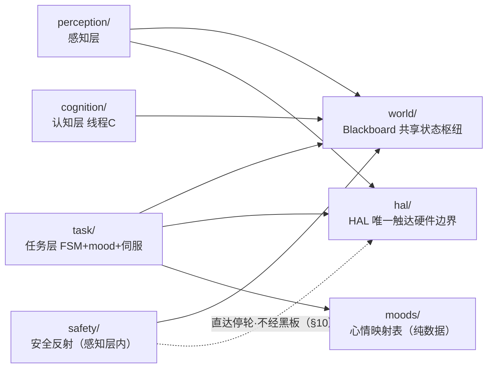

> 说明：实线箭头=经黑板/常规依赖；虚线箭头（`safety -. .-> hal`）=安全反射经 HAL 直达停轮的例外路径（不经黑板，§10，PRD US4.4「不可绕过」）。`safety` 与 `perception` 共用感知层线程、逻辑上是感知层内闭环的反射，故在图中并列于感知侧。模块粒度对齐 §1.2 模块表，依赖方向与 §1.2 读/写黑板列、各功能点分层类图 `..>` 一致。

### 1.4 关键架构决策（需评审重点看）

1. **单进程多线程，而非多进程**：三层共享黑板是高频读写的核心耦合点，进程内共享内存 + 锁的成本远低于跨进程 IPC/序列化；MediaPipe 与 pycozmo 均为进程内库；Gemma 经 Ollama 走本地 HTTP（本身就是跨进程的模型服务，认知层只持有 client）。故主程序为单进程，感知/任务/认知各起一个线程（认知层常驻线程 C 自 M2 起即启动：M2~M3 只跑规则兜底这一纯规则 deliberator，M4 才把 Gemma 决策叠加进同一线程 C——线程 C 的生命周期自 M2 起，Gemma 能力 M4 才叠加，二者区分见 §8.3.3 / §13.1）。详见 §13.1。
2. **黑板并发模型 = 单写者 + 不可变对象整体原子替换 + 同一把锁内周期快照**：直接落实 PRD US4.1 并发契约（复合对象构造后不可变、所有 `set_*` 与 `snapshot()` 走同一把 `threading.Lock`，不依赖 GIL）。详见 §3.3。
3. **mood-translator 从 M1 的独立轻量单元，到 M2 长成任务层 FSM 的一个子模块**——同一份代码增量演进、接口不变、不推翻。详见 §7.1 与 §14。
4. **安全维度仲裁固定 安全反射 > 规则 > 模型；心情维度固定 事件即时心情 > 防抖窗口最新有效来源**。仲裁逻辑集中在任务层（mood）与感知层（safety），不分散。详见 §7.4。
5. **任务层行为编排：近期(M2~M4)保持 FSM，行为树(BT)列为长期演进方向（前瞻决策，含迁移触发条件）**。这是一条**演进路线决策、本轮不改任何既有设计**（不动 §5 的四态 FSM/状态/迁移/计时口径、不动 §6 视觉伺服、不动 §10 安全反射），仅明确"何时、为何、如何"把任务层执行引擎从 FSM 切到 BT，使现在的设计与将来的演进对齐、不踩坑。

   - **现状与近期决策（保持 FSM）**：任务层四态 FSM（`FREE_ROAM / PLAY_CUBE / FOLLOW / SEARCH`，§5）**近期(M2~M4)继续用 FSM**。理由：①当前行为数少（4 态）、转移清晰，FSM 表达最直观，状态图即文档；②FSM 内已沉淀大量经多轮评审的**有状态/时序语义**——T1/T2/T3 每拍基于 `last_seen_ts` 实时计算（§5.4.2）、surprise `HOLD` 边沿触发不重入（§7.5）、有向搜索的私有 `_cx_history` 与 `cx_dir` 派生（§5.4.2）、intention 单写者 / FSM 只读（§5.1.1 / §3.2）——此刻重写为 BT 有真实回归风险，属**过早优化**，不做。
   - **长期演进方向（行为树 BT，候选库 [py_trees](https://github.com/splintered-reality/py_trees)）**：把 BT 列为任务层行为编排的长期演进方向。BT 相对 FSM 的长期优势：①**可组合 / 子行为复用**（叶子节点与子树可跨行为重用）；②**每拍从根重评的反应式优先级**——天然表达"丢人打断跟随""低电量打断一切"这类跨行为抢占，免去 FSM 显式枚举 N² 条转移；③行为数增长时**扩展性更好**（加行为=挂子树，不必重排迁移网）；④与认知层 **"LLM-as-BT-Planner"** 方向契合（未来 System 2 可生成 / 参数化子树）。
   - **迁移触发条件（可判定，非凭感觉）**：满足任一即评估把任务层编排切换为 BT——①**任务层行为数越过 8**（计量口径：按顶层 `FSM_STATE` 状态枚举数计，子状态/子段不单列——如 SEARCH 内的有向段/全向段算同一个行为；**6~8 为预警观察区**，到此即留意 FSM 转移网复杂度，**越过 8 为硬触发点**即启动 BT 评估。4 态时 FSM 够用，越过此量级 FSM 转移网开始难维护）；②出现**安全反射之外、需要跨行为反应式抢占的需求**（例如"低电量打断一切""丢人即打断玩方块"这类需在多个状态枚举上显式声明转移的跨行为抢占——FSM 下表达需大量显式转移，BT 的"每拍从根重评"是其原生能力）。未触发前不迁移。
   - **降低迁移成本（与既有设计呼应，非新增约束）**：要求每个行为写成**自包含模块**（`enter/tick/exit` 清晰、行为间不互相穿透状态），使将来移植为 BT 叶子节点成本低。这与已有行为原语设计一致——如 §5.3 PlayCube 私有 `_last_*_seq`、§5.4 FOLLOW 私有 `_cx_history` 均为行为私有、不外泄；本条只是把"行为自包含"显式记为面向 BT 的工程纪律，**不改任何既有行为语义**。
   - **边界澄清（BT/FSM 只是任务层编排方式，不改分层）**：BT vs FSM 仅是"任务层执行 / 编排引擎"的选择，**不改变认知 / 执行的分层结构**——
     - **视觉伺服（§6）**是连续控制律（`cx→转向`、`size→进退` 的 P 控制），无论 FSM 还是 BT，它都是被跟随行为调用的**控制器、不进树 tick**；
     - **安全反射（§10）**本就旁路 FSM、感知层内经 HAL 直达停轮（PRD US4.4「不可绕过」），**独立于上层编排方式**，硬安全绝不塞进 BT 的 10Hz tick；
     - 迁移可走**混合形态**（BT 在上做行为选择 / 抢占、叶子节点内部仍可保留小 FSM），非"FSM 与 BT 非此即彼"。
     - 视角补注（轻量、不改既有章节定位）：可借当代 **System 1 / System 2** 表述理解本分层——**System 2 = 认知层慢决策**（§8，秒级周期性单次结构化决策 / 规则兜底）、**System 1 = 任务层编排 + 视觉伺服 + 安全反射的快反应**（§5/§6/§10，10Hz/反射级）。BT 仅是 System 1 内任务层编排引擎的演进，不上移到 System 2、不下沉为伺服 / 反射。

---

## 2. 需求 → 设计映射

下表逐条把 PRD 的 User Story / 心情 / 阈值常量 / 黑板字段映射到本设计的落点，证明覆盖无遗漏。（落点节号已更新至 v5.0 新章节位置。）

| PRD 条目 | 设计落点（模块/机制/接口） | 里程碑 |
|---|---|---|
| US1.1 连接+苏醒动画 | `hal.connect()` + `hal.play_animation(wake)`；main.py `--demo connect`；§9.1 启动序列；电量经黑板日志 | M1 |
| US1.2 最小人体识别 visible | `perception.PoseDetector`（§4.2）+ `VisibleDebouncer`（§4.3）；person 复合对象预留 cx/size 子字段；感知层耗时/帧率日志（§4.4） | M1 |
| US1.2/US3.6 **单帧 visible 接受局部子集**（本轮） | §4.2.2 双闸原始判定（最少关键点数 + 上半身核心子集命中，控假阳）；新增配置 `landmark_min_confidence`/`visible_min_landmarks`/`upper_body_core`/`visible_core_min`（§3.4）；**去抖器（§4.3）不变** | M1（判据）/ M3（与 cx/size 耦合时的低置信处理） |
| US3.6 **局部检出 cx/size 可靠性边界**（本轮） | §4.2.2 cx/size"可稳定计算"判据 + 不可算时"沿用平滑值 + 标记 `cxsize_stale`"组合策略；下游伺服/多人选择据此用滞后值不硬切（§6.1/§6.2/§4.2.2）；person 新增 `cxsize_stale` 子字段（§3.2） | M3 |
| US1.3 见人 surprise | `mood-translator`（§7.1）：visible 上升沿→mood=surprise→HOLD→降级 calm；§7.4 仲裁；§7.5 时序边界 | M1 |
| US2.1 自由活动+遇崖停 | `task.FreeRoamState`（§5.2）随机游走；`safety`（§10.1）悬崖停轮+CLIFF_BACKOFF_MAX 后退 | M2 |
| US2.2 玩方块 | `task.PlayCubeState`（§5.3）；cube **新 tap_seq/move_seq 事件**（§3.2 单调序号比对，M-B）→即时心情 happy/playful；PLAY_CUBE_IDLE_TIMEOUT 或 cube 断连回退 | M2 |
| US2.3 自由活动心情 | mood-translator 翻译认知/规则心情；最短保持防抖（§7.4） | M2 |
| US3.1 转向居中 | 视觉伺服转向律（§6.1）：cx_norm→差动转向，TURN_DEADZONE 死区+迟滞 | M3 |
| US3.2 进退距离 | 视觉伺服距离律（§6.2）：size_norm 分区 + 迟滞 + size_max_hard | M3 |
| US3.3 跟随心情 | FOLLOW 态心情：calm/happy；移动期心情走表情/LED 不占轮（§6.3） | M3 |
| US3.4 丢人升级+搜索 | `task.SearchState`（§5.4.2）+ T1/T2 计时（mood-translator/FSM 共用单调时钟）；复见 surprise→happy | M3 |
| US3.4 **有向搜索·轻量档**（本轮） | FOLLOW 态维护 cx 滑动历史（**任务层私有、不进黑板**）→ 进 SEARCH 取窗口均值 `cx_dir` 定向（§5.4.2）；先朝该侧定向转、超时/扫完一侧扩全向；中线/不一致退化全向；中线阈值复用 `turn_deadzone` 量级；新增配置 `search_dir_*`（§3.4）；confused/anxious/T1·T2·T3/复见链不变；不做位置信念/IMU·odometry/SLAM（backlog） | M3 |
| US3.5 长时间收尾 T3 | SEARCH 态 anxious 起计 T3 → calm + FREE_ROAM（§5.4.2） | M3 |
| US3.6 去抖+多人选择 | `VisibleDebouncer`（M1/M3 共用）+ 多人选 size_norm 最大者（§4.2.2，M3 起生效） | M1/M3 |
| US4.1 三层周期+黑板解耦 | §1 架构；§3.3 并发契约（单写者+不可变整体替换+同一把锁内快照，M-D）；§13 并发模型 | M2 |
| US4.2 认知决策意图/心情 | `cognition.decide()`（§8.2）结构化输出；**字段级校验、字段级兜底**（合法字段保留、非法字段走兜底，S-10/CQ-2，US4.2「非法枚举不被采纳」的实现细化、不改本意） | M4 |
| US4.3 规则兜底+仲裁 | `cognition.rule_fallback()`（§8.3.3）；COG_DECISION_TTL stale 失效；§7.4 仲裁 | M2（规则兜底由认知层线程 C 跑通 + 仲裁框架就位）；M4 叠加模型覆盖与 stale 失效 |
| US4.4 安全反射不可绕过 | `safety`（§10.1）感知层内闭环，仲裁最高优先级 | M2 |
| US4.5 结构化日志 | `world.BlackboardLogger`（§11）逐字段/事件 JSON 行 | M2（M1 已用于 visible/帧率/mood 日志） |
| US4.6 断连重连恢复 | `hal` 连接监控 + `task` 重连恢复（§12）；RECONNECT_MAX_RETRIES；重连回 FREE_ROAM | M2 |
| 七种心情 calm/happy/playful/curious/confused/anxious/surprise | `moods/` 映射表（§7.6）+ mood 枚举（§3.2）；触发落点：surprise=visible 上升沿(§7.5)、happy/playful=cube 新事件/复见(§5.3/§5.4.2)、confused/anxious=丢人 T1/T2(§5.4.2/§8.3.3)、calm=默认/降级、**curious=FREE_ROAM 探索扫描经规则兜底写入(§5.2/§8.3.3，M-A 闭合死分支)** | M1（surprise/calm）→ M2（+curious/playful/confused/anxious 等规则兜底全量）→ M3（happy 复见链） |
| 阈值常量（感知去抖 / 心情计时 / 丢人升级 / 视觉伺服 / 有向搜索 / 认知 / 重连等全部） | `config.yaml`（§3.4）集中管理，逐项见该表 | 各 M |
| 黑板字段契约（PRD §11） | §3.2 数据模型 + §3.3 读写契约（同一把锁+不可变，M-D）；cube 即时事件由 PRD §11 的 tapped/moved **实现细化为 tap_seq/move_seq 单调序号**（M-B，语义等价"是否发生新事件"、规避清零写冲突，不违背 PRD 单写者契约） | 字段按 M1/M3 启用时机 |

---

## 3. 共享层：黑板与数据对象（world/ + 复合数据对象）

本章把共享层这一功能点聚齐：类图（主要对象与关系）、黑板数据模型、读写并发契约、配置项全表、以及"三层+黑板一拍数据流"主干序列图。黑板是层间唯一共享状态载体，扛核心并发契约。

### 3.1 共享层类图（主要对象与关系）

> 关系记号（全文各分层类图共用）：实线菱形（`*--`）= 组合/拥有；空心三角（`<|--`）= 实现/继承；虚线箭头（`..>`）= 依赖（含"写/读黑板"的数据流，注释说明 write/read/direct）。
>
> 布局约定（遵《类图绘制规约》）：继承图纵向（父类在上、子类在下、三角箭头朝上）；依赖图横向（`direction LR`，依赖方在左、被依赖方在右、依赖箭头朝右）。`Blackboard` 等读写枢纽在 LR 下自然落中间（写它的类在其左、它 read 出去喂的类在其右）。自动布局只逼近边位、不保证像素级锚点。**核心架构约束在图中体现**：层间不直接调用，一律经 `Blackboard` 写/读交换状态，唯一例外是安全反射经 `HalInterface` 直达停轮（见 §10）。

黑板是层间唯一共享状态载体。注意本图含两类性质不同的成员：`Blackboard` 是**有行为的黑板机器**（线程安全存储 + 快照 + 结构化日志，§3.3），`Person`/`Cube`/`MoodCtx` 等则是**被它持有的构造后不可变值对象**（§3.2/§3.3，仅标关键字段以体现数据契约，不画方法）。二者都属共享层、同放 `world/` 一处，无需拆出。

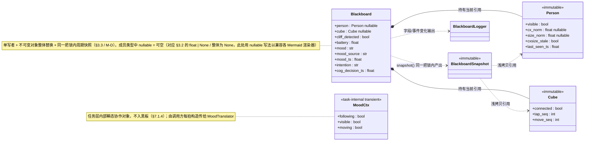

### 3.2 黑板数据模型（落实 PRD §11 字段契约）

黑板是层间唯一共享状态。字段表（单写者 + 类型 + 启用里程碑）：

```python
# person 复合对象（感知层单写，整体原子替换）
# M1：visible/last_seen_ts 有效；cx_norm/size_norm = None
# M3：填充 cx_norm/size_norm 子字段
person = {
    "visible": bool,            # 经多帧确认（US3.6），M1 起
    "cx_norm": float | None,    # [-1,1]，0=画面中央，M3 起
    "size_norm": float | None,  # [0,1]，近似远近，M3 起
    "cxsize_stale": bool,       # True=本帧 cx/size 不可稳定计算、用沿用的平滑值（局部检出，§4.2.2），M3 起；M1=False
    "last_seen_ts": float,      # 单调时钟，最近一次稳定可见时刻，M1 起
}  # 或整体为 None（从未见过人时）
# 说明（cxsize_stale，本轮新增）：visible 放宽到接受局部关键点子集后（§4.2.2），可能 visible=true 但本帧
#   cx/size 不足以稳定计算（只检出局部、躯干成对点不全）。此时感知层沿用上一帧平滑值并置 cxsize_stale=true，
#   供伺服/多人选择识别"这是滞后值非新鲜观测"。它不影响丢人判定（丢人只看去抖后 visible）。仍随 person 整体原子替换、感知层单写。

cube = {                        # 感知层单写，整体原子替换
    "connected": bool,
    "tap_seq": int,             # 拍击事件单调自增序号（感知层单写、永不清零）；任务层比对识别新事件
    "move_seq": int,            # 移动事件单调自增序号（同上）
}  # 或 None
# 说明（M-B）：tap_seq/move_seq 取代旧 tapped/moved bool。感知层每发生一次拍/移动 +1、永不清零、
#   随 cube 整体原子替换；任务层(PlayCube)在自己内存保存 _last_tap_seq/_last_move_seq（私有、不写黑板），
#   每拍比对 cube.tap_seq > _last_tap_seq 识别新事件，处理后追平。跨 30Hz 写/10Hz 读不丢不重，单写者保持。

# 标量/枚举字段
cliff_detected: bool            # 感知层单写，驱动安全反射
battery: float                  # 感知层单写，电压 V
mood: str                       # 任务层(即时)/认知层(低频)写，§7.4 仲裁；七种枚举
mood_source: str                # 任务层写，immediate/cognitive/rule，支撑 US4.3 仲裁 + 可观测
mood_ts: float                  # 任务层写，mood 最近更新时刻（单调时钟）
intention: str                  # 认知层写，无返回时规则兜底写；意图枚举
cog_decision_ts: float          # 认知层写，最近决策时刻，用于 COG_DECISION_TTL stale 判定
```

**枚举集合**：

```python
MOOD = {"calm", "happy", "playful", "curious", "confused", "anxious", "surprise"}   # 七种
INTENTION = {"free_roam", "play_cube", "follow", "search_person", "stop"}
FSM_STATE = {"FREE_ROAM", "PLAY_CUBE", "FOLLOW", "SEARCH"}   # 状态机状态，不写黑板，任务层内部
```

> PRD 术语表强调：状态机状态（大写）≠ intention（小写）。FSM_STATE 是任务层内部状态，不进黑板；intention 是认知/规则写入黑板的决策意图。二者不混为一谈。

**时钟基准**：所有时间戳（last_seen_ts/mood_ts/cog_decision_ts、T1/T2/T3/SURPRISE_HOLD 计时）统一用**单调时钟**（如 `time.monotonic()`），全系统同一基准，避免墙钟回拨影响计时。

### 3.3 黑板读写并发契约（落实 US4.1）

黑板是高频多线程读写点，落实 PRD「单写者 / 整体原子替换 / 周期快照」三条契约：

| 契约 | 实现机制 |
|---|---|
| 单写者 | 每个字段只有注明的那一层写（见 §3.2）；评审/代码组织上强制（写方法按层分组，禁止越层写） |
| 整体原子替换 | 复合字段（person/cube）以**不可变对象整体替换引用**：写者构造好完整新对象，一次赋值替换旧引用（引用赋值原子）；读者拿到的要么是旧完整对象、要么是新完整对象，永不读到半更新中间态 |
| 周期快照 | 黑板提供 `snapshot()`：在**同一把锁的同一临界区内**一次性拷贝当前所有字段引用，返回一个不可变快照；任务层每周期先 `snapshot()` 再决策，整周期内字段一致（不会一周期内字段彼此打架） |

**两条强制并发约束（M-D，澄清快照一致性，删去原"或依赖 GIL"二义）**：

1. **复合对象构造后即不可变**：`person`/`cube` 一经构造视为**不可变（immutable）**——写者每次必须构造**全新 dict** 再整体替换引用，**绝不复用旧 dict 做 in-place 增量修改**；读者拿到后**绝不 in-place 改任何 key**（如需派生值在任务层私有变量里算）。代码层用 `MappingProxyType` 包裹或 frozen dataclass **强制**只读，不只靠约定。理由：仅"替换引用原子"不足以保证不可变——若替换后对象仍被任一方就地改，会破坏"读者要么读到旧完整对象、要么读到新完整对象"的契约。

2. **所有 `set_*` 与 `snapshot()` 一律走同一把 `threading.Lock`**：不再保留"或依赖 GIL/原子引用"的备选。`snapshot()` 必须在该锁的临界区内一次性拷贝**全部字段引用**（person/cube/cliff/battery/mood/intention/各 ts 等），保证任务层永不拿到"person 新值但 mood 旧值"的撕裂快照。因 person/cube 已是"整体替换"，写临界区只换引用、快照临界区只做浅拷贝引用，临界区仍极短，锁竞争与性能无忧。

> 这两条同时也是 §1.4 决策 2「单写者 + 整体原子替换 + 周期快照」的精确化：单写者保证无写写冲突，同一把锁的临界区快照保证读到的是一致的整快照，不可变保证快照内容不被事后篡改。§13.1 并发模型据此表述统一为"同一把锁 + 不可变对象整体替换 + 快照"，全文无"或依赖 GIL"残留。

```python
class Blackboard:
    def set_person(self, person: dict | None) -> None: ...   # 感知层调
    def set_cube(self, cube: dict | None) -> None: ...       # 感知层调
    def set_mood(self, mood, source, ts) -> None: ...        # 任务层调
    def set_intention(self, intention, ts) -> None: ...      # 认知/规则调
    def snapshot(self) -> "BlackboardSnapshot": ...          # 任务层/认知层每周期调
```

### 3.4 配置项（config.yaml，集中管理全部阈值常量）

PRD 所有阈值常量集中于 config.yaml，标默认值，全部可配置、联调可调。该表是跨功能点的全局配置载体，故随共享层一并给全。

```yaml
# ── 感知/去抖 ──
visible_on_frames: 3            # 连续命中翻 true（US1.2/US3.6）
visible_off_frames: 3           # 连续未命中翻 false
perception_fps_log_interval: 1.0  # 感知层耗时/FPS 日志聚合间隔(s)
# 单帧原始 visible 判定（接受局部关键点子集，US1.2/US3.6，§4.2.2；控假阳门槛，实测调）
landmark_min_confidence: 0.5    # 单个 landmark 计入"命中"的最低置信度(visibility/presence)
visible_min_landmarks: 6        # 单帧达置信度的关键点数 ≥ 此值（第一闸：足够人体证据）
upper_body_core: [0, 11, 12, 23, 24]  # 上半身核心子集(BlazePose 索引：鼻/双肩/双髋)，控假阳
visible_core_min: 2             # 上半身核心子集中达置信度的点数 ≥ 此值（第二闸：上半身结构成立）

# ── 心情/计时 ──
surprise_hold: 1.5              # surprise 最短保持(s)（US1.3）；与"1.5s 响应时延上限"正交独立
surprise_response_latency: 1.5  # 从 visible 翻转到开始播 surprise 的响应时延上限(s)；独立于 surprise_hold

# ── 丢人升级 ──
t1_confused: 2.0                # 丢人→confused(s)（US3.4）
t2_anxious: 5.0                 # 丢人→anxious(s)
t3_giveup: 30.0                 # anxious 起→放弃回 calm/FREE_ROAM(s)（US3.5）

# ── 视觉伺服（M3）──
turn_deadzone: 0.15             # 转向死区（US3.1）
turn_deadzone_exit: 0.18        # 死区离开阈值（迟滞，>进入阈值）
size_min: <实测定>              # 目标尺寸区间下界（US3.2）
size_max: <实测定>              # 目标尺寸区间上界
size_max_hard: <略大于 size_max> # 触发后退的硬阈值
size_hysteresis: <实测定>       # 区间边界迟滞量

# ── 有向搜索·轻量档（M3，US3.4，§5.4.2）──
search_dir_window_ms: 800       # 取"最后已知方向"的去抖后稳定可见窗口长度(ms)，对窗口内可算 cx 求均值
search_dir_deadzone: 0.15       # 方向判定中线阈值；|cx_dir|≤此值=方向不可判定→退化全向。复用 turn_deadzone 量级
search_dir_sweep_deg: 90        # 有向段先朝该侧扫过的角度(约±度)，到此扩为全向
search_dir_timeout: 2.0         # 有向段最长时长(s)，超时未重见即扩为全向

# ── 安全/玩方块 ──
cliff_backoff_max: 20           # 悬崖后退最大距离(mm)（US2.1）
play_cube_idle_timeout: 12.0    # 玩方块无互动回退(s)（US2.2）

# ── 认知层（线程 C 自 M2 起；下列前两项 M2 即用，余项 M4 Gemma 用）──
cognition_period: 1.5           # 认知层线程 C 决策周期(s)，M2 起即用作规则兜底触发周期
cog_decision_ttl: 3.0           # 模型决策有效期(s)，默认 2× cognition_period（US4.3，stale 框架 M2 仲裁就位、M4 起约束模型结果）
cognition_provider: ollama      # 默认本地；保留 cloud 切换能力（本期不交付）；M4 Gemma 用
cognition_model: gemma-4-12b    # M4 默认认知模型（稠密多模态，Q4 约 8–12GB，经 Ollama）；备选 gemma-4-26b-a4b，改此项即切模型（§13.2 降级）；M4 Gemma 用
cognition_thinking_highfreq: false  # 高频意图决策关 thinking；M4 Gemma 用
multimodal_min_interval: 5.0    # 多模态看图最小间隔(s)；M4 Gemma 用

# ── 连接/重连 ──
reconnect_max_retries: 3        # 重连上限(US4.6)

# ── 动画/链路 ──
wake_animation: <bin名>         # 苏醒动画（US1.1，可配置）
animation_names: 见 moods/ 映射

# ── 三层周期 ──
perception_hz: 30
task_hz: 10
```

### 3.5 三层 + 黑板一拍数据流主干序列图（§1.1 / §3.3 / §8）

状态图（各功能点章节内）从"状态如何迁移"看主流程；序列图从"跨层对象如何交互、按什么时序"看同一批主流程，二者**并存、互为视角**。本节这张是全系统的"骨架时序"，跨三层、属共享层枢纽视角，故置于共享层一章。序列图的 participant 与消息忠实沿用 §1.2 模块表、各分层类图、§3.2 黑板字段的既有命名与既有数据流向，**不引入任何新对象/状态/字段/接口/语义**。约定：`Blackboard` 作为层间唯一交换枢纽显式画为一个 participant，各层"写事实/读快照/写目标"均落在它身上（呼应 §1.1「层间不直接调用、只经黑板」）；周期/线程以 note 标注。

这条是全系统的"骨架时序"：感知层（线程 A）写事实 → 黑板 → 任务层（线程 B）每拍快照后决策并经 HAL 下发 → 认知层（线程 C）旁路读摘要写 intention/mood。三层各自独立周期、不互相直接调用，全部经 `Blackboard` 交换状态；`snapshot()` 在同一把锁内取一致视图（§3.3）。关键时序点：①感知层覆盖式写 person/cube；②任务层每拍"先 snapshot 再决策再下发"；③认知层串行、慢推理不阻塞 A/B（§13.1）。对应 §5.1 FSM 状态图的"每拍读 intention 做迁移"的底层交互。

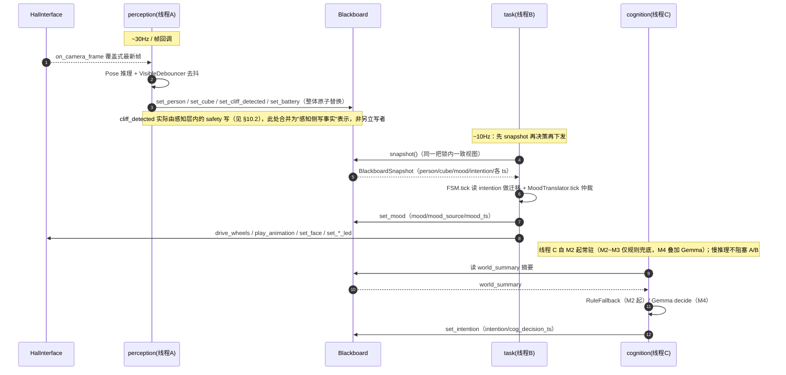

---

## 4. 感知层：帧获取与人体识别（perception/ + safety/）

本章把感知层这一功能点聚齐：分层类图、帧管线结构、visible 判定与多人选择（含局部子集双闸/cx-size 处理）、去抖器、性能可观测、输出对象。安全反射虽运行在感知层线程内，但其闭环时序与契约自成一节（§10），本章只描述感知侧"写事实"。

### 4.1 感知层类图（perception/ + safety/）

感知层把帧/传感器事实写入黑板；安全反射在本层内闭环，经 HAL 直达停轮、不经黑板上送（§10）。

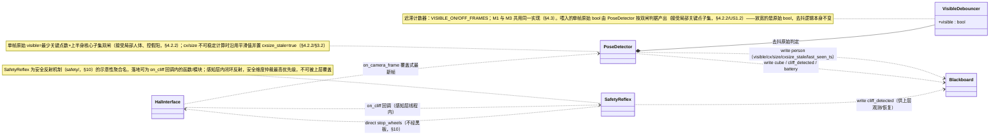

### 4.2 帧获取与人体识别

#### 4.2.1 帧管线结构

感知层主循环（线程 A）以"拉取最新帧 → Pose 推理 → 去抖 → 写黑板"为一拍。pycozmo 以回调推送摄像头帧，HAL 维护"最新帧"槽位（覆盖式，丢旧帧只留最新），感知层主循环从槽位取最新帧推理——**避免帧积压导致时延累积**（低帧率设备宁可丢帧也不排队）。

```
HAL 帧回调 ──写──► [latest_frame 槽位(带锁,覆盖式)] ──读──► 感知主循环
                                                          │
              ┌───────────────────────────────────────────┘
              ▼
   MediaPipe Pose 推理（拿到完整 landmark）
              │
     ┌────────┴─────────┐
   landmark 检出?        landmark→（M3 才算）cx_norm/size_norm
     │                   （M1：cx/size = None，不计算）
     ▼
  VisibleDebouncer（多帧确认）
     │
     ▼
  组装 person 复合对象 → 整体原子写入黑板（§3.3）
     │
     ▼
  记录逐帧耗时/帧率 → 结构化日志（§11）
```

#### 4.2.2 visible 判定与多人选择

- **visible 原始判定（接受局部关键点子集，US1.2/US3.6）**：单帧内对 MediaPipe Pose 输出的每个 landmark 取其置信度（BlazePose 的 `visibility`/`presence`），判据如下——

  > 单帧原始 visible = `(达到 LANDMARK_MIN_CONFIDENCE 的关键点数 ≥ VISIBLE_MIN_LANDMARKS)` **且** `(上半身核心关键点子集 UPPER_BODY_CORE 中至少 VISIBLE_CORE_MIN 个达到置信度)`

  - 选定判据的双闸理由：**第一闸（最少关键点数 N）**保证"画面里确有足够人体证据"，吸收单点抖动；**第二闸（上半身核心子集命中）**控假阳——MediaPipe Pose 对"半身/侧身/出框一半"仍能检出上半身骨架，故只要求"上半身核心点命中"即可接受局部人体，无需全身/下半身在框；而背景纹理、海报/投影、宠物等非目标物上偶发的零散点很难同时满足"足够多点 + 上半身躯干结构成立"，被双闸滤掉。`UPPER_BODY_CORE` 取 BlazePose 上半身解剖锚点：双肩(11,12)、双髋(23,24)、鼻(0)（具体索引集合配置化，联调再调）。
  - **控假阳的边界（PRD US1.2「兼顾假阳一侧」）**：`LANDMARK_MIN_CONFIDENCE` 与 `VISIBLE_MIN_LANDMARKS`/`VISIBLE_CORE_MIN` 共同设最低门槛。去抖只滤偶发单帧假阳、滤不掉**持续性**假阳（如墙上海报里的人会被持续检出），故持续性假阳由此处的"最低置信度 + 最少点数 + 上半身结构"原始门槛把关，与去抖窗口（§4.3）协同把假阳压到联调可接受范围。具体取值实测调、不锁死（§3.4 新增配置项）。
  - 该原始 bool 喂给去抖器，**不直接写黑板**。**放宽的只是这一单帧原始 bool 的门槛，去抖机制（§4.3）完全不变**（仍 VISIBLE_ON/OFF_FRAMES 双向多帧确认、单帧漏检不翻转、M1/M3 共用同一实现）。

- **局部检出时 cx_norm/size_norm 的处理（US3.6「可靠性边界」，M3 起）**：visible 放宽到"局部子集即算可见"**不降低** cx_norm/size_norm 的可靠性要求——多人选最近者（下条）依赖 size_norm、距离伺服（§6.2）依赖 size_norm、转向伺服（§6.1）依赖 cx_norm，这三处仍要可靠输入。为此对 cx/size 单设一道"可稳定计算"判据（独立于 visible 原始判据）：

  > cx_norm 可稳定计算 ⟺ 算 cx 所需的水平锚点（双肩，缺时退双髋）在框且达置信度；size_norm 可稳定计算 ⟺ 算尺寸所需的成对锚点（肩宽/髋宽，至少一对）在框且达置信度。

  当某帧 visible=true 但 cx/size 不满足上述"可稳定计算"判据（典型：只检出头肩一角、躯干成对点不全或出框）时，**采用组合处理策略**：① **沿用上一帧平滑值**（cx/size 已在感知层做时间滤波，§6.4——本帧不投喂新原始值，平滑器保持上次输出，等价"暂不更新该子字段"）；② 该帧 person 同时**标记低置信** `cxsize_stale=true`（见 §3.2），供下游决策参考。
  - **选定理由（三选一/组合中取"沿用平滑值 + 标记低置信"）**：相比"暂不更新但不标记"，多标一个低置信位让伺服/多人选择能识别"这是滞后值、不是新鲜观测"；相比"把不可靠值照样算出来写进去"，沿用平滑值避免把局部检出的抖动 cx/size 灌进控制律导致转向/进退乱动。三者结合既不丢 visible（满足放宽目标=减少跟丢），又守住 cx/size 可靠性（不被局部检出污染），最契合 PRD「visible 放宽不降低 cx/size 可靠性」。
  - **下游消费约束**：多人选择与距离伺服在 `cxsize_stale=true` 时使用沿用的平滑值、不据该帧硬切区间（迟滞天然吸收）；若连续多帧 cx/size 不可算，size_norm 平滑值会持续保持，**与丢人判定无关**（丢人仍只看去抖后 visible，cx/size 不可算 ≠ 丢人）。

- **多人选择（M3 起生效）**：若单帧检出多组 pose，在"cx/size 可稳定计算"的候选中选 `size_norm` 最大者（最近）作为跟随目标，其 landmark 用于算 cx/size。M1 只需"有没有人"，不做选择。该规则在感知层落地，使黑板 person 始终代表"当前跟随目标"。

### 4.3 visible 双向多帧去抖（VisibleDebouncer）

落实 US1.2 / US3.6，M1 与 M3 **共用同一实现**，不在 M3 重定义。

> **本轮变更不动去抖器（务必区分）**：US1.2/US3.6 本轮放宽的是**喂给本去抖器的单帧原始 bool**（§4.2.2 接受局部关键点子集），**不是**本去抖器的逻辑。去抖器仍把每帧原始 bool（无论该 bool 由完整人体还是局部子集判出）按下述迟滞计数规则处理，VISIBLE_ON/OFF_FRAMES 双向多帧确认、单帧漏检/误检不翻转、M1/M3 共用同一实现——**全部不变**。

- **状态**：当前去抖后的 `visible`（稳定值）、连续命中计数、连续未命中计数。
- **规则（迟滞计数器）**：
  - 当稳定值为 false 时：原始判定连续 true 达 `VISIBLE_ON_FRAMES`（默认 3）→ 翻转为 true（**上升沿**，下游据此触发 surprise）；其间任一帧原始为 false 则 ON 计数清零。
  - 当稳定值为 true 时：原始判定连续 false 达 `VISIBLE_OFF_FRAMES`（默认 3）→ 翻转为 false（下降沿，T1 计时基准）；其间任一帧原始为 true 则 OFF 计数清零。
- **关键产物**：
  - 翻转为 true 的瞬间 → 记录上升沿事件（mood-translator 消费）。
  - 翻转为 false 的瞬间 → 更新 `person.last_seen_ts` 并记录下降沿时刻（T1 计时起点）。
- **去抖时刻的时间基准**：`last_seen_ts` 与 T1 起点均取**去抖判定成立的那一帧时刻**（单调时钟），而非原始单帧时刻——保证 PRD「T1 基于去抖后 visible 由 true→false 时刻起算」。

> 单帧漏检/误检在 ON/OFF 计数窗口内被吸收，不翻转 visible，不触发状态切换（US3.6）。

### 4.4 感知层性能可观测（M1 即需）

M1 无 Gemma，"可观测"下沉到感知层自身：每帧记录 Pose 推理耗时；按滑动窗口估算达成帧率（FPS）；经 §11 结构化日志按固定间隔（如每秒一条）输出。这是 visible 去抖窗口/时延阈值联调调参的数据来源（PRD Q6）。

> 设计取舍：耗时/FPS 日志按"采样汇总"输出（每秒一条聚合），而非逐帧刷屏，避免日志 I/O 反噬感知层帧率。

### 4.5 感知层输出对象（预留 M3 扩展点）

感知层产出的 person 对象设计为**可承载子字段的复合结构**，M1 时 cx/size 为 None，M3 仅填充子字段，不改帧获取与 Pose 调用结构。数据结构见 §3.2。这样黑板 person「整体原子替换」契约在 M1/M3 都成立。

---

## 5. 任务层 FSM（task/：状态机 + 行为原语）

本章把任务层 FSM 这一功能点聚齐：分层类图、FSM 四态主流程状态图、跟随主流程序列图、以及 FREE_ROAM/PLAY_CUBE/FOLLOW/SEARCH 各态的文字详述（含有向搜索）。心情仲裁/翻译/计时虽由任务层的 mood-translator 承担，但它自成一个功能点（§7），本章只引用、不展开。视觉伺服控制律亦自成一节（§6）。

### 5.1 任务层 FSM 的图（类图 + 状态图 + 序列图）

#### 5.1.1 任务层类图（task/：FSM + mood-translator + 视觉伺服）

任务层每拍先 `snapshot()` 再决策；FSM 负责状态/意图/行为原语，`MoodTranslator` 负责 mood 仲裁/计时/翻译，`VisualServo` 负责 M3 控制律。mood 字段唯一写者是 `MoodTranslator`（§7.1.4）。

```mermaid
classDiagram
    direction LR
    class TaskLoop
    class FSM {
        FREE_ROAM
        PLAY_CUBE
        FOLLOW
        SEARCH
        -_cx_history : deque
    }
    class VisualServo
    class MoodTranslator {
        surprise: IDLE / HOLDING
        +hold_deadline : float
    }
    class MoodCtx
    class Blackboard
    class MoodMap
    class HalInterface

    TaskLoop *-- FSM : 持有并每拍 tick
    TaskLoop *-- MoodTranslator : 持有并每拍 tick
    FSM *-- VisualServo : FOLLOW 态调用（M3）
    TaskLoop ..> MoodCtx : 每拍构造（following/visible/moving）
    TaskLoop ..> Blackboard : read snapshot（每周期）
    MoodTranslator ..> MoodCtx : tick 入参（场景上下文，不读黑板 intention/FSM）
    MoodTranslator ..> MoodMap : 查表取 动画/表情/LED
    MoodTranslator ..> Blackboard : write mood / mood_source / mood_ts
    MoodTranslator ..> HalInterface : 下发 animation / face / led
    VisualServo ..> HalInterface : 下发 drive_wheels（差动轮速）
    Blackboard ..> FSM : read intention（做迁移，FSM 不写 intention）
    note for FSM "FSM_STATE 为任务层内部状态，不写黑板（§3.2）；FSM 只读 intention 做迁移、不写 intention。intention 写者统一为认知层（含其内规则兜底 RuleFallback，§8.1 / §8.3.3 / §3.2 单写者契约）。_cx_history=FOLLOW 态从 snap.person.cx_norm 自算的私有滑动历史，进 SEARCH 取窗口均值 cx_dir 做有向搜索（§5.4.2，US3.4 轻量档）——任务层私有派生量、不进黑板、不破单写者契约"
    note for MoodTranslator "mood 唯一写者；即时心情(surprise/happy/playful)与低频来源(规则/认知)统一在此仲裁（§7.4）"
    note for MoodMap "纯数据映射(YAML，§7.6)，非逻辑类；类名为查表语义示意"
    note for TaskLoop "TaskLoop 为任务层线程 B 入口骨架的示意性聚合名（§9.3/§13.1/§14），落地可为模块/函数"
```

#### 5.1.2 任务层 FSM 四态主流程状态图（§5.2~§5.4）

迁移条件均取自 §5.4 现有 ASCII 图与 §5.2~§5.4 文字（visible 去抖、intention、T1/T2/T3、PLAY_CUBE_IDLE_TIMEOUT、cube 断连等）。两类"立即停"均旁路 FSM、不作为状态迁移画入图内，仅以注释标注：悬崖/碰撞由安全反射处理（§10.1），连接中断由停车重连处理（§12）——二者口径不同、不混称。

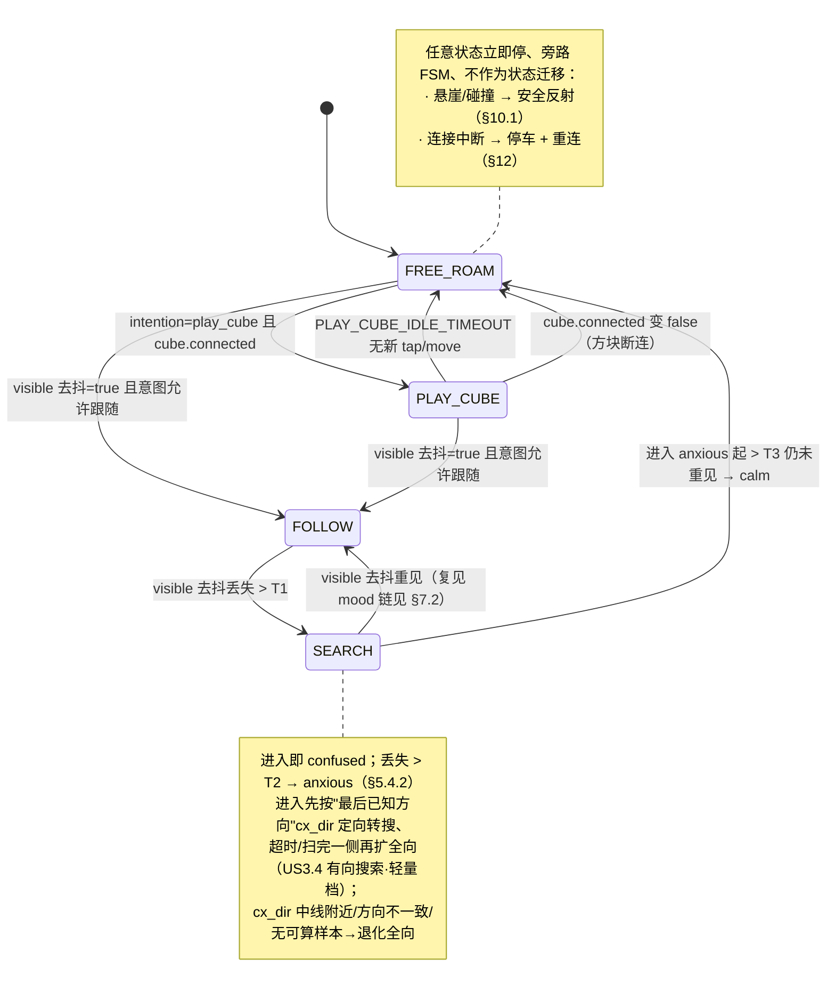

#### 5.1.3 跟随主流程序列图：FOLLOW → 丢人 → SEARCH → 重见恢复（§5.4.2 / §6 / §5.1.2）

序列图与状态图并存、互为视角（状态图看状态迁移、序列图看跨层对象交互时序）。下列序列图的 participant 与消息忠实沿用 §1.2 模块表、§5.1.1 类图、§3.2 黑板字段的既有命名与既有数据流向，不引入任何新对象/状态/字段/接口/语义。

这条覆盖 US3.1~US3.5 的跟随闭环时序，是 §5.1.2 FSM 状态图中 `FOLLOW⇄SEARCH` 那段迁移的对象交互视角。关键时序点：①感知 `visible` 去抖为真 + 认知/规则写 `intention=follow` 共同促成进 FOLLOW，VisualServo 据 cx/size 下发差动轮速；②去抖丢失（下降沿更新 `last_seen_ts`）后任务层每拍实时算 `now-last_seen_ts`，过 T1 进 SEARCH、过 T2 升 anxious；③去抖重见的上升沿先经 surprise（详见 §7.2）短暂保持后转 happy、回 FOLLOW；④anxious 起过 T3 仍未重见则回 FREE_ROAM。T1/T2/T3 计时口径见 §5.4.2。

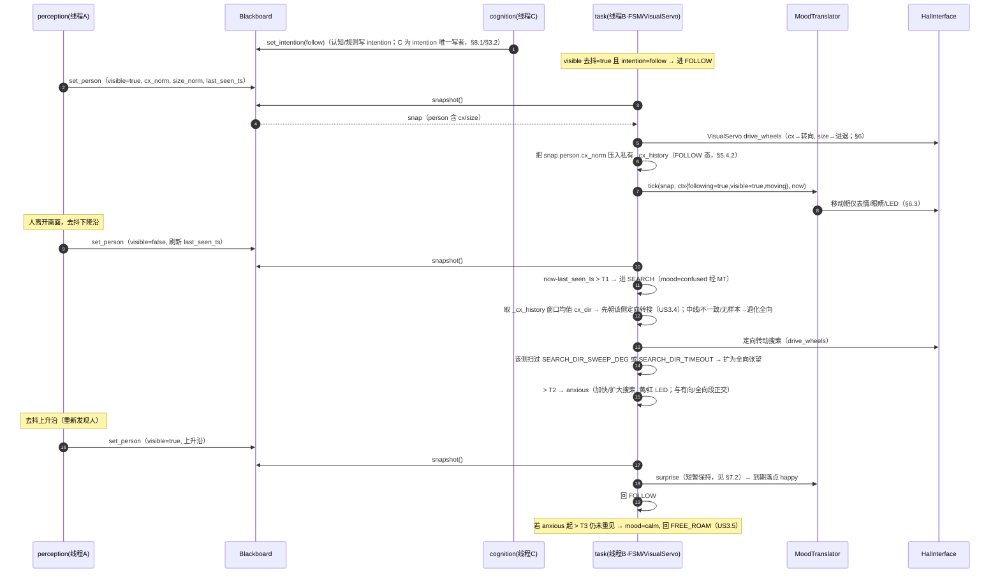

### 5.2 FREE_ROAM（US2.1 / US2.3）

状态机状态（大写）：`FREE_ROAM / PLAY_CUBE / FOLLOW / SEARCH`。读黑板 `intention`（小写枚举）+ 感知事实做迁移。FSM 主体负责 intention/状态/行为原语，mood 全权交给协作的 mood-translator。四态迁移总览：

```
                         intention=play_cube 且 cube.connected
        ┌──────────────────────────────────────────────┐
        │                                                ▼
   ┌─────────┐  intention=follow / visible 去抖=true  ┌──────────┐
   │FREE_ROAM│◄───────────────────────────────────────│PLAY_CUBE │
   └────┬────┘   PLAY_CUBE_IDLE_TIMEOUT 无互动回退      └──────────┘
        │  visible 去抖=true（且意图允许跟随）
        ▼
   ┌─────────┐  visible 去抖丢失 > T1                 ┌──────────┐
   │ FOLLOW  │───────────────────────────────────────►│  SEARCH  │
   └─────────┘◄───────────────────────────────────────└────┬─────┘
        ▲   visible 去抖重见（复见→surprise→happy→FOLLOW）   │
        │                                                    │
        └────────────────────────────────────────────────────┘
                  SEARCH 中 anxious 起 T3 超时 → FREE_ROAM + calm

   （任意状态）悬崖/碰撞/连接中断 → 安全反射立即停（§10.1），不经 FSM
```

**FREE_ROAM 行为**：随机游走：周期性生成随机的前进/转向原语（非固定路径），受悬崖反射约束。心情由认知/规则写入、mood-translator 翻译。悬崖反射在感知层内闭环，FSM 无需轮询悬崖即可保证安全（但 FSM 也会读 `cliff_detected` 决定恢复时机）。

**curious 触发落点（M-A，本设计确定性来源之一）**：FREE_ROAM 每生成一段"探索性扫描"原语（原地慢转/头部转动张望，区别于直线前进）时，规则兜底（§8.3.3）给出 `mood=curious`，对应 PRD 第 5 节 curious 触发场景"发现新目标/扫描中"。该 mood 与 calm/playful 同走 §7.4「通过防抖窗口的最新有效来源」一档，受最短保持约束、不与 surprise 等即时心情冲突；下一段直线游走或进入其它状态时由后续来源覆盖。这样 curious 有确定性写入路径、不再是死分支。详细规则见 §8.3.3。

### 5.3 PLAY_CUBE（US2.2）

进入条件：`cube.connected` 且 `intention=play_cube`（认知/规则给出；无认知时规则可周期性按概率选 play_cube）。
- 点亮方块 LED：颜色/节奏随当前 mood（查 `moods/` 表）。
- **监听 cube 事件（单调序号比对，M-B）**：PlayCube 在自己内存保存 `_last_tap_seq`/`_last_move_seq`（**任务层私有、不写黑板**）。每拍快照后比对：`cube.tap_seq > _last_tap_seq` → 识别到新拍击 → 将 happy 作为即时心情来源经 mood-translator（见 §7.1.4）落 mood，而非 FSM 直接 set_mood；`cube.move_seq > _last_move_seq` → 识别到新移动 → 同理将 playful 作为即时心情来源经 mood-translator 落 mood；处理后把私有计数**追平到当前序号**（序号差>1 表示跨拍漏读多次，按"最近一次事件"处理一次即可，不补播）。1s 内切心情（§13.3 时延口径），**不经认知层**。不再使用旧 `tapped`/`moved` bool（避免 30Hz 写/10Hz 读丢事件或重复触发）。
- 退出（两条）：
  - 持续 `PLAY_CUBE_IDLE_TIMEOUT`（默认 12s）无新 tap/move 事件（即 `tap_seq`/`move_seq` 在该窗口内无增长）→ 回 FREE_ROAM。
  - **方块断连（S-7，US4.6）**：`cube.connected` 变 false → 立即退出 PlayCube 回 FREE_ROAM。方块断连**只影响 PlayCube 可用性、不触发整机重连**（整机重连仅针对 Cozmo 主连接，见 §12），Cozmo 主连接不受影响、继续运行。

### 5.4 FOLLOW / SEARCH（US3.1~US3.5）

#### 5.4.1 FOLLOW

- 执行视觉伺服（§6）。稳定跟随 mood=calm；靠近到目标区间 mood=happy；复见经 surprise→happy。visible 去抖丢失 > T1 → 进 SEARCH。
  - **维护"最后已知方向"（US3.4 有向搜索·轻量档）**：FOLLOW 态每拍把快照里 `snap.person.cx_norm`（当帧 cx 不可稳定计算则不记入，见 §4.2.2）连同其时刻压入一个**任务层私有的定长滑动历史**（环形缓冲，仅 FOLLOW 态写、退出 FOLLOW 不清空——保留到进 SEARCH 取用）。该历史是任务层从快照 cx 自算的派生量，**不进黑板**（归属决策见下「最后已知方向的字段归属」）。

#### 5.4.2 SEARCH

- **进入先做有向搜索（US3.4）**：进 SEARCH 时先求"最后已知方向"——取私有滑动历史中**最近 `SEARCH_DIR_WINDOW_MS`（默认 800ms）窗口内、cx 可稳定计算的样本的 cx_norm 均值**，记为 `cx_dir`：
  - `cx_dir > SEARCH_DIR_DEADZONE` → 人最后偏右 → 先朝右定向转搜；`cx_dir < -SEARCH_DIR_DEADZONE` → 先朝左定向转搜。
  - `|cx_dir| ≤ SEARCH_DIR_DEADZONE`（中线附近、方向不可判定，含正中丢失），**或**窗口内无可稳定计算样本（如丢人前几帧 cx 全不可算）→ **退化为全向张望、不强行选向**（即既有 SEARCH 行为）。
  - **关于"窗口内方向不一致"（S-1，澄清不另设判据）**：窗口内样本正负号混杂时，均值 `cx_dir` 会被左右样本相互抵消、自然趋近 0，由上一条的 `|cx_dir| ≤ SEARCH_DIR_DEADZONE` 死区**天然吸收**为退化全向——故"方向不一致退化"是均值+死区判据的**自然结果、仅作解释性描述，不另设"同向占比"阈值/配置项**。取均值符号而非投票多数，正是为了让混杂方向无需额外计数逻辑即被死区收口（奥卡姆：不引入 `search_dir_min_agreement` 这类无依据的新常数）。
  - **中线阈值复用结论**：`SEARCH_DIR_DEADZONE` **取与 §6.1 `TURN_DEADZONE`（默认 0.15）同一量级**（默认即设 0.15、独立配置项可分别微调）。理由：`TURN_DEADZONE` 是"cx 落此区间内视为已居中、不值得转向"的工程判据，与"cx 落此区间内方向不足以判定左右"语义同源，复用其量级最自然、避免新引入一个无依据的常数；设为独立配置项是因二者物理含义正交（一个管伺服死区、一个管方向判定），允许联调各自微调。
  - 取**窗口均值/多数符号**而非"紧贴 visible 翻转的最后一帧 cx"的理由（PRD US3.4 明确要求）：丢人前最后一帧常处于机器人自身转向中，cx_norm 受机器人角速度污染最重、恰是最不该用的那帧；取去抖后稳定可见窗口内的均值/多数符号，抵消瞬时污染。
  - **工程注记：有向搜索在"窄视野局部丢人"场景可能频繁退化全向（S-2，本设计已知并接受）**。本轮变更1 要解决的恰是"局部人体频繁丢人"场景，而该场景下丢人前最后一段常 `cxsize_stale=true`、cx 不可稳定计算（§4.2.2）；`_cx_history` 只压入"cx 可稳定计算"样本，故 `search_dir_window_ms`(800ms) 窗口内可能无可算样本→走退化全向。**这是有意取舍：宁可退化为全向（安全、已列退化条件），也不用局部检出的脏方向把搜索带偏**——有向搜索仅是"方向可靠时的加速优化"，不是丢人恢复的必要路径。联调须关注有向段实际命中率；若偏低，可在不破坏"只用可算样本"前提下放宽窗口长度（`search_dir_window_ms` 已配置化）或评估纳入 `cxsize_stale` 前的近期可算样本，作为联调旋钮、非本轮硬设计。
  - **窗口取样的容量/时间窗/不回灌闭合（DQ-1）**：`_cx_history` 是定长环形缓冲，**容量取 ≥ `search_dir_window_ms` 对应帧数**（800ms @ task_hz 10Hz ≈ 8 样本，留余量按约 10~16 设，配置或常量化均可），保证一个窗口的样本不被提前覆盖。进 SEARCH 求 `cx_dir` 时**按样本时刻严格过滤**：仅纳入 `now - sample_ts ≤ search_dir_window_ms` 的样本，故跨多轮搜索时（FREE_ROAM→再见人→短 FOLLOW→又丢→再进 SEARCH）即便缓冲里残留上一轮 FOLLOW 的陈旧 cx，也因超出时间窗被滤掉，不污染本轮方向判定（退出 FOLLOW 不清空仅为省一次清理、由时间窗兜底正确性）。**SEARCH 段自身不回灌 `_cx_history`**（搜索转动中机器人自身角速度会污染 cx，且 SEARCH 态本就不做视觉伺服）——写入仅限 FOLLOW 态（见 §5.4.1「维护最后已知方向」），确保下一轮取到的都是"上一段真实跟随期"的方向证据。
- **有向段 → 全向段的扩展律**：进入先朝 `cx_dir` 一侧定向转动搜索；**该侧转过 `SEARCH_DIR_SWEEP_DEG`（默认约 ±90°）或经 `SEARCH_DIR_TIMEOUT`（默认 2s）仍未去抖重见 → 扩为既有的全向张望**（原地慢转/左右张望，扫遍另一侧）。退化（方向不可判定）时跳过有向段、直接全向。
  - **`SEARCH_DIR_SWEEP_DEG` 在无 IMU/odometry 下的落地口径（S-3，开环近似，不违 backlog 边界）**：本机无里程计/IMU 方位反馈（变更2 已把方位推算列 backlog 不做），机器人**无法闭环测得"已实际转过 90°"**。故 `search_dir_sweep_deg` 按**"定向转速 × 经过时间"开环折算**为一个等效时间上限（角度 ÷ 定向搜索角速度 = 折算秒数），到此即视作"扫过该侧"。它与 `SEARCH_DIR_TIMEOUT` 取**或**关系、`SEARCH_DIR_TIMEOUT` 始终兜底，**两支都是计时**、不会卡死。换言之：本期有向段的退出实质以计时为准，`search_dir_sweep_deg` 仅作"按额定转速把角度近似成时间"的开环旋钮（便于以角度直觉配参），**不声称精确测角**；待后续 backlog 引入 IMU/odometry 再升级为闭环角度判据。与 backlog 边界不矛盾——本轮不做方位推算，只做开环时间折算。
- 进入即 mood=confused（**无论有向段还是全向段，confused 心情不变**），原地慢转/左右张望扫描。
- 自丢失起 > T2 → mood=anxious，加快/扩大搜索 + 黄/红 LED（**anxious 升级、加快/扩大搜索与有向/全向段正交——有向段未完成时若已过 T2，照常升 anxious 并继续按当前段加快搜索**）。
- 去抖重见 → surprise（短暂保持）→ happy → 回 FOLLOW（**复见 surprise→happy 链不变**）。
- 自进入 anxious 起 > T3（默认 30s）仍未重见 → mood=calm，回 FREE_ROAM（US3.5）。
- **轻量档边界（与 PRD 第 1.3/第 8 节决策 9 一致）**：本设计仅利用"最后已知方向（左/右）"这一标量信息先定向再全向。**不做**位置信念估计、不做基于 IMU/odometry 的方位推算、不做 SLAM 式世界坐标人位建模——这些记为后续可选增强 backlog，本轮不设计进来。

> **最后已知方向的字段归属决策（单写者契约 §3.3 / PRD US4.1）**：选**任务层私有内存（FSM 内 FOLLOW 态维护的 cx 滑动历史 + 进 SEARCH 时算出的 `cx_dir`），不新增黑板字段**。理由：①该方向不是感知层的观测事实（感知层只写 person.cx_norm 这一原始观测），而是**任务层从 person.cx_norm 历史自行推导的私有派生量**——任务层每拍已 snapshot 拿到 cx_norm，完全能在私有内存里自算，无须感知层多写一个字段；②进黑板会引入"谁是写者"的归属纠结（感知层写则越权派生、任务层写则与"task 不写 person 子字段"冲突），最小侵入是不进黑板；③它只被 SEARCH 进入逻辑一处消费，无跨层共享需求。与既有 §5.3 PlayCube 的 `_last_tap_seq` 私有计数同属"任务层私有派生量、不写黑板"的一致做法。故**不动 §3.2 黑板字段表、不动 §3.3 单写者契约、不动 §3.1 类图的 Blackboard**；该私有历史挂在任务层 FSM 上（§5.1.1 类图为 FSM 补注一句）。

- **T1/T2/T3 计时（S-2，写死计算口径）**：基于单调时钟。**T1/T2 每拍用 `now - snap.person.last_seen_ts` 实时计算**，而非"进入某状态时锁定起点"——感知层每次去抖下降沿更新 `last_seen_ts`，任务层每拍据最新值实时比对，故 HOLD 期内 visible 抖动导致 `last_seen_ts` 被刷新时，T1/T2 自动以"最后一次去抖后的 false"为基准（与 §7.5 第 4 点、PRD US3.4「T1 以最后一次去抖后 false 起算」一致，无需额外冻结/重置逻辑）。T3 例外：以"进入 anxious 时刻"为基准（进入 anxious 时记一次单调时刻，此后实时比对 `now - anxious_enter_ts`）。

---

## 6. 视觉伺服控制律（M3）

本节是 FOLLOW 态的控制律功能点（由 §5.1.1 类图的 `VisualServo` 承担、被 FSM 在 FOLLOW 态调用）。输入 `cx_norm∈[-1,1]`、`size_norm∈[0,1]`，输出差动轮速。**转向与距离两路解耦叠加**：左右轮速 = 基础前进速度（距离律） ± 转向修正（转向律）。

### 6.1 转向律（US3.1）

- **死区 + 迟滞**：`|cx_norm| ≤ TURN_DEADZONE`（默认 0.15）→ 不发转向指令（稳态判据，避免静止往复）。
- 出死区后，转向角速度与 `cx_norm` 成比例（**纯 P 控制，无 I/D 项**，比例系数可配置），并设速度上限。
- **采样率不匹配的鲁棒性（S-6）**：任务层 10Hz 消费感知层 ~15fps 的 cx/size，可能重复采样同一帧。**纯 P 控制对"快于感知层的重复采样"不敏感**（同一输入产生同一输出、无累积误差）；稳态依赖**死区 + 迟滞**而非积分项。**故意不加 D 项**——微分对重复采样会放大噪声（相邻两拍读到同帧时数值阶跃，D 项会算出虚假大速率）。距离律（§6.2）同理为分区+迟滞、无微分。
- **迟滞**：进入死区与离开死区用不同阈值（离开阈值略大于进入阈值），防止边界抖动反复触发。
- cx_norm 已在感知层做时间滤波平滑（§6.4）。

### 6.2 距离律（US3.2）

按 size_norm 分区，区间边界带迟滞：

```
 size_norm <  size_min                       → 前进（人远）
 size_min  ≤ size_norm ≤ size_max            → 维持/停（目标区间，不蠕动）
 size_max  <  size_norm ≤ size_max_hard      → 停车不后退（偏近）
 size_norm >  size_max_hard                   → 后退（过近）
```

- **稳态判据**：人静止在目标区间内 → 停住，不反复前后蠕动（区间内不发进退指令）。
- **迟滞**：进入/离开各区间的阈值不同（如"远→维持"的进入阈值高于"维持→远"的离开阈值），防边界抖动。

### 6.3 移动期心情解耦（US3.3）

移动控制期间，mood-translator 收到"移动中"标志，只下发表情/眼睛/LED 心情表达，不下发占轮整段动画（§7.1.3）。

### 6.4 信号平滑

cx_norm / size_norm 在感知层做时间滤波（如指数滑动平均，系数可配置），输出平滑值写黑板。接受"平滑滞后跟随、非紧跟"（PRD 第 6 节检测鲁棒性）。控制律消费平滑后的值。

---

## 7. 心情子系统：mood-translator / surprise / 仲裁

本章把心情这一功能点聚齐：mood-translator（翻译/计时单元，含 tick 入参契约）、surprise 心情生命周期状态图、surprise 时序序列图、心情仲裁框架、surprise 时序边界四点实现、心情映射表。mood 字段唯一写者是 mood-translator（任务层）。

### 7.1 mood-translator（心情翻译/计时单元）

PRD 的核心设计落点之一。它**归任务层职责**（是 mood 的合法写者），但 M1 时**不是完整 FSM**（不持状态机状态、不读写 intention）。

#### 7.1.1 职责（贯穿 M1→M2 增量演进）

| 能力 | M1（轻量形态，独立单元） | M2+（任务层 FSM 的子模块） |
|---|---|---|
| 消费 visible 上升沿 → 触发 surprise | ✓ | ✓ |
| SURPRISE_HOLD 计时 + 到期降级 | ✓（降级落点固定 calm） | ✓（降级落点按场景：跟随→happy，否则 calm） |
| 心情仲裁（即时 > 防抖窗口最新有效） | ✓（仅 surprise vs 默认 calm） | ✓（全量来源仲裁，§7.4） |
| 最短保持防抖 | ✓（仅 SURPRISE_HOLD） | ✓（所有心情最短保持） |
| 把 mood 翻译为动画/表情/LED → HAL | ✓ | ✓ |
| 读写 intention / 状态迁移 | ✗（不碰） | ✗（仍由 FSM 主体负责；mood-translator 只管 mood） |

**增量演进要点**：M1 的 mood-translator 是一个独立的 `MoodTranslator` 对象，由 M1 的极简任务层循环每拍调用。M2 引入完整 FSM 时，`MoodTranslator` 原样作为 FSM 的协作对象被复用——FSM 负责 intention/状态，`MoodTranslator` 仍负责 mood 仲裁/计时/翻译。**接口与内部计时逻辑不变，不推翻**。

#### 7.1.2 心情翻译

mood 翻译是"查表 + 下发"：从 `moods/` 映射表（§7.6）按当前 mood 取得 {动画名/表情参数/LED 颜色}，经 HAL 下发。**最短保持期内不重复下发同一心情的整段动画**（防抖，避免动画被频繁打断 US2.3/US3.3）；仅在 mood 实际切换时下发新表现。

#### 7.1.3 跟随移动期的心情表达约束（US3.3）

FOLLOW 态移动中，心情**只走表情/眼睛/LED**；占用车轮的整段 `.bin` 动作动画在移动期不播放或被打断，避免抢占转向/距离控制。mood-translator 据"当前是否处于移动控制中"（由任务层提供的一个标志）决定下发"轮式动画"还是"仅表情/LED"。

#### 7.1.4 tick 入参契约（S-1，澄清 mood-translator 如何获取场景上下文）

mood-translator **不持状态机状态、不读黑板 intention/FSM 状态**（保持其"非 FSM"定位）。它降级落点需要的"场景上下文"由**调用方每拍作为入参传入**，而非自己去读黑板 FSM 状态：

```python
class MoodTranslator:
    # 每拍调用一次；ctx 由调用方（M1 极简循环 / M2 FSM 主体）构造后传入
    def tick(self, snap: "BlackboardSnapshot", ctx: "MoodCtx", now: float) -> None: ...

# MoodCtx：调用方据自身状态构造的场景上下文（任务层内部协作对象，不入黑板）
MoodCtx = {
    "following": bool,   # 当前是否处于跟随场景（M2+ 由 FSM 据自身状态=FOLLOW 给出；M1 恒 False，无跟随）
    "visible": bool,     # 当前去抖后 visible（取自 snap.person）
    "moving": bool,      # 当前是否处于移动控制中（§7.1.3 决定下发轮式动画 or 仅表情/LED）
}
```

- **谁来填 `following`**：M2+ 由 FSM 主体每拍把"自身状态是否为 FOLLOW"折算成 `following` 传入；FSM 状态仍是任务层内部对象，mood-translator 经入参拿到、**不直接读它**——既满足 surprise 降级落点（§7.3）按场景判 happy/calm 的需要，又不破坏"translator 不持状态、不读 intention"的定位。
- **谁来填 `moving`**：由控制律执行点（§6.3）每拍告知是否正占轮移动，决定 mood 表达走轮式动画还是仅表情/LED。
- **M1 形态**：M1 极简循环恒传 `following=False`（M1 无跟随），故 surprise 降级落点恒为 calm，与 §7.3/§14 一致。

> 这同时消除 S-1 指出的"两写者写同一 mood 字段、HOLD 结束那拍谁有写权"歧义：**mood 字段的唯一写者是 mood-translator**（surprise 计时、降级、即时心情、低频来源仲裁全部在它内部完成）；FSM/规则不直接写 mood，只通过"把 confused/anxious 等作为低频来源经 ctx/snap 传给 translator、由 translator 仲裁后落 mood"。任务层内部"单写 mood = mood-translator"这一点保证 HOLD 结束那拍写权无歧义（§7.4 仲裁链统一在 translator 内裁决）。

### 7.2 surprise 心情生命周期主流程状态图（§7.3）

mood-translator 内部的 surprise 子状态（`IDLE / HOLDING`）与降级落点，取自 §7.3 四点实现与 §7.1.4 入参契约。降级落点由 `tick(snap, ctx, now)` 入参 `ctx.following`/`ctx.visible` 决定；细节（视觉伺服分区、字段级兜底等）不在此图展开。

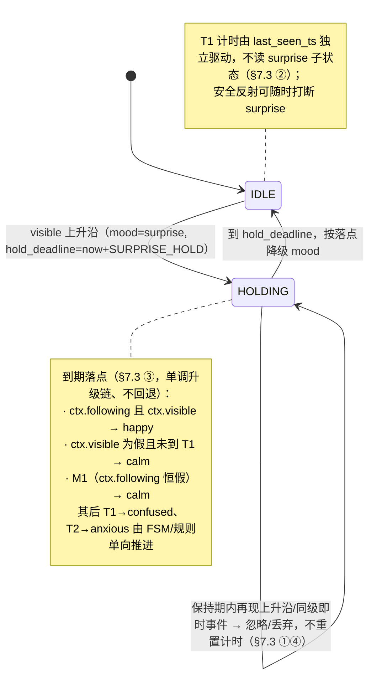

### 7.3 surprise 时序边界四点序列图（§7.5 / §7.2 / US1.3·US4.3）

这条是 §7.2 surprise 心情生命周期状态图的交互时序展开，逐一对应 §7.5 四个时序点：②不冻结 T1、③空窗心情归属（到期单调升级落点）、①同级事件丢弃、④边沿触发不重入。关键时序点：visible 上升沿在 IDLE 态进入 HOLDING 并下发 surprise 表现（响应时延 ≤ surprise_response_latency，§13.3）；HOLDING 期内同级即时事件丢弃、再来上升沿忽略不重置 hold_deadline；T1 由 `last_seen_ts` 独立驱动，与 surprise 是否在 HOLD 无关；安全反射可随时打断。mood 唯一写者是 MoodTranslator（§7.1.4）。

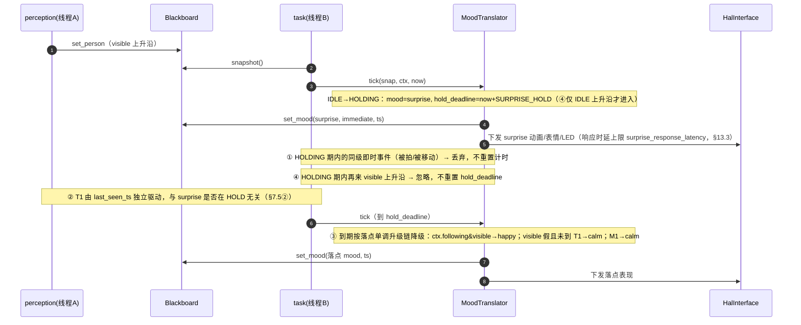

### 7.4 心情仲裁（统一框架）

落实 US4.3 / US1.3 / 第 5 节。仲裁集中在 mood-translator，**两个维度**：

**安全维度（不在 mood-translator，在 safety + 上层目标）**：安全反射 > 规则 > 模型。安全反射停车不可被任何心情/意图覆盖（§10.1）。

**心情维度**（mood-translator 内）：

```
优先级（高 → 低）：
  ① 事件驱动即时心情（surprise / 被拍 happy / 被移动 playful）
        其中 surprise 在 SURPRISE_HOLD 内享有"最短保持"，期内不被同级或更低打断
  ② 通过防抖窗口的最新有效来源（认知层低频心情 / 规则兜底心情）
```

- **即时心情来源**：由任务层据感知事实直接触发（visible 上升沿→surprise、cube 新 tap 事件→happy、cube 新 move 事件→playful；事件识别用 §3.2 单调序号比对，见 M-B）。
- **低频心情来源**：认知层写入 mood（M4）或规则兜底写入 mood（M2 起），含 calm/curious/confused/anxious 等——其中 **curious 由规则兜底在 FREE_ROAM 扫描动作时写入**（M-A，§8.3.3）。
- **来源区分**：mood-translator 内部维护即时心情的"是否处于保持期"状态，无需把"来源"持久化到黑板。但为支撑 US4.3 仲裁与可观测，黑板 mood 配套写入 `mood_source`（immediate/cognitive/rule）与 `mood_ts`（见 §3.2）——满足 PRD §11「心情需可区分来源」。

> 仲裁结果的最终产物只有一个：当前生效 mood（写黑板 + 翻译下发）。

### 7.5 surprise 时序边界四点的实现（US1.3 / US4.3）

这是 PRD 反复强调的无歧义点，逐点给出状态/计时实现。mood-translator 维护一个 surprise 子状态：`IDLE / HOLDING`，并持有 `hold_deadline`（单调时钟）。

```
                visible 上升沿
        IDLE ─────────────────────► HOLDING（mood=surprise, hold_deadline=now+SURPRISE_HOLD）
         ▲                              │  到 hold_deadline
         │                              ▼
         │                     按"落点单调升级链"决定降级 mood：
         │                       · 跟随场景且人仍可见 → happy
         │                       · 人不可见且未到 T1   → calm
         │                       · (随后 T1 到→confused, T2 到→anxious 由 FSM/规则推进)
         │                       · M1 无跟随 → 一律 calm
         └──────────────────────────────┘
```

**四点实现**：

1. **同层处理（不被同级打断）**：HOLDING 态收到同级即时事件（被拍/被移动）→ **丢弃**（设计选定"丢弃"而非"延后"，理由见下）。surprise 保持不变直到 hold_deadline。
   - 选"丢弃"理由：被拍/被移动是瞬时事件，延后到 HOLD 结束（最多 1.5s 后）再补播，语义上已是过期反应、易造成"动作迟到"的违和；而 surprise 本就是强反应，期内丢弃同级瞬时事件对体验影响小、实现也最简（无需事件队列）。PRD 允许二选一，此处定为**丢弃**。
2. **不冻结 T1**：T1 计时由 `last_seen_ts`（去抖下降沿时刻）独立驱动，**不读 surprise 子状态**——即 surprise 在 HOLD 与否完全不影响 T1。安全反射可随时打断 surprise（§10.1 优先级最高）。
3. **空窗心情归属（单调升级链）**：hold_deadline 到达时，mood-translator 按当下事实查"落点"，事实取自 `tick(snap, ctx, now)` 入参（S-1）——`ctx.following`+`ctx.visible` 为真→happy；`ctx.visible` 为假且未到 T1→calm；M1（`ctx.following` 恒假）→calm。**"是否跟随场景"由调用方经 `ctx.following` 传入，mood-translator 不直接读 FSM 状态/intention**（§7.1.4）。此后 confused/anxious 由 T1/T2 计时单调推进，calm→confused→anxious **不回退**（升级链由 FSM/规则作为低频来源经 translator 单向推进，mood-translator 不做反向降级）。
4. **边沿触发不重入**：HOLDING 态再次收到 visible 上升沿（边界抖动）→ **忽略**，不重置 hold_deadline、不叠加新一轮。仅 IDLE 态的上升沿才进入 HOLDING。保持期内 visible 抖动只通过 `last_seen_ts` 影响 T1 基准（以最后一次去抖后的 false 起算），不影响 surprise。

### 7.6 心情映射表（moods/，纯数据）

`moods/` 是数据而非逻辑——一张 mood → 表现的映射表，供 mood-translator 查表下发。

```yaml
moods:
  calm:     { animation: <bin名>, face: idle_blink,   backpack_led: dim_white }
  happy:    { animation: <bin名>, face: happy,        backpack_led: green }
  playful:  { animation: <bin名>, face: playful,      backpack_led: cyan,   cube_led: cyan }
  curious:  { animation: <bin名>, face: curious,      backpack_led: blue }
  confused: { animation: <bin名>, face: confused,     backpack_led: amber }
  anxious:  { animation: <bin名>, face: anxious,      backpack_led: red }
  surprise: { animation: <bin名>, face: surprise,     backpack_led: white }
```

> 具体 `.bin` 动画名/LED 颜色实现时从 pycozmo 资源选定并填入，全部可配置（PRD 风险项：动画名待实现选定）。

---

## 8. 认知层：决策 / 规则兜底 / 可观测（cognition/：线程 C 自 M2 起，M2~M3 仅规则兜底，M4 叠加 Gemma）

本章把认知层这一功能点聚齐：分层类图、统一决策接口、stale 失效、规则兜底、决策周期序列图、结构化日志（可观测）。认知层在常驻线程 C 串行决策，读黑板摘要、写 intention/mood，永不下发电机指令。

> **认知层本质（读前定调，消除歧义）**：认知层是**周期性单次结构化决策**——每个周期「读 world_summary 摘要 → 一次 `decide()` → 字段级校验/兜底 → 写 intention/mood」，**不是多步工具调用 / 多步规划循环的 agent loop**。M2~M3 这一周期走纯规则（RuleFallback）；M4 在同一周期里把"一次 `decide()`"具体化为"Gemma 一次推理出 {intention, mood} JSON"，仍是**单次结构化决策**、不引入多步规划。该周期的完整时序见 §8.4 决策周期序列图。
>
> **与 PRD 措辞对账（不改 PRD）**：PRD（第 7 节里程碑、US4.2/US4.3）所称 "Gemma agent loop" 在本设计中具体化为上述**周期性单次结构化决策**（非多步工具/规划的 agent loop）；FDS 正文统一用「认知决策周期 / 周期性结构化决策 / Gemma 决策（单次结构化）」表述，与 PRD 同指一事，不存在第二种机制。

### 8.1 认知层类图（cognition/）

线程 C 自 M2 起即常驻：M2~M3 只运行 `RuleFallback`（纯规则、不调用 Gemma），M4 才把 `GemmaProvider` 叠加进同一线程 C，模型不可达/超时/stale 时仍由规则兜底接管。

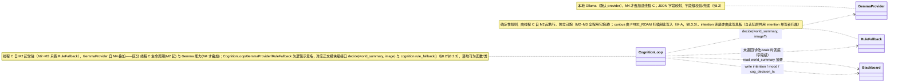

认知层常驻线程 C 自 M2 起即启动：M2~M3 在 C 内只跑规则兜底（§8.3.3，纯规则、不调用模型），M4 才把下述 Gemma 决策（单次结构化，§8.4）叠加进同一线程 C。下文 §8.2/§8.3 描述的统一接口与 stale 失效随 Gemma 能力 M4 落地；本地 Gemma（Ollama）为默认 provider，云端为可选 fallback（本期不交付云端实现，仅保留切换能力）。

### 8.2 统一接口

```python
# cognition 对外统一接口（provider 无关）
def decide(world_summary: dict, image: bytes | None = None) -> dict:
    """返回 {"intention": <枚举>, "mood": <枚举>}；字段级校验：合法字段保留，非法/缺失字段置 None。
    两字段均非法/缺失时返回 {"intention": None, "mood": None}（等价整体未返回，走规则兜底）。"""
```

- **运行模式**：事件驱动 + 低频轮询（每 1–2s 或关键事件），非每帧（US4.2）。
- **线程模型**：在认知层**唯一常驻线程 C 内串行执行**（§13.1，S-4）——前一次决策未完成则跳过本次触发、不堆积、不另起子线程。
- **thinking**：高频意图/心情决策关 thinking 求快；偶发复杂看图理解才开 thinking，多模态看图低频（≥5s 或关键事件），不与高频决策叠加（PRD 第 6 节，控 CPU/内存带宽，不抢 MediaPipe）。
- **输入**：`world_summary`（黑板摘要：电池、是否见人/方块、当前 mood/intention、关键事件）+ 可选图像快照。
- **多模态快照取帧（N-1 / CQ-1）**：可选图像快照**复用感知层"最新帧槽位"（§4.2.1）**，接受 320×240 灰度低质，零额外摄像头带宽、不抢 MediaPipe。**取帧走槽位锁、与感知层覆盖写互斥**（认知层在槽位锁内拷出当前帧引用即释放，不在锁内做编码/推理）。**本期多模态为可选辅助决策、不作硬验收**（PRD 已如此定义，无需回需求阶段）。
- **输出处理（字段级校验、字段级兜底，S-10 / CQ-2）**：模型返回 JSON → 解析 → **对 intention、mood 各自独立校验是否合法枚举**：
  - 某字段合法 → 采纳该字段，写黑板 + `cog_decision_ts`。
  - 某字段解析失败/非法枚举/缺失 → **该字段单独走规则兜底**（合法的另一字段不受牵连，不整体丢弃）。
  - 两字段都非法 → 等价"模型未返回"，整体走规则兜底，**绝不写非法值**（US4.2）。
  > 粒度说明（CQ-2）：这是对 PRD US4.2「非法枚举不被采纳」的**实现细化**——把粒度细化到字段级（合法字段保留、非法字段走兜底），**不改变需求本意**（非法值一律不被采纳）。比"整体返回 None 丢弃合法 intention"更鲁棒、成本相同。

> PRD 明确本期不依赖模型原生 function calling（US4.2 说明），以"模型输出 JSON 字段 → 任务层读取执行"实现。下述 function calling 工具集（PRD 构想第 7 节）作为**接口层语义定义**保留，第一阶段以 JSON 字段映射等价实现：`set_intention`/`set_mood` 等价于输出 JSON 的 intention/mood 字段；`get_world_state` 等价于把 world_summary 作为输入喂入；`play_animation` 不暴露给模型（动画下发是任务层职责，模型不直接控硬件）。这样 M4 后续若启用原生 function calling，可平滑切换而不改上层。

### 8.3 决策有效期与规则兜底

#### 8.3.1 运行线程归属

规则兜底由认知层常驻线程 C 执行，而线程 C **自 M2 起即常驻**（§13.1 / §1.4 决策 1）——故规则兜底**自 M2 起就独立可跑**（M2~M3 期间线程 C 只跑这一纯规则 deliberator、全程用规则跑通 intention/mood，如 visible→follow、丢人 T1→confused、FREE_ROAM 扫描→curious）；M4 才把 Gemma 决策（单次结构化，§8.4）叠加进同一线程 C，模型返回且未 stale 时覆盖规则结果（仲裁见 §7.4，安全反射永不可覆盖）。须区分：线程 C 生命周期=M2 起，Gemma 能力=M4 才叠加，二者不是一回事。

#### 8.3.2 stale 失效（COG_DECISION_TTL）

任务层读 intention/mood 时校验 `now - cog_decision_ts ≤ COG_DECISION_TTL`（默认 2× 认知层决策周期）。超期的（stale）模型决策作废，不得覆盖更新的规则状态（US4.3，防止模型晚到把已升级到 anxious 的状态拉回旧值）。stale 时任务层使用规则兜底结果。

#### 8.3.3 规则兜底（US4.3）

确定性规则，模型未返回/超时/不可达/stale 时给出默认 intention/mood：

- 看见人（visible 去抖=true）→ intention=follow。
- 人丢 > T1 → confused / 意图 search_person；> T2 → anxious。
- **低电量 → intention=stop**（S-8：低电量是状态量、非瞬时安全事件，统一归规则兜底处理，**不在 §10.1 安全反射内**；§10.1 安全反射只保留悬崖/碰撞两类真正瞬时事件，两处口径已对齐，不再重复"低电量停车"）。
- 自由活动默认 → free_roam，并可周期性按概率选 play_cube（cube.connected 时）。
- **探索扫描 → mood=curious（M-A）**：FREE_ROAM 处于"探索性扫描"原语（原地慢转/头部张望，§5.2）期间，规则兜底写 `mood=curious`，落实 PRD 第 5 节 curious 触发"发现新目标/扫描中"。这是 curious 在 M1~M3 的**唯一确定性写入路径**；M4 接入后认知层亦可按场景写 curious，与规则兜底走同一 mood 字段、同一仲裁（§7.4）。

> curious 触发归属说明（M-A，闭合"七种心情未闭环"）：本设计选**规则兜底（FREE_ROAM 扫描动作）**作为 curious 的确定性落点，而非"SEARCH 进入瞬间给 curious 再转 confused"——后者会与 PRD US3.4「进入 SEARCH 即 confused」的明确语义打架（SEARCH 是"丢人着急找"，给 curious 语义不符）；FREE_ROAM 探索扫描才契合 PRD curious 触发场景"发现新目标/扫描中"。此落点自 M2 规则兜底就位即生效（FREE_ROAM 属 M2），M1 无 FREE_ROAM 故 M1 不触发 curious（M1 只有 surprise/calm，与 §14 里程碑表一致）。

> 认知层与全系统的可观测（含模型覆盖/兜底生效的事件条目）统一收口到 §11 结构化日志（`world.BlackboardLogger`）。

### 8.4 认知层决策周期序列图（§8.2 / §8.3）

本图把 §8.2 统一接口与 §8.3 决策有效期/规则兜底所描述的**单次认知决策周期**展开为时序，证明它是「读摘要 → 一次 `decide()` → 字段校验/兜底 → 写黑板」的**周期性单次结构化决策**，而非多步工具/规划的 agent loop。与 §3.5 的关系：§3.5「三层 + 黑板一拍数据流」是**跨层粒度**的旁路视角（只把认知层画成线程 C 的一条旁路边）；本图是**认知层内部**这一旁路在单个周期内的展开（M2~M3 规则路 / M4 Gemma 路两条分支、字段级校验兜底、stale 口径、单写者落黑板）。participant 与消息忠实沿用 §8.1 类图（CognitionLoop/GemmaProvider/RuleFallback）、§3.2 黑板字段、§8.2 接口与 §4.2.1 最新帧槽位的既有命名，**不引入任何新对象/机制/字段/阈值**。

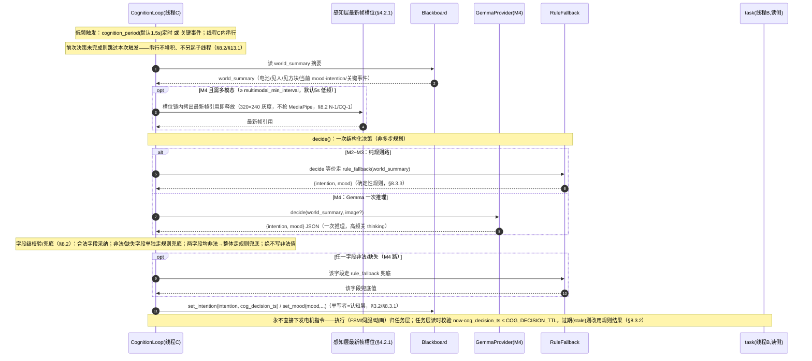

> 说明（3 句）：①这条流程对应 §8.2「运行模式/线程模型/输出处理」与 §8.3「stale 失效/规则兜底」——一个周期内只 `decide()` 一次，M2~M3 走 RuleFallback、M4 走 Gemma 单次推理，两条路殊途同归到「字段校验 → 写 intention/mood」；②stale 校验发生在**任务层读侧**（图末 note，§8.3.2），认知层只负责把带 `cog_decision_ts` 的结果写黑板；③认知层**永不下发电机指令**（单写者只写 intention/mood/cog_decision_ts），执行交由任务层，与 §1.1「模型决策永不进实时控制环」一致。

---

## 9. 底层 HAL 与启动接线（hal/ + main.py）

本章把底层 HAL 这一功能点聚齐：HAL 类图、对 pycozmo 的封装边界与行为契约、层间接口约定、main.py 启动接线与 demo 命令（含启动序列）。HAL 是唯一触达硬件的边界，便于 mock。

### 9.1 HAL 类图、封装边界与启动序列

HAL 是唯一触达硬件的边界，`PycozmoHal` 为真实现、`MockHal` 供无硬件联调；内部 `_cliff_active` 硬闸是安全反射的最后防线（§9.1 契约 1 / §10.1）。

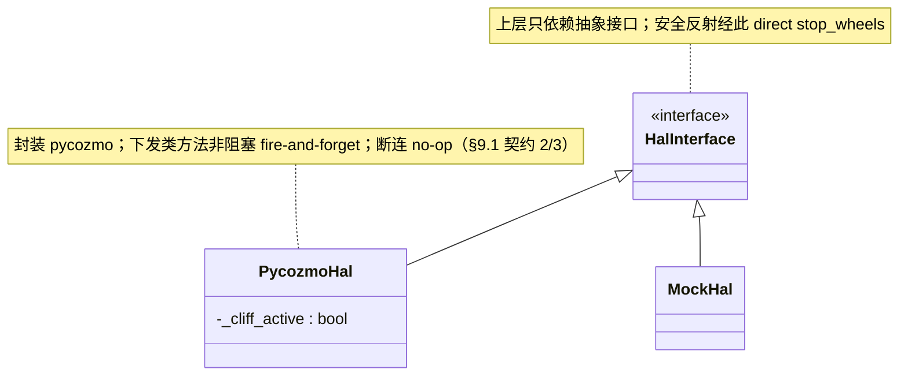

HAL 是上层与 pycozmo 之间唯一边界，对外暴露**稳定的能力接口**，对内封装 pycozmo 细节。上层只依赖 HAL 抽象接口，测试时注入 MockHal。

```python
class HalInterface:                 # 抽象接口，上层只依赖它
    # 连接生命周期
    def connect(self) -> None: ...
    def disconnect(self) -> None: ...
    def is_connected(self) -> bool: ...
    def on_disconnect(self, callback) -> None: ...   # 断连通知（驱动 §12 重连）

    # 运动
    def drive_wheels(self, left_mmps: float, right_mmps: float) -> None: ...
    def stop_wheels(self) -> None: ...               # 安全反射直达
    def move_lift(self, ...) / move_head(self, ...): ...

    # 表现
    def play_animation(self, name: str) -> None: ...
    def set_face(self, expr) -> None: ...
    def set_backpack_led(self, color) -> None: ...
    def set_cube_led(self, color) -> None: ...

    # 传感器/事件回调（HAL→感知层）
    def on_camera_frame(self, callback) -> None: ...  # 覆盖式最新帧
    def on_cliff(self, callback) -> None: ...         # 驱动安全反射
    def on_cube_event(self, callback) -> None: ...    # 拍/移动/连接事件 → 感知层据此自增 tap_seq/move_seq、维护 connected
    def read_battery(self) -> float: ...

class PycozmoHal(HalInterface): ...   # 真实现，封装 pycozmo
class MockHal(HalInterface): ...      # 测试实现，喂假帧/假事件，断言下发指令
```

**HAL 行为契约（三条强约束，被 §10.1/§12/§13.1 引用）**：

1. **悬崖硬闸（安全保证 · M-C）**：HAL 内维护 `_cliff_active`（`on_cliff` 回调置位、悬崖解除清零）。`drive_wheels()` 入口判断 `_cliff_active` 为真时**直接 no-op**（或仅放行后退方向，供 CLIFF_BACKOFF 脱离）。此为 US4.4「任何上层目标都不能覆盖此反射」的硬件级最后防线，约 5 行，详见 §10.1。
2. **非阻塞下发（D-3 前置）**：所有下发类方法（`play_animation`/`drive_wheels`/`set_face`/`set_*_led` 等）为**异步提交（fire-and-forget）、不阻塞调用线程**。整段 `.bin` 动画的下发不得卡住任务层 10Hz 周期。若 pycozmo 原生调用阻塞，则 HAL 内部用**下发队列 + 自有消化线程**异步执行，对外接口立即返回。这是"单任务层线程即可满足 10Hz、无需为 mood 单开线程"（§13.1、原 D-3）的前提。
3. **断连 no-op（S-5）**：连接断开状态下，所有下发类方法为**安全 no-op、不抛异常**。调用方（§10.1/§12）无需各自包 try/except，断连后的"安全停车"调用幂等无害。

**Mock 测试策略**：
- MockHal 可注入预制摄像头帧序列（含/不含人）→ 驱动感知层去抖、surprise、视觉伺服的单元/集成测试，无需实体 Cozmo。
- MockHal 记录所有下发指令（drive_wheels/play_animation/led）→ 断言"悬崖触发后是否 stop_wheels""surprise 是否在响应时延内下发 surprise 动画"等验收点。
- MockHal 可主动触发 on_cliff/on_cube_event/on_disconnect → 测试安全反射、玩方块、断连重连路径。
- 因 HAL 是唯一硬件边界，三层逻辑可在无硬件下全程 mock 联调（CI 友好）。

**启动序列（以 `--demo connect` 为例，US1.1/US1.2/US1.3）**：

```
1. 读 config.yaml → 构造 Blackboard、HAL（PycozmoHal）、moods 映射
2. hal.connect()（前置：用户已唤醒 Cozmo + 连其 Wi-Fi）
   └ 连接建立后 5s 内 hal.play_animation(wake_animation)
   └ 打印"连接成功" + read_battery() 电压
3. 启动感知层线程：注册 on_camera_frame/on_cliff/on_cube_event；逐帧 Pose→visible 去抖→写黑板
4. 启动任务层线程（M1 为极简循环，仅驱动 mood-translator）
   └ mood-translator 消费 visible 上升沿→surprise→HOLD→calm，经 HAL 下发表现
   └ 结构化日志输出 visible 变化 / 帧率 / mood 切换
5. 退出（Ctrl-C）：停轮 → hal.disconnect()，安全断开不残留
```

### 9.2 层间接口（经黑板，非直接调用）

层间不直接调用，统一经黑板读写（§3.3 接口）。唯一直达是安全反射经 HAL stop_wheels（§10.1）。

### 9.3 main.py 启动接线与 demo 命令

```
main.py --demo connect   # M1：连接 + 苏醒动画 + 最小 visible 感知 + 见人 surprise
main.py --demo roam      # M2：三层 + FREE_ROAM/PLAY_CUBE + 安全反射 + 重连
main.py --demo follow    # M3：+ FOLLOW/SEARCH 视觉伺服 + 丢人情绪
```

> `--demo roam`/`--demo follow` 在 §9.1 启动序列基础上增启完整 FSM、安全反射、重连，以及**认知层线程 C**（M2~M3 仅跑规则兜底，M4 叠加 Gemma 决策——线程 C 生命周期自 M2 起、Gemma 能力 M4 才叠加，§13.1）。各 demo 通过开关装配不同层，main.py 是装配点。

---

## 10. 安全反射闭环（safety/：US4.4，感知层内闭环、唯一不经黑板的直达例外）

本章把安全反射这一功能点聚齐：闭环时序序列图 + 文字契约。安全反射运行在感知层线程内，但因其是全系统唯一不经黑板的直达例外，自成一节。

### 10.1 安全反射（US4.4，感知层内闭环）

> 范围界定（S-8）：安全反射只含**真正的瞬时安全事件——悬崖、碰撞**。低电量**不是**瞬时安全事件，归**规则兜底**处理（任务层 intention=stop，见 §8.3.3），不在本节安全反射内。两处口径统一，避免"低电量停车"在安全反射与规则兜底重复出现。

- **触发**：HAL 的 `on_cliff` 回调（悬崖）、碰撞/急停姿态。回调运行在感知层线程上下文。
- **动作**：回调内**直接** `hal.stop_wheels()`，不写黑板等上层、不经 FSM/认知层。随后置 `cliff_detected=true` 供上层观测与恢复决策。
- **悬崖后退（US2.1，可选）**：停车后可执行小幅后退脱离，距离 ≤ `CLIFF_BACKOFF_MAX`（默认 20mm）；后退方向无传感器覆盖，若该方向也触发悬崖则立即再停、不再后退。
- **不可绕过（双层防护，明确各自语义）**：任何上层 mood/intention/伺服指令都不能覆盖停车。落实 US4.4「任何上层目标都不能覆盖此反射」，分两层：
  - **第一层（安全保证 · 必选）= HAL 内硬闸**：HAL 维护内部标志 `_cliff_active`（`on_cliff` 回调置位、悬崖解除时清零），`drive_wheels()` 入口判断 `_cliff_active` 为真时**直接 no-op**（或仅放行后退方向，用于 CLIFF_BACKOFF 脱离）。约 5 行硬闸，成本可忽略。这是关闭竞态窗口的**最后防线**——感知层回调线程停轮后，即便任务层线程（10Hz）下一拍才读到 `cliff_detected` 并在其间误下发 `drive_wheels`，也被 HAL 硬闸拦截，不会覆盖刚停的轮速。把硬件保护放在最贴近硬件的 HAL 层，语义上最合理。
  - **第二层（性能优化 · 非安全保证）= 上层据 cliff_detected 暂停下发**：任务层读到 `cliff_detected` 后主动不下发驱动指令，**减少无效下发**（避免每拍都触发 HAL 硬闸 no-op）。此层仅为性能/清洁优化，**安全性不依赖它**——它有竞态窗口（如上所述），安全完全由第一层 HAL 硬闸保证。
- 设计取舍：原"双保险均为安全保证"的表述（旧 D-1）已收敛为"HAL 硬闸是唯一安全保证、上层暂停下发降为性能优化"，消除"纯靠上层自觉无法关闭竞态窗口"的隐患（D-1→采纳）。HAL 接口契约见 §9.1。

### 10.2 安全反射闭环序列图（§10.1 / US4.4，唯一不经黑板的直达例外）

这条是全系统**唯一不经黑板**的交互（§1.1/§3.1 的安全反射例外），对应 §5.1.2 FSM 状态图中以 note 标注的"悬崖/碰撞旁路 FSM 立即停"。关键时序点：①`on_cliff` 回调在感知层线程内直接经 HAL `stop_wheels()`，不写黑板等上层、不经 FSM/认知层；②随后置 `cliff_detected=true` 供上层观测/恢复；③HAL 内 `_cliff_active` 硬闸是最后防线——即便任务层下一拍误下发 `drive_wheels` 也被入口 no-op 拦截（§9.1 契约 1，关闭竞态窗口）。安全维度仲裁最高、不可被任何 mood/intention/伺服覆盖。

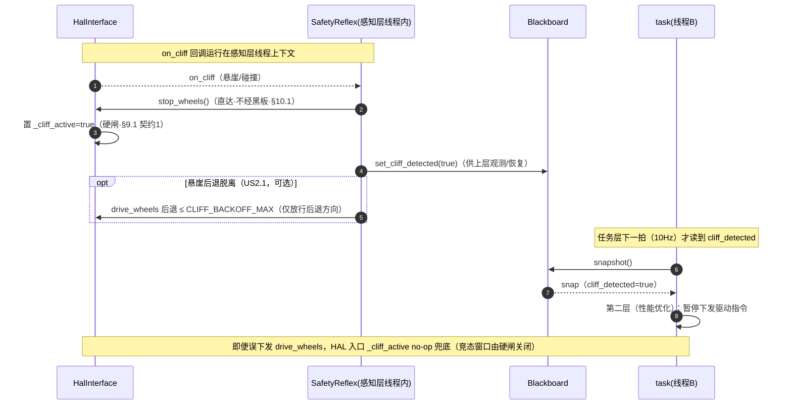

---

## 11. 结构化日志（US4.5，M2 起；M1 已部分使用）

`world.BlackboardLogger` 输出逐条 JSON/键值行：
- 黑板关键字段（person/cube/mood/intention/battery/cliff）的当前值与变化。
- 关键事件条目：状态机迁移、心情切换（含 surprise→calm/happy）、丢人/复见、模型覆盖/兜底生效、连接中断/重连。
- M1 专用：感知层逐帧耗时/达成帧率（聚合）、mood 由 surprise→calm 的切换条目（M1 可观测验收锚点）。

> 图形面板 Out of Scope，本期只交付结构化日志，可被人工查看或后续工具消费。

---

## 12. 断连与重连恢复（US4.6）

```
hal.on_disconnect 触发
   ▼
立即 hal.stop_wheels()（安全停车，类比安全反射）
   ▼
自动重连循环：尝试 hal.connect()，最多 RECONNECT_MAX_RETRIES 次（默认 3）
   ├─ 成功 → 恢复运行：默认回 FREE_ROAM（随后凭 US3.6 去抖见人即自动进 FOLLOW，复用既有路径）
   │         若重连瞬间画面稳定可见人，可直接进 FOLLOW（设计选定：先回 FREE_ROAM，由统一去抖路径接管，简化恢复逻辑、避免特例）
   └─ 超上限 → 安全退出：停轮 + disconnect + 打印明确失败提示，不残留异常状态
```

- 重连不要求恢复中断前精确状态（PRD 允许回 FREE_ROAM 或重新进跟随）。
- 模型不可达由 §8.3.3 规则兜底处理，与底层断连互不替代（US4.6 说明）。
- **断连状态下的下发安全（S-5）**：上述 `stop_wheels()` 等指令在连接已断时下发会失败/抛异常。落实方式见 §9.1 HAL 契约——**连接断开状态下所有下发类方法（drive_wheels/stop_wheels/play_animation/set_*_led 等）为安全 no-op、不抛异常**。因此本节及 §10.1 的调用方无需各自包 try/except，断连后的"安全停车"调用是幂等无害的。

**方块（cube）断连（US4.6 覆盖"Cozmo 或方块连接中断"）**：方块断连**只影响 PlayCube 可用性，不触发整机重连**（整机重连仅针对 Cozmo 主连接）。感知层把 `cube.connected` 置 false；若当前处于 PLAY_CUBE 状态，FSM 据此退出 PlayCube 回 FREE_ROAM（见 §5.3 退出条件）。Cozmo 主连接不受影响、继续运行。

> 时延口径与并发边界（1s 切心情 / surprise 两个 1.5s / cube 序号 / 幂等防重复下发）见 §13.3。

---

## 13. 非功能性设计

### 13.1 并发模型（三层不同周期调度）

- **线程划分（定死，S-4）**：感知层线程 A（~30Hz / 帧回调驱动）、任务层线程 B（~10Hz 定时）、**认知层 1 个常驻线程 C**（秒级 / 事件）。**线程 C 自 M2 起即常驻启动**——M2~M3 在 C 内只运行规则兜底这一纯规则 deliberator（不调用 Gemma），M4 才把 Gemma 决策（单次结构化，§8.4）叠加进**同一线程 C**（同一线程、同一黑板读写口）。须区分两件事：①线程 C 的生命周期（自 M2 起）与 ②Gemma 决策能力（M4 才叠加），二者不是一回事——故 M2~M3 规则兜底由线程 C 执行（不挂任务层线程 B），写黑板 intention/mood（单写者仍逻辑归属认知层模块）。HAL 的 pycozmo 回调在其自身 I/O 线程，经覆盖式槽位 + 黑板与三层解耦。
- **周期实现**：B 用固定步长循环（每拍 ~100ms，先 snapshot 再决策再下发）；A 由帧回调驱动 + 自身节流到 ~30Hz；**C 用定时器/事件触发，在其常驻线程内部串行执行决策——前一次决策未完成则跳过本次触发、不堆积（无嵌套子线程）**。删去旧表述"决策走子线程"的二义：认知层不再为每次决策另起子线程，只有 C 这一个常驻线程；它本身就独立于 A/B，故 Gemma 推理慢也不阻塞 A/B。
- **线程安全**：全部跨线程状态经黑板（§3.3 同一把锁 + 不可变对象整体替换 + 快照）；HAL 下发指令线程安全（pycozmo 调用经 HAL 串行化或其内部队列，见 §9.1 非阻塞下发契约）。
- **不阻塞实时环**：认知层 Gemma 推理可能数百 ms~秒级，运行在常驻线程 C，**绝不阻塞 A/B**；任务层只读黑板里"已就绪"的 intention/mood（带 stale 校验），从不等模型（US4.1/US4.2）。
- **线程 C 在 M2~M3 的开销（可忽略）**：M2~M3 线程 C 只跑纯规则 deliberator（读 world_summary 摘要 + 确定性分支 + 写黑板，无模型推理），按 `cognition_period`（默认 1.5s，§3.4）低频触发，CPU/内存开销可忽略，不构成 32GB 同台共存压力（Gemma 权重的内存占用要 M4 才发生——M4 默认 Gemma 4 12B 约 8–12GB、备选 26B-A4B 约 13–18GB，见 §13.2）。故"线程 C 自 M2 起常驻"对 M1→M3 资源预算无实质影响。
- **MediaPipe 与 GIL 争用风险（前置标注，S-3）**：MediaPipe Pose 是进程内 C 扩展，跑在感知层线程 A。其推理是否在 GIL 外执行**尚未论证**——若某段不释放 GIL，每帧几十 ms 会周期性占住解释器，导致任务层 B 的 10Hz 周期抖动。**验证项（M1 实测）**：以感知层逐帧耗时日志（§4.4）+ 任务层周期抖动日志佐证，确认 Pose 推理是否在 GIL 外执行、B 周期是否稳定。**退路（不现在改架构）**：若 GIL 争用致 B 周期不稳，把 Pose 推理移到独立子进程，仅回传 visible/cx/size 等小结果（小数据量 IPC，不传整帧）。当前阶段仅前置标注此风险与退路，架构不预先改动。

### 13.2 资源与可观测（PRD 第 6 节）

- **M4 默认认知模型 = Gemma 4 12B**（稠密 dense、encoder-free 原生多模态，经 Ollama 本地跑，默认 Q4_K_M 量化，统一内存约 **8–12GB**）。与 MediaPipe、pycozmo 同台 32GB Mac mini 共存；多模态看图低频（≥5s），不与高频意图决策叠加，避免抢 CPU/内存带宽拖慢 MediaPipe。**备选 = Gemma 26B-A4B（4-bit，约 13–18GB）**，保留为可切换项（改 §3.4 `cognition_model` 一项即切，详见下「降级」）。
  - **选型权衡（诚实写明，非全面碾压）**：选 12B 稠密为默认的理由是**内存占用约减半**（~8–12GB vs ~13–18GB）——在 32GB 上与 MediaPipe 共存余量更大、降低统一内存换页风险；官方称其质量接近 26B MoE、总内存占用不到其一半。**代价**：纯 token 解码上，稠密 12B（全参数参与）比 26B-A4B（MoE、每 token 仅约 4B 激活参数）**单 token 解码略慢**。但本项目认知/看图为**低频（≥5s）、短输出（intention/mood 两字段 JSON）、非阻塞线程 C、首字延迟只记日志不作 SLA**（§13.1 / 下「可观测」），故该解码速度差异对我们的用法**无实质影响**；规则兜底 + stale 仲裁亦保证模型慢/不可达时上层照常运行。
- **可观测**：内存占用峰值、认知层首字延迟纳入 §11 结构化日志（M4）；M1 阶段感知层耗时/帧率纳入日志（§4.4）。
- **降级**：本期人工切换配置（改 §3.4 `cognition_model` 切模型——默认 `gemma-4-12b`、备选 `gemma-4-26b-a4b`；或降多模态频率/关 thinking），不做自动降级（Out of Scope）。
- **M4 待确认点（实测/核对，影响默认模型可用性，与 §16 风险关联）**：
  1. **Ollama 的 Gemma 4 12B tag 是否真支持传图**——多模态通路（图像 patch 投影）可能滞后于权重发布，须在本机用 Ollama 实际传一张快照验证图像入口可用；若暂不可用，多模态本期本就非硬验收（§8.2），可先纯文本 world_summary 决策、待 tag 补齐再开图。
  2. **本机首字延迟 / 解码速度实测**——§13.1/上「可观测」已有日志口径，照测 Gemma 4 12B 在本机的实际值，确认低频/短输出下体验可接受（仅记日志、不作 SLA）。
  3. **结构化 JSON 输出在新模型上重验**——换模型需在 Gemma 4 12B 上重新验证 intention/mood 两字段 JSON 的解析成功率与枚举合法性（与 §16「Gemma 结构化输出成熟度」风险直接关联），非法/失败仍走字段级兜底（§8.2）。
  4. **核对 license**——以官方 Gemma 4 12B model card 为准确认许可条款后再正式纳入（二手来源口径不一，文中不写死）。

### 13.3 时延口径与并发边界

- **"1s 内切心情"口径**（US2.2/US2.3）：从黑板事件写入（cube `tap_seq`/`move_seq` 自增 / mood 更新）到对应动画开始播放 ≤ 1s（软件内部可保证项）。端到端（含方块无线电上报）尽力而为，目标 ≤ 1.5s，不作硬验收。
- **surprise 两个 1.5s**：`surprise_response_latency`（visible 翻转→开始播 surprise 表现的响应时延上限）与 `surprise_hold`（surprise 进入后最短保持）物理含义正交、各自可配、默认同值、互不联动（§3.4 两个独立配置项落实）。
- **幂等/防重复下发**：mood-translator 最短保持期内不重复下发同一心情整段动画（§7.1.2）；视觉伺服死区/区间内不发指令（§6），天然防抖动。
- **cube 瞬时事件消费（单调自增序号，M-B / D-2→采纳）**：tapped/moved 不再用"置位—清零"的 bool（30Hz 写 / 10Hz 读跨周期必然丢事件或重复触发），改为**感知层单写、单调递增、永不清零的事件序号** `cube.tap_seq` / `cube.move_seq`（每发生一次拍/移动 +1）。任务层（PlayCube）在自己内存保存 `_last_tap_seq` / `_last_move_seq`（**任务层私有、不写黑板**，单写者契约完整保持），每拍比对——`cube.tap_seq > _last_tap_seq` 即识别到新拍击事件，处理后把私有计数追平。这样跨 30Hz/10Hz 既不丢事件（序号差可一次性补齐多次事件）也不重复触发，且感知层仍是 cube 的唯一写者。

> 此机制同时消除了旧设计「置位—消费—清零」与「单写者=感知层」的张力（原 §16 待确认点 D-2 已采纳为本机制并落入 §3.2 黑板契约）。

### 13.4 检测鲁棒性

低分辨率灰度（~320×240, ~15fps）下 Pose 仅用粗特征（检出 + 肩/髋水平中心 + 肩宽）；出现/消失双向多帧确认（§4.3）；cx/size 时间滤波平滑（§6.4）；接受平滑滞后跟随。最小可用分辨率/帧率 M3 实测确认。

---

## 14. 按里程碑的演进（增量、后续不推翻前面）

| 里程碑 | 新增/演进模块 | 交付能力 | 接口演进（不推翻前者） |
|---|---|---|---|
| **M1** | perception(最小 visible 管线 + 去抖)、world(黑板最小子集 + 日志)、hal、moods(calm/surprise)、mood-translator(独立单元)、main(`--demo connect`) | 连接+苏醒+visible 感知+见人 surprise→calm；感知耗时/帧率日志 | 黑板 person 复合对象（cx/size=None 预留）；HAL 全接口就位；VisibleDebouncer 定型（M3 复用） |
| **M2** | task(完整 FSM: FREE_ROAM/PLAY_CUBE) + 把 M1 的 mood-translator **作为 FSM 子模块复用**、safety、cognition(规则兜底先行)、重连、可观测日志全量 | 自由活动+遇崖停+玩方块+心情+断连重连 | mood-translator 长成 FSM 子模块（接口/计时不变）；仲裁框架就位；规则兜底独立可跑 |
| **M3** | perception 增算 cx_norm/size_norm（同一帧 landmark，不改帧获取）、task(FOLLOW/SEARCH + 视觉伺服控制律)、丢人 T1/T2/T3 计时 | 转向跟随+远近反应+丢人情绪+复见+收尾+多人选最近 | person 子字段填充（黑板契约不变）；VisibleDebouncer 原样复用；mood-translator 降级落点扩展为 happy/calm |
| **M4** | cognition(Gemma 决策, 单次结构化) 叠加到规则兜底之上 | 模型下发意图/心情；超时/不可达/stale 由兜底维持 | `decide()` 接口就位，模型结果经仲裁/stale 覆盖规则；上层零改动 |

**演进保证**：黑板 person「整体原子替换」契约 M1 即成立，M3 只填子字段；mood-translator 接口贯穿 M1→M4 不变；VisibleDebouncer M1 定型 M3 复用；规则兜底先于模型，M4 叠加不推翻。落地顺序 M1→M2→M3→M4。

**任务层循环结构约束（S-9，杜绝 M1 一套、M2 推翻重写）**：M1 任务层"极简循环"**就是 M2 任务层线程 B 的入口骨架**——同一线程入口、同一"每拍先 `snapshot()` 再决策再经 HAL 下发"的循环框架。M2 仅在该循环内**增加 `FSM.tick()`**（FREE_ROAM/PLAY_CUBE/FOLLOW/SEARCH 迁移与行为原语），**mood-translator 调用点不变**（M1 即每拍 `mood_translator.tick(snap, ctx, now)`，M2 只是把 `ctx.following` 等由 FSM 据自身状态填实）。M3 在同一循环里再叠加视觉伺服控制律。三者都是"往同一循环里塞模块"，非另起循环、非推翻 M1 入口。

---

## 15. 技术选型与权衡

| 决策点 | 选型 | 替代方案 | 取舍理由 |
|---|---|---|---|
| 进程模型 | 单进程多线程 | 多进程 + IPC | 黑板高频共享，进程内共享内存+锁成本远低于 IPC 序列化；MediaPipe/pycozmo 进程内库；Gemma 已经 Ollama 跨进程 |
| 黑板并发 | 单写者 + 不可变对象整体替换 + 同一把锁内周期快照 | 字段级细粒度锁 / 无锁队列 / 依赖 GIL | 直接满足 PRD 契约；同一把锁保证整快照一致（无撕裂）、不可变保证快照不被事后篡改（M-D）；复合对象整体替换使临界区极短，不取"依赖 GIL"是因其不能保证多字段整快照一致 |
| 帧管线 | 覆盖式最新帧槽位（丢旧帧） | 帧队列 | 低帧率设备宁丢帧不排队，避免时延累积；跟随容忍滞后 |
| surprise 同级事件处理 | 丢弃（非延后） | 延后到 HOLD 结束 | 瞬时事件延后已过期、易违和；丢弃实现最简无需队列（PRD 允许二选一） |
| 重连恢复 | 统一回 FREE_ROAM，由去抖路径接管 | 重连瞬间直接进 FOLLOW | 复用既有去抖→跟随路径，避免恢复特例，简化逻辑（PRD 允许由设计定） |
| 认知层接口 | JSON 字段映射（function calling 语义保留） | 依赖模型原生 function calling | PRD 明确本期不依赖原生 FC；JSON 字段更可控、配约束解码；保留 FC 语义便于后续平滑切换 |
| mood-translator 形态 | M1 独立单元 → M2 成长为 FSM 子模块 | M1 直接做最小 FSM | PRD Q4/Q8 已确认轻量形态；独立单元最小、增量演进不推翻 |

---

## 16. 风险、依赖与未决问题

### 风险与依赖（承自 PRD 第 9 节，本设计无新增技术风险）

- 单目测距不精确、低质画面漏检 → 靠多帧去抖 + 时间滤波缓解（§4.3/§6.4）。
- Gemma 结构化输出成熟度（最大不确定项）→ 解析失败/非法枚举走兜底（§8.2），M4 实测验证。**换用 Gemma 4 12B 后需在新模型上重新验证结构化输出（intention/mood 两字段 JSON）与多模态（Ollama tag 传图）可用性**（M4 待确认点，见 §13.2）。
- 本地模型资源峰值、pycozmo 稳定性、动画名待选定 → 见 §13.2 / §12 / §7.6。

### 原开放问题 —— 已随 developer 评审闭合（备查）

v1 草案的四个开放问题（D-1/D-2/D-3/N-1）已在本轮（v2）经 developer 评审拍定并落盘，结论如下，不再悬空：

| 原编号 | 闭合结论 | 落盘章节 |
|---|---|---|
| **D-1** 安全反射拦截层落点 | 采纳=**M-C**：HAL 内 `_cliff_active` 硬闸为**唯一安全保证**（`drive_wheels()` 入口 no-op，或仅放行后退）；上层据 `cliff_detected` 暂停下发**降为性能优化**（非安全保证）。消除"纯靠上层自觉"的竞态窗口。 | §10.1、§9.1 契约 1 |
| **D-2** cube 瞬时事件消费机制 | 采纳=**M-B**：改用感知层单写、单调自增、永不清零的 `cube.tap_seq`/`move_seq`；任务层私有 `_last_*_seq` 比对识别新事件。彻底消除"置位—清零"与单写者张力，跨 30Hz/10Hz 不丢不重。 | §3.2、§5.3、§13.3 |
| **D-3** 任务层线程数 | 采纳"不为 mood 单开线程"，**前置必须落实**：§9.1 契约 2「play_animation 等下发为异步提交（fire-and-forget）、不阻塞调用线程；pycozmo 原生阻塞则 HAL 内部用下发队列+消化线程」。单任务层线程即满足 10Hz。 | §9.1 契约 2、§13.1 |
| **N-1**（=CQ-1）多模态快照画质 | 按默认采纳：复用感知层最新帧槽位、接受 320×240 灰度低质，取帧走槽位锁与感知层覆盖写互斥；**本期多模态为可选辅助、不作硬验收**（PRD 已如此定义，无需回需求阶段）。 | §8.2 |

> v2 轮 developer 代码评审的 4 条必须改（M-A curious 触发、M-B cube 序号、M-C HAL 硬闸、M-D 快照一致性）与 10 条建议改（S-1~S-10）已全部处理并落盘。v4/v4.1 轮针对 §1.4/§1.5 补图的评审处置见下「§16.1 本轮（v4.1）补图评审处置记录」。综合各轮，文档无遗留待确认设计疑问；M1/M2/M3 主链路与 M4 接口均可据本文实现。

### 16.1 本轮（v4.1）补图评审处置记录

> 背景：v4 在 §1 新增分层类图（§1.4）与主流程状态图（§1.5），均为**描述性补图**，不引入新设计语义。developer 完成补图评审，逐条处置如下（编号沿用 developer 评审原文）。**本轮所有修订仅限补图（图边/note/类型写法/措辞），未改动任何正文设计语义。**

**覆盖度/忠实度小结回应**：developer 自核类图忠实度（2 处命名落地差异，非新造对象）、状态图忠实度（M-1 经其自我修正为不成立、四态迁移与 surprise 图均忠实）、粒度符合用户诉求、关键约束表达正确——架构师认同上述自核结论，无异议。

| 编号 | 级别 | 处置 | 说明 / 落点 |
|---|---|---|---|
| **DQ-1** FSM 写 intention 写者归属 | 必须改 | **采纳** | 经核对 §4.1（intention「认知层写，无返回时规则兜底写」）+ §3.8.3（规则兜底属 cognition/）+ PRD §11 单写者契约：intention 唯一写者是认知层（含其内 RuleFallback），FSM **只读不写**。正文 §3.6「FSM 读 intention 做迁移」从无 FSM 写 intention 的依据，故 §1.4.3 误画的 `FSM ..> Blackboard : write intention（规则兜底时）` 边为补图笔误。已删该边、改为 `Blackboard ..> FSM : read intention（做迁移，FSM 不写 intention）`，并在 FSM note 显式写明「FSM 只读 intention、intention 写者统一为认知层（含 RuleFallback）」。消除「intention 双写者」全局不一致。落点：§1.4.3 类图 + note。 |
| **S-1** SafetyReflex/TaskLoop 图新起类名 | 建议改 | **采纳**（倾向 developer 首选） | 在 §1.4.2 SafetyReflex note、§1.4.3 TaskLoop note 各加「示意性聚合名，落地可为模块/函数」，不在正文新认领类名（避免给 safety/、任务层入口骨架硬塞类语义）。落点：§1.4.2 / §1.4.3 note。 |
| **S-2** MoodCtx stereotype | 建议改/可选 | **采纳** | §1.4.1 MoodCtx stereotype 由 `<<task-internal>>` 改为 `<<task-internal transient>>`，明示瞬态、非黑板级不可变数据对象；note「不入黑板、每拍构造」保留。落点：§1.4.1。 |
| **S-3** MoodMap 类名 vs 纯数据(YAML) | 建议改 | **采纳** | §1.4.3 MoodMap 加 note「纯数据映射(YAML，§4.3)，非逻辑类；类名为查表语义示意」，与 §1.3 决策/§4.3「纯数据」对齐。落点：§1.4.3 note。 |
| **S-4** 认知层类名与正文接口命名不对齐 | 建议改 | **采纳** | §1.4.4 CognitionLoop note 注明三类名（CognitionLoop/GemmaProvider/RuleFallback）为逻辑示意，对应正文模块级接口 `decide(world_summary, image)` 与 `cognition.rule_fallback()`（§3.8），落地可为函数/类；RuleFallback note 同时说明其写 intention 属 §3.8.3 单写者归属。落点：§1.4.4 note。 |
| **S-5** §1.5.1 左 note 把「连接中断」错挂安全反射 | 建议改 | **采纳** | §1.5.1 左 note 改为分列「悬崖/碰撞 → 安全反射（§6.1）」「连接中断 → 停车 + 重连（§6.2）」，二者口径不混称；图引言（§1.5.1 正文）同步说明二者旁路 FSM、不作状态迁移。落点：§1.5.1 引言 + 左 note。 |
| **S-6** FSM/surprise 图措辞与 ASCII 统一 | 可选 | **不采纳（保留现状）** | 现图 label（如「visible 去抖=true 且意图允许跟随」「visible 去抖丢失 > T1」）与 §3.6 ASCII 措辞已基本一致，无语义错；进一步逐字对齐收益小，按奥卡姆剃刀不再改动。 |
| **S-7** surprise 复见链塞进 FSM 迁移 label | 可选 | **采纳** | §1.5.1 `SEARCH --> FOLLOW` label 由「复见→surprise→happy」精简为「visible 去抖重见（复见 mood 链见 §1.5.2）」，把 mood 生命周期归 §1.5.2，守住「FSM 管状态、translator 管 mood」边界。落点：§1.5.1。 |
| **S-8** 成员类型 `Type \| None` 触发 Mermaid 渲染异常 | 建议改 | **采纳** | §1.4.1 类图成员类型 `Person \| None`/`float \| None` 等改为 `nullable` 写法（跨渲染器最稳妥、规避空格分隔 `\|` 的解析走样），并在 Blackboard note 标注「nullable = 可空，对应 §4.1 的 `float \| None`」。Python 代码块（§3.8.1/§4.1/§4.2）中的 `\| None` 是 Python 类型契约、非 Mermaid，保留不动。**说明：架构师无法打开 GitHub 预览实测，此处改用跨渲染器兼容写法规避风险，未声称已实测。** 落点：§1.4.1。 |

**结论**：DQ-1（唯一必须改）已按单写者契约修正——FSM 只读 intention、写者统一认知层（含 RuleFallback）；建议改 S-1~S-5/S-7/S-8 全部采纳，S-6 保留现状。**已与研发对齐，无遗留待确认项，可提交用户决策。**

#### 16.1.1 终轮整体复审处置记录（v4.2）

> 背景：developer 终轮通读全文，发现 v4.1 的 DQ-1 修订有一处**同源残影未收口**——补图（§1.4.3 FSM note / §1.4.4 RuleFallback note）与正文 §4.1/§3.8.3/PRD §11 都已统一为「intention 单写者=认知层（含规则兜底）」，但 §1.2 模块表第 59 行 `task/` 的「写黑板字段」列仍残留 `intention(兜底时)`，与第 60 行 `cognition/` 形成同一张表内的 intention 双写者表述。本轮为**纯一致性收口**，不改其它设计语义。

| 编号 | 级别 | 处置 | 说明 / 落点 |
|---|---|---|---|
| **DQ-1 残影** §1.2 表第 59 行 task 仍挂 intention(兜底时) | 必须改 / 设计疑问 | **采纳** | 按 developer 建议：第 59 行 `task/` 的「写黑板字段」列由 `mood, intention(兜底时)` 改为仅 `mood`（删 `intention(兜底时)`）；intention 兜底写归 `cognition/` 行（第 60 行已含）。并在 §1.2 表后新增一句归属注，明示「intention 单写者=认知层（含规则兜底 RuleFallback）、规则兜底逻辑归 `cognition/` 不随任务层跑、自 M2 起独立可跑、task 只读不写」，消除「规则兜底 M2 即随任务层跑」的误解。至此 §1.2 表与 §1.4.3/§1.4.4/§4.1/PRD §11「intention 单写者=认知层」全局自洽，DQ-1 彻底闭合。落点：§1.2 第 59 行 + §1.2 表后注。 |

**边界检查（M2~M3 规则兜底由哪个线程驱动）结论**：本次收口仅删表格残影、未改任何执行语义，**不引入新空洞**（修正前后 intention/curious 等的写入路径与触发逻辑完全未变，仅把「谁是写者」的表述统一到 cognition/）。

复审中曾标注一个**先于本轮即潜伏的真实设计问题**（M2~M3 规则兜底由哪个线程驱动），当时不在补图收口范围内、交主控决定。该条已于 v4.3 处理，记录如下。

#### 16.1.1.a 执行线程归属收口（v4.3，主控决定现在处理）

> 原【设计疑问·待主控决定是否单独处理】**M2~M3 阶段 `cognition.rule_fallback()` 由哪个线程驱动？** 已由主控拍定，**现在一并修掉**。

**矛盾定位**：v4.2 收口后文档出现一处活矛盾——§1.2 表后注与 §3.8.3 称规则兜底「不随任务层跑、自 M2 起独立可跑」，但 §1.1/§1.2/§1.3/§7.1/§1.4.4 又把认知层常驻线程 C 描述为「M4 才启」。两者合起来意味着 M2~M3 没有任何线程执行 `rule_fallback()`，intention 与 curious/confused/anxious 等心情无人产出，使 M2「自由活动+心情」交付物落空。根因是文档把两件事混成「M4 才启」：①认知层**线程 C 的生命周期**；②**Gemma/agent loop 能力**。

**收口方向（主控拍定，按文档既有倾向收口）**：认知层常驻线程 C **自 M2 起即启动**，M2~M3 在 C 内只运行规则兜底这一纯规则 deliberator（不调用 Gemma）；M4 才把 Gemma agent loop 叠加进**同一线程 C**（同一线程、同一黑板读写口，模型结果经仲裁/stale 覆盖规则）。由此：①线程 C 生命周期 = M2 起；②Gemma 能力 = M4 才叠加，二者明确区分。intention 单写者仍为认知层（含其内 RuleFallback）不变——本轮只是给它在 M2~M3 落实执行线程（线程 C），任务层线程 B 仍只读 intention、不写。

**订正落点（统一为「线程 C 自 M2 起、M4 叠加 Gemma」口径）**：

| 落点 | 订正内容 |
|---|---|
| §1.1 ASCII（认知层框、任务层框注） | 认知层周期注由「M4 接入」改为「C 自 M2 起；M2~M3 仅规则兜底，M4 叠加 Gemma」 |
| §1.2 模块表 `cognition/` 行「周期」列 | 「秒级/事件（M4）」改为「线程 C 自 M2 起常驻；M2~M3 仅规则兜底，M4 叠加 Gemma」 |
| §1.2 表后归属注 | 让「自 M2 独立可跑」有线程承载：明确规则兜底由线程 C 执行、线程 C 自 M2 起常驻，区分线程 C 生命周期与 Gemma 能力 |
| §1.3 决策 1 | 「认知层 M4 才启」改为「认知层常驻线程 C 自 M2 起启动（M2~M3 仅规则兜底），M4 叠加 Gemma」 |
| §1.4.4 标题、引言、类图 3 条 note | 「本层 M4 落地」拆为「线程 C 自 M2 起 / Gemma M4 才叠加」；RuleFallback note 注明由线程 C 自 M2 起执行 |
| §3.8 标题与引言、§3.8.3 末段 | 统一「线程 C 自 M2 起、M4 叠加 agent loop」；规则兜底「自 M2 独立可跑」落到线程 C |
| §7.1 线程划分 | 「认知层 1 个常驻线程 C（M4 起）」改为「线程 C 自 M2 起常驻、M2~M3 仅规则兜底、M4 叠加 Gemma」；新增「线程 C 在 M2~M3 的开销（可忽略）」一条，把空转/低频跑规则的 CPU/内存开销纳入并说明对 M1→M3 资源预算无实质影响（Gemma 内存占用要 M4 才发生） |
| §2 映射表 US4.3 里程碑列 | 「M4（仲裁框架 M2 起）」改为「M2（规则兜底由线程 C 跑通 + 仲裁框架就位）；M4 叠加模型覆盖与 stale 失效」 |
| §4.4 config 认知层注释块 | 注释由「认知层（M4）」改为「线程 C 自 M2 起；`cognition_period`/`cog_decision_ttl` M2 即用，provider/thinking/multimodal 为 M4 Gemma 用」 |
| §5.3 main.py 装配说明 | 「（M4）认知层线程」改为「认知层线程 C（M2~M3 规则兜底，M4 叠加 Gemma）」 |

§8 里程碑表（M2 行 `cognition(规则兜底先行)`、`规则兜底独立可跑`；M4 行 `cognition(Gemma agent loop) 叠加到规则兜底之上`）与 §3.8.3 行 604、§3.8 线程模型「唯一常驻线程 C 内串行执行」**本已与该口径一致**，措辞无需改动（"串行执行"结论不变，且未暗示线程 C 仅 M4 存在），故不动。

**边界**：本轮是把已潜伏的执行线程归属点明、使全文自洽的**收口**，非新增能力——未改动仲裁/stale/接口等任何其它设计语义。intention 单写者归属、任务层线程 B 只读 intention 均保持不变。

**v4.2 结论**（保留）：§1.2 表残影已收口，intention 单写者口径全局自洽，DQ-1 彻底闭合，未引入新空洞。
**v4.3 结论**：认知层执行线程归属已收口——全文统一为「认知层线程 C 生命周期 = M2 起、M2~M3 仅规则兜底、Gemma 能力 M4 才叠加」，「认知层 M4 才启」的歧义残留已根除；M2「自由活动+心情」交付物有线程承载。**已与研发对齐口径、无遗留【设计疑问】，可提交用户决策。**

#### 16.1.2 M4 认知模型选型更新（v4.4，用户拍定）

> 背景：Gemma 4 12B（Google，2026-06-03/04 发布）——稠密、encoder-free 原生多模态（文本/图像/音频/视频，图像 patch 直接投影进 embedding，无独立视觉编码器），Q4_K_M 约 8–12GB 即可跑、16GB 机器可跑、Ollama 已支持。用户拍定将 M4 默认认知模型由 `Gemma 26B-A4B` 改为 **Gemma 4 12B**，26B-A4B 降为可切换备选。本轮为**纯选型/配置/文档更新**，不动任何架构/接口/仲裁/stale/线程/单写者设计语义。

| 落点 | 订正内容 |
|---|---|
| §7.2（主改） | 默认认知模型改为 **Gemma 4 12B**（稠密多模态，Q4_K_M 约 8–12GB，经 Ollama）；**备选 = 26B-A4B（约 13–18GB）**保留为可切换项；补「选型权衡」（内存约减半利于 32GB 与 MediaPipe 共存；稠密 12B 单 token 解码略慢于 A4B，但低频/短输出/非 SLA 用法无实质影响——诚实写明、非全面碾压）；「降级」一行改为「改 `cognition_model` 切模型」 |
| §7.2 新增「M4 待确认点」 | 4 条：①Ollama 的 Gemma 4 12B tag 是否真支持传图（多模态通路可能滞后于权重发布，须本机验证）；②本机首字延迟/解码速度实测（照 §7.1 日志口径）；③结构化 JSON 输出在新模型上重验（与 §10 风险关联）；④核对 license（以官方 model card 为准、文中不写死） |
| §7.1（「线程 C 在 M2~M3 的开销」条，约行 893） | 「Gemma 的 13–18GB 内存占用要 M4 才发生」改为「M4 默认 12B 约 8–12GB、备选 26B-A4B 约 13–18GB」，与新默认口径一致、不与备选打架 |
| §4.4 config 认知层块 | **新增显式模型字段** `cognition_model: gemma-4-12b`（注释标「M4 默认；备选 gemma-4-26b-a4b，改此项即切模型」），让 §7.2「改 config 切模型」的降级策略有承载（修补原 config 无显式模型名字段的落地空洞） |
| §10 风险「Gemma 结构化输出成熟度」 | 补一句「换用 Gemma 4 12B 后需在新模型上重新验证结构化输出与多模态可用性」 |
| 顶部状态行 | 升 v4.4、加变更摘要；v4.3 移入历史行 |

**最终口径（一句话）**：M4 默认认知模型 = Gemma 4 12B（稠密多模态、Q4 约 8–12GB、经 Ollama），26B-A4B（约 13–18GB）为可切换备选，全文「M4 默认模型/其内存占用」口径一致。

**边界**：本轮纯选型/配置/文档更新，**未改动任何架构、接口、仲裁、stale、线程模型、单写者等设计语义**；稠密 12B 解码略慢对低频/短输出/非 SLA 的用法无实质影响，不牵动频率/线程模型等设计取舍（无新设计疑问）。**已与研发对齐口径、无遗留【设计疑问】，可提交用户决策。**

> 关联提示（不在本文修改范围、留待用户决策）：**PRD 也点名了旧模型 26B-A4B**——PRD §6 非功能性需求（行 296「默认本地 Gemma 4 26B-A4B（4-bit，权重约 13–15GB，含 KV 峰值约 16–18GB）」）、§8 已确认决策补录（行 329 决策 5「Gemma 选型：维持 26B-A4B」）、§9 风险（行 340「本地模型资源峰值：Gemma + MediaPipe + pycozmo 同台 32GB」）。本轮只改 FDS、不动 PRD（属另一条 prd 流程）；如需同步 PRD 选型口径，建议用户另走 prd 流程。

#### 16.1.3 §1.4 类图布局按《类图绘制规约》对齐（v4.5）

> 背景：fds skill 撰写要求新增《类图绘制规约》——继承关系纵向（父类在上、子类在下、三角箭头朝上）、依赖关系横向（依赖方在左、被依赖方在右、依赖箭头朝右）。本轮据此把 §1.4 各类图的**渲染布局**对齐到规约。**纯布局对齐**：仅动各 `classDiagram` 的 `direction` 与类声明/边书写顺序，**未改动任何类集合、类名、关系类型（`*--`/`<|--`/`..>`）、边注释（write/read/direct/decide 等）、note 文字与 §1.4 引言/「关系记号」图例语义**；改前改后图所表达的对象与关系完全等价，仍与 §1.2 模块表、§3、§4.1 一一对应。

| 落点 | 布局调整 | 是否动语义 |
|---|---|---|
| §1.4.1 共享层 | 依赖型图（`..>` 为主，含写/读黑板数据流），加 `direction LR`；`Blackboard` 作读写枢纽在 LR 下自然落中间（写它的类在左、其 snapshot/log 出去的在右），声明/边顺序按「依赖在左、被依赖在右」排列 | 无 |
| §1.4.2 感知层 | 依赖型图，加 `direction LR`；`HalInterface→PoseDetector/SafetyReflex`、`PoseDetector/SafetyReflex ..> Blackboard` 等沿「依赖方在左、被依赖方在右、箭头朝右」排列 | 无 |
| §1.4.3 任务层 | 依赖型图，加 `direction LR`；`TaskLoop/FSM/MoodTranslator/VisualServo` 等为依赖方在左，`MoodCtx/Blackboard/MoodMap/HalInterface` 为被依赖方在右（`Blackboard ..> FSM : read intention` 的读依赖方向保持原样不动） | 无 |
| §1.4.4 认知层 | 依赖型图，加 `direction LR`；`CognitionLoop` 为依赖方在左，`GemmaProvider/RuleFallback/Blackboard` 在右 | 无 |
| §1.4.5 底层 | 继承型图（`HalInterface <|-- PycozmoHal/MockHal`），显式标 `direction TB` 固定纵向意图——父类 `HalInterface` 在上、`PycozmoHal/MockHal` 在下、三角箭头朝上，原默认 TB 行为未被破坏 | 无 |
| §1.4 引言/图例 | 补「布局约定」一句（继承纵向、依赖横向、`Blackboard` 居中），让读者知晓布局约定 | 无（仅说明性补语） |
| 顶部状态行 | 升 v4.5、加变更摘要；v4.4 移入历史行 | — |

**边界与一致性**：§1.4.1~§1.4.5 各图**要么纯依赖、要么纯继承**，不存在「同一图内继承与依赖并存致规则 2 与 3 冲突」的情况，故无需取舍、无【设计疑问】。自动布局只逼近「边位」、不保证像素级锚点，达标判据＝「父在上/子在下、依赖在左/被依赖在右、箭头方向正确」（已在引言图例与本节写明）。所有 `direction` 写在 `classDiagram` 之后、类声明之前那一行，Mermaid 语法仍合法可渲染。**未改动任何设计语义/需求覆盖/接口/其它章节。已与研发对齐（纯布局对齐、无语义变更），无遗留【设计疑问】。**

#### 16.1.4 `world/` 与 `moods/` 模块定位澄清（v4.6，用户拍定）

> 背景：用户对 §1.2 的 `world/` 与 `moods/` 两模块产生疑问——①误以为 `world/` 只是"共享数据"，并不解为何叫 world；②觉得 `moods/` 是数据、`world/` 也像数据，倾向把二者并入 `data/types/`。用户已拍板选择最省方案：**保持现有按层/角色的目录结构不变，只把文档写清楚**。本轮据此做**纯澄清性措辞调整**。
>
> 澄清口径：`world/` 不是被动数据，而是**有并发行为的运行时基础设施**——它就是黑板（`Blackboard` 类），承担线程安全字段存储 + 快照（同锁内一致视图）+ 结构化日志，并扛着整体原子替换、快照一致性、intention 单写者等核心并发契约（§4.2），是一等基础设施模块，不能降级到 data/types；命名取 world model / 世界模型惯用语，且与认知层读的 `world_summary` 配套自洽（world → world_summary），它也承载 `mood`/`intention` 等 agent 内部状态。`moods/` 则是**纯数据映射表**（mood→动画/表情/LED，§4.3，无逻辑）。整个目录树按"架构分层/角色"组织，不另设横向 data/types 桶。

| 落点 | 调整 | 是否动结构/语义 |
|---|---|---|
| §1.2 模块表 `world/` 行 | 核心职责措辞强化为"黑板（`Blackboard` 类）：线程安全字段存储 + 快照 + 结构化日志的共享状态基础设施（有并发行为，非被动数据）" | 否（仅措辞） |
| §1.2 模块表 `moods/` 行 | 职责措辞改为"纯数据表、不含逻辑（§4.3）"使其一目了然 | 否（仅措辞） |
| §1.2 表后新增一条注 | 点明 `world/`（有行为的共享状态基础设施/世界模型，与 `world_summary` 配套）与 `moods/`（纯数据表）性质不同，目录按层组织、不并入 data/types | 否（新增说明性注） |
| §1.4.1 标题引言 | 补一句区分"`Blackboard` 黑板机器（有行为）"与"其持有的纯值对象（Person/Cube/MoodCtx）"，二者同属共享层、同放 `world/`、无需拆出 | 否（仅说明性补语） |
| 顶部状态行 | 升 v4.6、加变更摘要；v4.5 移入历史行 | — |

**边界与一致性**：本轮**未改任何目录名**（未把 `world/` 改 `blackboard/`、未建 `types//data/`、未移动 `moods/`），**未改任何字段/接口/契约/设计语义**，仅动解释性措辞使模块定位清晰；未借机扩展其它章节。**已与用户拍板口径对齐（纯文档澄清、无结构/语义变更），无遗留【设计疑问】。**

#### 16.1.5 补模块图（v4.7，按《撰写要求》新增强制项）

> 背景：fds skill《撰写要求》新增强制项——FDS 必须至少含一张**模块图**（本次设计涉及的各模块及模块间依赖关系，箭头由依赖方指向被依赖方），与类图、状态图并列；缺失即「必须改」。当前 FDS 有 §1.5 分层类图与 §1.6 主流程状态图，独缺模块图。本轮为**纯补图**：新增一张模块粒度的依赖图，并配文字说明整体结构与边界。**未改动任何既有设计语义/对象/关系/字段/接口/契约/目录结构。**

| 落点 | 调整 | 是否动结构/语义 |
|---|---|---|
| 新增 §1.3「模块依赖图（模块粒度）」 | 置于原 §1.2 模块表之后、原 §1.3「关键架构决策」之前（最不打乱现有编号的位置）；Mermaid `flowchart LR`，节点=模块（`perception`/`safety`/`task`/`cognition`/`world`/`hal`/`moods`，粒度对齐 §1.2 模块表、不下钻类/函数），边=模块间依赖（依赖方 `-->` 被依赖方）；配一段文字说明整体结构与边界 | 否（新增描述性补图） |
| 章节编号顺延 | 原 §1.3「关键架构决策」→§1.4；原 §1.4「分层类图」→§1.5（含 §1.4.1~§1.4.5→§1.5.1~§1.5.5）；原 §1.5「主流程状态图」→§1.6（含 §1.5.1~§1.5.2→§1.6.1~§1.6.2） | 否（仅编号顺延） |
| 全文交叉引用同步 | 更新正文（§1~§9）内指向被顺延章节的活引用：§1.2 表后注（§1.4.4→§1.5.4、§1.3 决策1→§1.4 决策1、§1.4.3→§1.5.3）、§1.5.3 FSM note（§1.4.4→§1.5.4）、§1.6.1 状态图 label（§1.5.2→§1.6.2）、§3.8.3（§1.3 决策1→§1.4 决策1）、§4.2（§1.3 决策2→§1.4 决策2）。§10.1.1~§10.1.4 历史处置记录按其撰写时点的当时编号原样保留（不改写历史记录） | 否（仅引用号同步） |
| 顶部状态行 | 升 v4.7、加变更摘要；v4.6 移入历史行 | — |
| 历史编号冻结声明 | 据 developer【建议改】，在顶部历史块之后、`> 上游需求` 行之前新增一句统一总括声明：「历史/v4.x」版本说明块与 §10.1.1~§10.1.4 历史处置记录内的章节号均为各条目撰写时点的当时编号、不随顺延改写，查阅时按当时语境理解。**仅补此一句元说明，未改动任何历史行原文、未改正文编号、未动模块图或其它内容。**视为补元说明、不构成设计变更，版本号保持 v4.7 | 否（仅补元说明） |

**模块图依赖边清单（依赖方 → 被依赖方）**：`perception → world`、`perception → hal`、`task → world`、`task → hal`、`task → moods`、`cognition → world`、`safety → world`、`safety ⇢ hal`（虚线特殊边：安全反射直达停轮、不经黑板，§6.1 例外）。`world`/`hal`/`moods` 为被依赖的枢纽/底层，无出边。

**自洽性核对**：模块图依赖方向与 §1.1 总体结构 ASCII 图（三层只经黑板交换、唯一例外是 safety 经 HAL 直达停轮）、§1.2 读/写黑板列（perception/task/cognition 读写黑板=依赖 `world`；task 经 HAL 下发=依赖 `hal`；task 查 mood 映射=依赖 `moods`；perception 帧/传感器回调=依赖 `hal`；safety 写 cliff_detected=依赖 `world`、direct stop_wheels=依赖 `hal`）、§1.5 分层类图各 `..>` 依赖一一对应，无新增或冲突的依赖。

**边界**：本轮**仅新增模块图及其文字说明、并为容纳它做章节编号顺延与活引用同步**——未新增/删除/修改任何模块、对象、关系、字段、接口、契约、目录结构或其它设计语义；未触碰 PRD。**纯补图、无设计语义变更，无遗留【设计疑问】，可提交用户决策。**

#### 16.1.6 补主流程序列图（v4.8，回应用户反馈）

> 背景：用户反馈现有 §1.6 主流程状态图（§1.6.1 任务层 FSM 四态、§1.6.2 surprise 心情生命周期）表达不够直观，希望针对主流程**补充序列图**——序列图能更好呈现跨层对象的交互与时序。本轮为**纯补图**：**保留状态图不动**，新增一节 §1.7「主流程序列图」作为状态图的**交互时序视角补充**（状态图看状态迁移、序列图看对象交互时序，二者并存互为视角）。participant 与消息一律沿用 §1.2 模块表/§1.5 分层类图/§4.1 黑板字段的既有命名，忠实反映既有的读/写黑板、调用方向、周期/线程归属。**未改动任何既有设计语义/对象/状态/字段/接口/契约。**

| 落点 | 调整 | 是否动结构/语义 |
|---|---|---|
| 新增 §1.7「主流程序列图」 | 置于 §1.6 主流程状态图之后、§2 之前；含四张 Mermaid `sequenceDiagram` + 各自简短说明 | 否（新增描述性补图） |
| §1.7.1 三层+黑板一拍数据流主干 | 对应 §1.1 总体结构 / §4.2 并发契约 / §3.8 认知层；画感知写事实→黑板→任务层 snapshot 后决策下发→认知层线程 C 旁路读摘要写 intention/mood 的一拍时序 | 否 |
| §1.7.2 跟随主流程 | 对应 §3.6.3 FOLLOW/SEARCH + §3.7 视觉伺服 + §1.6.1 FSM 状态图 `FOLLOW⇄SEARCH` 段；画进 FOLLOW→丢人去抖下降沿→T1 进 SEARCH→T2 升 anxious→重见上升沿经 surprise→happy 回 FOLLOW→T3 收尾的对象交互 | 否 |
| §1.7.3 surprise 时序边界四点 | 对应 §3.5 四点 + §1.6.2 surprise 心情生命周期状态图；逐点展开 IDLE→HOLDING、同级丢弃、上升沿不重入、T1 独立驱动、到期单调升级落点的交互时序 | 否 |
| §1.7.4 安全反射闭环 | 对应 §6.1 安全反射 + §5.1 契约1 HAL 硬闸 + US4.4；画 on_cliff→直达 stop_wheels（不经黑板例外）→置 cliff_detected→上层下一拍读到→HAL 硬闸兜底竞态窗口的交互时序 | 否 |
| 顶部状态行 | 升 v4.8、加变更摘要；v4.7 移入历史行 | — |

**忠实度核对（序列图消息逐一对得上既有正文/状态图/字段）**：①§1.7.1 的 `set_person/set_cube`、`snapshot()` 同锁一致视图、`set_mood`、`set_intention`、线程 A/B/C 周期与"先 snapshot 再决策再下发"，对齐 §4.1/§4.2/§7.1/§8（S-9）；②§1.7.2 的 cx/size→VisualServo 差动轮速、移动期仅表情/LED、`now-last_seen_ts` 实时算 T1/T2、T3 以 anxious 起算，对齐 §3.6.3/§3.7；③§1.7.3 四点（HOLDING 进入条件、同级丢弃、上升沿忽略不重置 hold_deadline、T1 独立、到期落点 happy/calm）逐条对齐 §3.5 ①~④ 与 §1.6.2 状态图 note；④§1.7.4 的"直达 stop_wheels 不经黑板"+"_cliff_active 硬闸 no-op"+"上层据 cliff_detected 暂停下发为性能优化"对齐 §6.1 双层防护与 §5.1 契约1。mood 唯一写者=MoodTranslator、intention 单写者=认知层（含 RuleFallback）、FSM 只读 intention 等既有单写者契约在序列图中均未被破坏。

**交叉引用一致性**：§1.7 各图说明显式回指 §1.6.1/§1.6.2 状态图对应段落（"对应/对得上某状态图"），状态图章节本身未改动、其内对 §1.6.2 等的引用仍有效；新增节位于 §1.6 之后、§2 之前，§2 及以后编号未变、无需顺延，全文其它交叉引用不受影响。

**边界**：本轮**仅新增 §1.7 四张序列图及其文字说明**——保留 §1.6 状态图不动，未新增/删除/修改任何对象、状态、字段、接口、契约、模块或其它设计语义；未触碰 PRD。通读中未发现序列图与既有正文/状态图存在无法两全的矛盾。**纯补图、无设计语义变更，无遗留【设计疑问】，可提交用户决策。**

**v4.8 内序列图评审微调（developer 评审处置，仍纯补图）**：developer 对 §1.7 四图评审结论无【必须改】，2 条【建议改】+ 2 条【可选】逐条处置如下，均为图面表达/可读性微调，零新语义。

| 意见 | 级别 | 处置 | 落点 |
|---|---|---|---|
| §1.7.1 cliff_detected 归 P、§1.7.4 归 SR，读者疑似两写者 | 建议改 | 采纳（取"加说明"方案，保留感知侧写事实的合并表达） | §1.7.1 该消息后新增 Note："cliff_detected 实际由感知层内 safety 写（见 §1.7.4），此处合并为感知侧写事实，非另立写者" |
| §1.7.2 认知层 C 声明却无消息、空泳道 | 建议改 | 采纳"补消息"方案（优于删 participant，呼应正文且更完整） | §1.7.2 进 FOLLOW 前补 `C->>BB: set_intention(follow)`；C 本就是 intention 唯一合法写者，与"intention 单写者=认知层（含 RuleFallback）、FSM 只读 intention"契约一致，未引入新写者/新语义 |
| §1.7.1 前三 set_xxx、第四 `battery` 写法不一 | 可选 | 采纳 | `battery`→`set_battery`，四个统一为 set_* |
| §1.7.3 Note 用 `<br/>` 与其它图纯文本风格不一 | 可选 | 采纳 | §1.7.3 到期落点 Note 去 `<br/>`、改纯文本 |

四处均只动图面文本/消息行，未新增/修改任何对象、状态、字段、接口、契约或设计语义；忠实度核对与单写者契约（mood 唯一写者 MoodTranslator、intention 单写者认知层、FSM 只读 intention）仍成立。**仍为纯补图，无设计语义变更，与 developer 已对齐，可提交用户决策。**

#### 16.1.7 局部人体鲁棒性 + 跟丢后有向搜索·轻量档（v4.9，PRD v11 两项变更同步）

> 背景：PRD v11 落定两项需求变更（变更1 局部人体鲁棒性 US1.2/US3.6、变更2 跟丢后有向搜索·轻量档 US3.4），并把三项留白留给 FDS 落实。本轮为**增量设计修订**，按当时（v4.9）章节编号落点。下述章节号为 v4.9 撰写时点的当时编号（属历史快照，不随 v5.0 重构改写）。

**变更1 局部人体鲁棒性（US1.2/US3.6）落点**：

| 落点（v4.9 当时编号） | 订正内容 |
|---|---|
| §3.1.2 visible 判定 | 给出单帧原始 visible 接受局部关键点子集的**双闸判据**（达置信度的关键点数 ≥ `visible_min_landmarks` 且上半身核心子集 `upper_body_core` 命中 ≥ `visible_core_min`）；双闸第一闸控漏检、第二闸控假阳 |
| §3.1.2 cx/size 处理 | 局部检出时 cx/size 不可稳定计算的处理**选定"沿用上一帧平滑值 + 标记低置信 `cxsize_stale`"组合策略**；明确 visible 放宽**不降低** cx/size 可靠性（多人选择/距离伺服仍用可靠输入） |
| §3.2 去抖器 | 加注强调放宽的是喂去抖器的单帧原始 bool、**去抖机制不变** |
| §4.4 config | 新增四个配置项 `landmark_min_confidence`/`visible_min_landmarks`/`upper_body_core`/`visible_core_min` |
| §4.1 数据模型 | person 新增 `cxsize_stale` 子字段 |

**变更2 跟丢后有向搜索·轻量档（US3.4）落点**：

| 落点（v4.9 当时编号） | 订正内容 |
|---|---|
| §3.6.3 SEARCH | "最后已知方向"取自 **FOLLOW 态私有 cx 滑动历史在丢人前 `search_dir_window_ms` 窗口内可算 cx 的均值符号**（非紧贴翻转的最后一帧），中线阈值 `search_dir_deadzone` **复用 `turn_deadzone`(0.15) 量级**、设独立配置项 |
| §3.6.3 归属 | 该方向**归任务层私有内存、不进黑板**（任务层从 person.cx_norm 历史自算的派生量，最小侵入、守单写者契约，故不动黑板字段，仅 §1.5.3 类图为 FSM 补注 `_cx_history`） |
| §3.6.3 搜索律 | 进入先朝 cx_dir 一侧定向转、扫过 `search_dir_sweep_deg` 或超 `search_dir_timeout` 扩为全向，中线附近/方向不一致/无可算样本退化全向；confused/anxious 升级、T1/T2/T3、复见 surprise→happy **全部不变**；位置信念/IMU·odometry/SLAM 记为 backlog 不做 |
| §4.4 config | 新增 `search_dir_window_ms`/`search_dir_deadzone`/`search_dir_sweep_deg`/`search_dir_timeout` |

**边界**：本轮把 PRD v11 两项需求变更同步为功能设计，落实 PRD 留给 FDS 的三项留白（cx/size 不可算策略、最后已知方向字段归属、有向段退化条件）；除上述落点外**未改动任何既有设计语义/仲裁/stale/线程/单写者契约**。**已与研发对齐，可提交用户决策。**

#### 16.1.8 v4.10 评审微调（developer 对 v4.9 的评审处置）

> 背景：developer 对 v4.9 的评审结论无【必须改】、需求全覆盖、衔接自洽 9 项全过。本轮采纳其 4 条【建议改】并自答 1 条【设计疑问】，均为**澄清/补注/类图字段对齐**，**未改任何既有设计语义/对象/状态/字段/接口/契约**。下述章节号为 v4.10 撰写时点的当时编号（属历史快照，不随 v5.0 重构改写）。

| 编号 | 级别 | 处置 | 说明 / 落点（v4.10 当时编号） |
|---|---|---|---|
| **S-1** 窗口内方向不一致是否另设判据 | 建议改 | **采纳（澄清，不另设判据）** | §3.6.3 澄清"窗口内方向不一致"由"均值+死区"天然涵盖、仅作解释性描述，不另设"同向占比"判据/配置（不引入 `search_dir_min_agreement`）。落点：§3.6.3。 |
| **S-2** 局部丢人场景有向搜索可能频繁退化全向 | 建议改 | **采纳（加工程注记）** | §3.6.3 加工程注记，明确局部丢人场景下有向搜索可能频繁退化全向系有意取舍（宁退化不用脏方向）、联调关注命中率。落点：§3.6.3。 |
| **S-3** `search_dir_sweep_deg` 在无 IMU/odometry 下的落地口径 | 建议改 | **采纳（开环时间折算说明）** | §3.6.3 说清 `search_dir_sweep_deg` 在无 IMU/odometry 下按"定向转速×时间"开环折算、与 timeout 取或且 timeout 兜底，不声称精确测角、不违 backlog 边界。落点：§3.6.3。 |
| **S-4** 共享层类图 Person 类缺 `cxsize_stale` | 建议改 | **采纳（类图字段对齐）** | §1.5.1 共享层类图 Person 类补 `+cxsize_stale : bool`，与 §4.1/§1.5.2 对齐。落点：§1.5.1。 |
| **DQ-1** `_cx_history` 容量/时间窗/是否回灌 | 设计疑问 | **自答并补闭合句** | §3.6.3 补闭合句——`_cx_history` 环形缓冲容量 ≥ 窗口对应帧数(800ms@10Hz≈8、按 10~16 留余量)、进 SEARCH 按样本时刻严格过滤(`now-ts ≤ window`)滤掉跨轮陈旧样本、SEARCH 段不回灌(只 FOLLOW 态写)。落点：§3.6.3。 |

**v4.10 内修订（纯命名对齐）**：正文/序列图中 `SEARCH_DIR_SWEEP` 大写引用统一为 `SEARCH_DIR_SWEEP_DEG`，与配置名 `search_dir_sweep_deg` 词根对齐——纯命名对齐、不动任何语义/默认值/逻辑。

**边界**：本轮 4 条建议改 + 1 条自答均为澄清/补注/类图字段对齐 + 一处命名对齐，**未改任何既有设计语义/对象/状态/字段/接口/契约**。**已与研发对齐，可提交用户决策。**

#### 16.1.9 v5.0 重构：重构前→重构后 章节映射表 + 零语义变更声明

> 背景：v5.0 据《撰写要求·组织原则：按功能点组织，不按图的类型组织》对 v4.10 做一次**只动章节组织与图文位置、零设计语义变更**的重排。原 §1 把图按"类型"集中堆放（§1.3 模块图、§1.5 分层类图、§1.6 状态图、§1.7 序列图各自成节），读者需在 §1 与 §3 间跳转拼凑同一功能点；本轮改为**全局架构概览（含跨功能点的全局模块图）置顶 + 其余按功能点/子系统/分层各自成节**，每个核心功能点把它的【类图 +（有状态机则）状态图 + 序列图 + 文字说明】聚在同一节。

**重构前（v4.10 旧节号）→ 重构后（v5.0 新节号 / 内容去向）完整映射**：

| 旧节号（v4.10） | 内容 | 新节号 / 去向（v5.0） |
|---|---|---|
| §1.1 总体结构 | 三层+黑板+HAL ASCII | §1.1（概览，原样） |
| §1.2 模块表 | 各模块职责/周期/读写黑板 | §1.2（概览，原样） |
| §1.3 模块依赖图 | 全局模块粒度依赖图 | §1.3（概览，原样，"跨功能点全局图"留概览） |
| §1.4 关键架构决策 | 4 条决策 | §1.4（概览，原样；内部引用顺延） |
| §1.5.1 共享层类图 | Blackboard/Person/Cube/MoodCtx | §3.1（并入共享层功能点） |
| §1.5.2 感知层类图 | PoseDetector/VisibleDebouncer/SafetyReflex | §4.1（并入感知层功能点） |
| §1.5.3 任务层类图 | TaskLoop/FSM/MoodTranslator/VisualServo | §5.1.1（并入任务层 FSM 功能点） |
| §1.5.4 认知层类图 | CognitionLoop/GemmaProvider/RuleFallback | §8.1（并入认知层功能点） |
| §1.5.5 底层类图 | HalInterface/PycozmoHal/MockHal | §9.1（并入底层 HAL 功能点） |
| §1.6.1 FSM 四态状态图 | 四态主流程 | §5.1.2（并入任务层 FSM 功能点） |
| §1.6.2 surprise 生命周期状态图 | IDLE/HOLDING | §7.2（并入心情子系统功能点） |
| §1.7.1 三层+黑板一拍序列图 | 骨架时序 | §3.5（并入共享层枢纽视角） |
| §1.7.2 跟随主流程序列图 | FOLLOW→SEARCH→重见 | §5.1.3（并入任务层 FSM 功能点） |
| §1.7.3 surprise 时序边界序列图 | 四点时序 | §7.3（并入心情子系统功能点） |
| §1.7.4 安全反射闭环序列图 | on_cliff 直达停轮 | §10.2（并入安全反射功能点） |
| §2 需求映射 | PRD→设计映射表 | §2（落点节号更新至新位置） |
| §3.1 感知层（§3.1.1~§3.1.4） | 帧管线/visible判定/可观测/输出对象 | §4.2.1 / §4.2.2 / §4.4 / §4.5 |
| §3.2 去抖器 | VisibleDebouncer | §4.3 |
| §3.3 mood-translator（§3.3.1~§3.3.4） | 职责/翻译/移动期/tick契约 | §7.1（§7.1.1~§7.1.4） |
| §3.4 心情仲裁 | 统一仲裁框架 | §7.4 |
| §3.5 surprise 时序四点实现 | 四点 | §7.5 |
| §3.6 任务层 FSM（§3.6.1~§3.6.3） | FREE_ROAM/PLAY_CUBE/FOLLOW/SEARCH | §5.2 / §5.3 / §5.4（§5.4.1 FOLLOW、§5.4.2 SEARCH） |
| §3.7 视觉伺服（§3.7.1~§3.7.4） | 转向/距离/移动期/平滑 | §6（§6.1~§6.4） |
| §3.8 认知层（§3.8.1~§3.8.3） | 统一接口/stale/规则兜底 | §8.2 / §8.3.2 / §8.3.3；另：原 §3.8.3 末段（运行线程归属）拆出为独立小节 §8.3.1（内容逐字未变） |
| §3.9 结构化日志 | BlackboardLogger | §11 |
| §4.1 黑板数据模型 | person/cube/枚举 | §3.2 |
| §4.2 并发契约 | 单写者/不可变/快照 | §3.3 |
| §4.3 心情映射表 | moods/ YAML | §7.6 |
| §4.4 config | 全部阈值配置 | §3.4 |
| §5.1 HAL 封装边界 | HalInterface + 契约 | §9.1 |
| §5.2 层间接口 | 经黑板 | §9.2 |
| §5.3 main.py 启动接线 | demo 命令 + 启动序列 | §9.3（启动序列并入 §9.1/§9.3） |
| §6.1 安全反射 | 感知层内闭环 | §10.1 |
| §6.2 断连与重连恢复 | 重连循环 | §12 |
| §6.3 时延口径与并发边界 | 1s 切心情/两 1.5s/cube 序号 | §13.3 |
| §7.1 并发模型 | 三层线程调度 | §13.1 |
| §7.2 资源与可观测 | Gemma 选型/内存/降级 | §13.2 |
| §7.3 检测鲁棒性 | 低分辨率粗特征 | §13.4 |
| §8 里程碑演进 | M1~M4 表 | §14 |
| §9 技术选型与权衡 | 选型表 | §15 |
| §10 风险/依赖/未决 | 风险表 + 开放问题闭合 | §16（风险与依赖、原开放问题闭合） |
| §10.1 补图评审处置（v4.1） | DQ-1/S-1~S-8 | §16.1 |
| §10.1.1 终轮复审（v4.2） | DQ-1 残影 | §16.1.1 |
| §10.1.1.a 执行线程归属（v4.3） | 线程 C 自 M2 起 | §16.1.1.a |
| §10.1.2 M4 模型选型（v4.4） | Gemma 4 12B | §16.1.2 |
| §10.1.3 类图布局对齐（v4.5） | direction 对齐 | §16.1.3 |
| §10.1.4 world/moods 定位（v4.6） | 模块定位澄清 | §16.1.4 |
| §10.1.5 补模块图（v4.7） | 模块依赖图 | §16.1.5 |
| §10.1.6 补序列图（v4.8） | 主流程序列图 | §16.1.6 |
| §10.1.7 两项变更（v4.9） | 局部人体/有向搜索 | §16.1.7 |
| §10.1.8 评审微调（v4.10） | S-1~S-4 + DQ-1 | §16.1.8 |

> 说明：§16.1~§16.1.8 各历史处置记录**正文逐字原样保留**（其中按当时编号写的 §x.y 引用属历史快照、不改写）；仅各小节自身的**编号前缀**由 §10.1.x 顺延为 §16.1.x（因风险章由 §10 移至 §16），这是承载它们的章号变化、不是改写历史内容。

**零语义变更声明**：v5.0 重构前后设计内容**逐字等价**——图的 Mermaid 源码、配置项、阈值、契约措辞、默认值/逻辑/对象/状态/字段/接口全部原样搬运，**未改写、未"优化"、未增删任何设计实体**；仅章节组织（按功能点聚合 vs 按图类型堆放）、图文位置与章节编号变化。全文章节编号与所有 §x.y 活引用已同步更新至新位置、无断裂引用。本轮**未触碰 PRD**。**纯结构重构、零设计语义变更，无遗留【设计疑问】，可提交用户决策。**

#### 16.1.10 新增前瞻性架构决策：FSM 近期保持 / BT 长期演进（v5.1）

> 背景：与用户讨论后确定任务层行为编排的演进路线——近期(M2~M4)继续用 FSM，行为树(BT，候选库 py_trees)作为长期演进方向。本轮把该结论沉淀为一条**前瞻性架构决策**写入 §1.4（决策 5），形式为"决策 + 理由 + 可判定迁移触发条件 + 降迁移成本 + 分层边界澄清"，并补必要交叉引用（§5/§6/§8/§10）。

落点与要点：

| 项 | 内容 |
|---|---|
| 落点章节 | §1.4「关键架构决策」新增**决策 5**（集中成一条、未打散到各处；§15 选型表保持不动） |
| 决策要点 | ①现状与近期：四态 FSM（§5）M2~M4 保持——行为少/转移清晰更直观，且 FSM 内已沉淀经评审的 T1/T2/T3 实时计算、surprise HOLD 不重入、`_cx_history`/`cx_dir` 派生、intention 单写者等时序语义，此刻重写 BT 属过早优化、有回归风险；②演进方向：BT（候选 py_trees）——可组合/复用、每拍从根重评的反应式抢占（免 N² 转移）、行为增多时扩展性更好、与 LLM-as-BT-Planner 契合；③迁移触发条件（可判定）：行为数 >约 6~8，或出现安全反射之外、需跨行为反应式抢占的需求；④降迁移成本：行为写成自包含模块（enter/tick/exit 清晰、不互相穿透状态），与 §5.3/§5.4 既有私有原语一致——仅显式记为工程纪律，非新增约束；⑤边界澄清：BT/FSM 仅任务层编排引擎之选，不改分层——视觉伺服(§6)是控制器不进树 tick、安全反射(§10)旁路编排直达 HAL、可走混合形态(BT 在上、叶子内仍可小 FSM)；轻量补注 System 1(任务层+伺服+反射)/System 2(认知层) 视角，不改既有章节定位 |
| 路由标注 | 无【设计疑问·待架构师确认】、无【需求澄清·待 PM 确认】、无【业务澄清·待用户决策】——纯前瞻路线沉淀，结论已由用户拍定 |
| v5.1 内修订 | 采纳 developer 评审【建议改】，就地收敛决策 5「迁移触发条件」可判定性：①补行为数计量口径（按顶层 `FSM_STATE` 状态枚举数计、子状态/子段不单列；6~8 为预警观察区、越过 8 为硬触发点），把"约 6~8"模糊区间收敛为"预警区 + 硬触发点"；②条件②补示例锚点（"低电量打断一切""丢人即打断玩方块"这类跨状态枚举抢占），与正文举例呼应。纯措辞收敛、不改决策实质，无【设计疑问】遗留 |

**零语义变更声明（v5.1）**：本轮**仅在 §1.4 新增决策 5 一条 + 交叉引用**，**未改任何既有设计语义/对象/状态/字段/接口/行为/阈值/计时口径**——§5 四态 FSM 及其迁移与 T1/T2/T3·surprise HOLD·`_cx_history`/`cx_dir` 语义、§6 视觉伺服、§10 安全反射、§3.2 黑板字段与单写者契约、§3.4 配置项、§14 里程碑、§15 选型表**全部原样不动**；该决策是**面向未来的演进路线**，不改 M1~M4 任一交付物的设计。本轮**未触碰 PRD**（PRD 第 1.3/第 8 节既有"轻量档、不做位置信念/SLAM"等 backlog 边界不受影响——BT 是执行引擎演进、与那些感知/世界建模 backlog 正交）。**纯新增前瞻决策、零既有语义变更，无遗留【设计疑问】，可提交用户决策。**

#### 16.1.11 补认知层决策周期序列图 + 清理 "agent loop" 措辞（v5.2，回应用户反馈）

> 背景：用户反馈认知层设计仍不清晰——"如果不是 agent loop，那它具体设计是什么？有没有序列图说清？"。经确认：认知层本质是**周期性单次结构化决策**（读摘要 → 一次 `decide()` → 字段校验/兜底 → 写 intention/mood），**不是多步工具/规划的 agent loop**；但①此前无专门序列图把"决策周期"画清（§3.5 只把认知层画成跨层粒度的一条旁路、未展开内部），②全文多处仍用 "agent loop" 措辞、持续误导读者以为是多步 agent。本轮做两件**澄清性**工作：补一张忠实序列图 + 措辞精确化，**不改任何既有设计**。

落点与要点：

| 项 | 内容 |
|---|---|
| 任务① 序列图落点 | §8 新增 **§8.4「认知层决策周期序列图」**（`sequenceDiagram`），participant 沿用 §8.1 类图既有命名（CognitionLoop/线程C、GemmaProvider、RuleFallback）+ Blackboard + 感知层最新帧槽位(§4.2.1) + task 读侧 |
| 图覆盖步骤 | ①低频触发（cognition_period 定时/事件、前次未完成则跳过、串行不堆积、不另起子线程——note 标注）→ ②读 world_summary（M4 opt 分支：复用感知层最新帧槽位、≥ multimodal_min_interval 低频取帧）→ ③`decide()`：alt 两条路（M2~M3 走 RuleFallback 纯规则 / M4 走 Gemma 一次推理出 {intention,mood} JSON）→ ④字段级校验/兜底（opt：非法/缺失字段单独走规则兜底；note：两字段均非法整体兜底、绝不写非法值）→ ⑤写黑板 set_intention/set_mood + cog_decision_ts（单写者=认知层）→ ⑥任务层读侧 stale 校验（now-cog_decision_ts ≤ COG_DECISION_TTL，过期用规则结果，end note）；note 强调认知层永不下发电机指令、执行归任务层 |
| 图与既有章节对应 | §8.4 忠实对应 §8.2（运行模式/线程模型/多模态取帧/字段级校验）+ §8.3（stale 失效/规则兜底）；与 §3.5 关系：§3.5 是**跨层粒度**旁路视角、§8.4 是**认知层内部**该旁路在单周期内的展开（配 3 句说明写清） |
| 任务② "agent loop" 措辞改动清单（仅现行正文 §1~§15 活措辞） | §1.1 ASCII：「本地 Gemma agent loop（M4）」→「Gemma 决策(M4,单次结构化)」；§1.2 模块表 cognition 行：「Gemma agent loop（M4）」→「Gemma 决策（M4，周期性单次结构化）」；§1.2 表后注：「Gemma agent loop 叠加」「②Gemma/agent loop 能力」→「Gemma 决策叠加」「②Gemma 决策能力」；§1.4 决策 1：「Gemma agent loop 叠加」→「Gemma 决策叠加」；§1.4 决策 5 System1/2 补注：「秒级 agent loop / 规则兜底」→「秒级周期性单次结构化决策 / 规则兜底」；§8.1 后引言：「M4 才把下述 agent loop 叠加」→「M4 才把下述 Gemma 决策（单次结构化，§8.4）叠加」；§8.3.1：「Gemma agent loop 叠加」→「Gemma 决策（单次结构化，§8.4）叠加」；§9.3 demo 说明：「M4 叠加 Gemma agent loop」→「M4 叠加 Gemma 决策」；§13.1 线程模型：「Gemma agent loop 叠加」「②Gemma/agent loop 能力」→「Gemma 决策（单次结构化，§8.4）叠加」「②Gemma 决策能力」；§14 里程碑表 M4 行：「cognition(Gemma agent loop)」→「cognition(Gemma 决策, 单次结构化)」 |
| 明确表述落点 | §8 引言显眼处新增一句：「认知层是**周期性单次结构化决策**（读摘要 → 一次 `decide()` → 字段级校验/兜底 → 写 intention/mood），**不是多步工具调用/多步规划循环的 agent loop**」 |
| PRD 对账注落点 | §8 引言新增一行对账注：「PRD（第 7 节里程碑、US4.2/US4.3）所称 'Gemma agent loop' 在本设计中具体化为上述周期性单次结构化决策（非多步工具/规划的 agent loop）」——**未改 PRD**，仅在 FDS 消除跨文档歧义 |
| 冻结不动 | 版本头「历史/v4.x」块、§16.1.x（含 §16.1.1.a/§16.1.6）历史处置记录中出现的 "agent loop" 属冻结历史快照，原样保留不动 |
| 路由标注 | 无【设计疑问·待架构师确认】、无【需求澄清·待 PM 确认】、无【业务澄清·待用户决策】——纯澄清性补图与措辞精确化，与既有设计无矛盾 |

**零设计语义变更声明（v5.2）**：本轮**只新增 §8.4 一张忠实序列图 + 现行正文 §1~§15 的 "agent loop" 措辞精确化 + §8 引言一句明确表述与一行 PRD 对账注**，**未改任何机制/对象/状态/字段/接口/阈值/计时口径/单写者契约**——§8.2 统一接口与字段级校验、§8.3 stale 失效与规则兜底、§3.2/§3.3 黑板字段与并发契约、§3.4 配置项、§13.1 线程模型、§14 里程碑**全部原样不动**；§8.4 序列图忠实可视化 §8.2/§8.3 既有设计，未引入任何新机制/参数。**未触碰 PRD**（PRD 仍称 "Gemma agent loop"，由 FDS §8 一行对账注消除跨文档歧义，不回需求阶段改 PRD）。**纯澄清性修订、零既有语义变更，无遗留【设计疑问】，可提交用户决策。**

---
