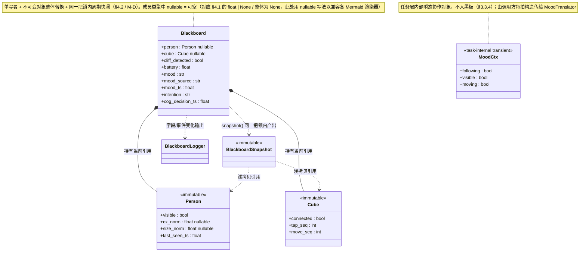
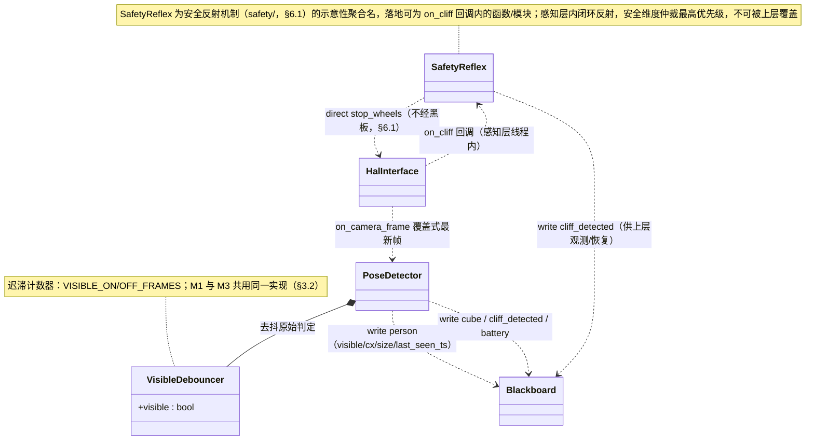
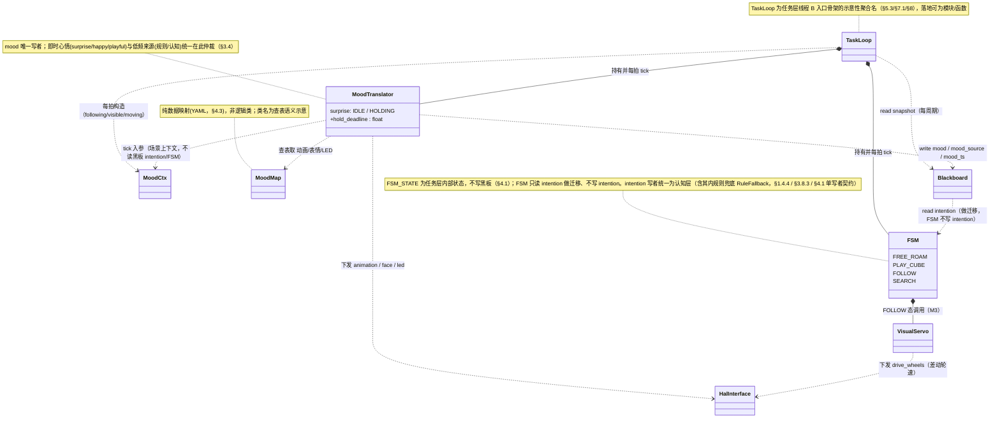
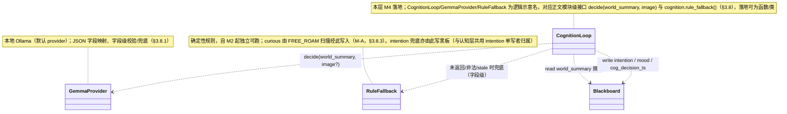

# Cozmo「跟人走」第一阶段 —— 功能设计文档（FDS）

> 状态：v4.1（在 §1 架构章节新增**分层类图**（§1.4）与**主流程状态图**（§1.5）；纯描述性补图，忠实反映既有模块/对象/状态，**无任何设计语义/对象/状态/字段变更**。v4.1 据 developer 对补图的评审修订：删 §1.4.3 误画的「FSM 写 intention」边、改为只读，使补图与 §3.6/§3.8.3/§4.1「intention 单写者=认知层（含其内规则兜底）」一致（DQ-1）；类图新起的聚合名 SafetyReflex/TaskLoop/MoodMap/CognitionLoop 等加 note 标注「示意名、落地可为模块/函数」与「纯数据(YAML)」（S-1/S-3/S-4）；MoodCtx stereotype 标 transient（S-2）；§1.5.1 note 把「连接中断」从安全反射名下析出、归 §6.2 停车重连（S-5）；类图成员类型的 `| None` 改 `nullable` 写法以兼容各 Mermaid 渲染器（S-8）；surprise 复见 mood 链从 FSM 迁移 label 精简、改引 §1.5.2（S-7）。**补图修订未改动任何正文设计语义**。详见文末「本轮（v4.1）补图评审处置记录」。沿用 v3；v2 已吸收 developer 代码评审：必须改 M-A~M-D + 建议改 S-1~S-10 + 设计疑问 DQ-1~DQ-4 + 需求澄清 CQ-1/CQ-2 全部处理并落盘）
> 上游需求：`docs/requirements/follow-me/follow-me-prd.md`（PRD v8，已定稿）
> 背景构想：`docs/ideas/follow-me-idea.md`
> 平台：Mac mini（Apple Silicon / 32GB）+ 实体 Cozmo，底层 [pycozmo](https://github.com/zayfod/pycozmo)
> 本文聚焦"怎么做"——把 PRD 的需求落成可实现的模块/机制/接口/数据契约，并按 M1→M4 增量演进。
> 编写原则：以文字 + 图表表达为主，契约性内容（接口签名、数据结构、枚举、配置项）用代码块精确表达；遵循奥卡姆剃刀，PRD 标 Out of Scope 的不设计进来。

---

## 1. 架构设计（总体骨架）

### 1.1 三层 + 黑板 + HAL 的总体结构

系统遵循 Gat 1998 三层模型（Reactive / Sequencer / Deliberator），各层**独立周期**运行，**只通过共享黑板（Blackboard）交换状态**，层间不互相直接调用。安全反射在感知层内闭环，绝不上送等待决策。

```
                          进程内（单进程多线程）
┌───────────────────────────────────────────────────────────────────────┐
│  认知层 Deliberator (cognition/)        线程 C  ~秒级 / 事件驱动（M4 接入）  │
│   读 world_summary（黑板快照摘要）→ 本地 Gemma agent loop / 规则兜底         │
│   产出 {intention, mood} + cog_decision_ts → 写黑板                        │
│   不下发任何电机指令；模型决策永不进实时控制环                                  │
└──────────────▲─────────────────────────────────────────┬────────────────┘
        world_summary 摘要 │                          intention / mood（低频）│
┌──────────────┴─────────────────────────────────────────▼────────────────┐
│  任务层 Sequencer (task/)               线程 B  ~10Hz（M2 起完整 FSM）       │
│   ① FSM：FREE_ROAM / PLAY_CUBE / FOLLOW / SEARCH（读 intention + 事实迁移） │
│   ② mood-translator：心情仲裁 + SURPRISE_HOLD 计时 + 翻译为动画/表情/LED      │
│   ③ 视觉伺服控制律（M3）：cx_norm→转向，size_norm→进退                       │
│   每周期对黑板取一次快照后再决策；经 HAL 下发电机/表情/LED/动画              │
└──────────────▲─────────────────────────────────────────┬────────────────┘
          facts 事实（读快照）│                          电机/表情/声音/LED 指令 │
┌──────────────┴─────────────────────────────────────────▼────────────────┐
│  感知层 Reactive (perception/)          线程 A  ~30Hz / 回调                │
│   摄像头帧 → MediaPipe Pose → person.visible（M1）+ cx/size（M3）           │
│   方块加速度计/连接、悬崖、电池、姿态 → 写黑板"事实"                          │
│   ★ 安全反射（safety/）：悬崖/碰撞→本层立即停轮，不等上层                     │
└───────────────────────────────────▲─────────────────────────────────────┘
                                     │ 帧/传感器回调 + 电机/LED 下发
                          ┌──────────┴──────────┐
                          │  HAL (hal/) 封装 pycozmo │  ← 唯一触达硬件的边界，便于 mock
                          └──────────┬──────────┘
                                     │ UDP / pycozmo 协议
                                ┌────▼────┐
                                │  Cozmo  │
                                └─────────┘
```

**数据流向（单向、解耦）**：下层向黑板写"事实"，上层从黑板读事实、写"目标/心情"。任何一层都不跨黑板直接调用另一层。唯一例外是安全反射——它在感知层内部直接经 HAL 停轮（见 §6.1），这是 PRD US4.4「不可绕过」的硬性要求。

### 1.2 各模块职责与周期一览

| 模块（目录） | 层 | 周期 | 核心职责 | 写黑板字段 | 读黑板字段 |
|---|---|---|---|---|---|
| `perception/` | 感知 | ~30Hz/回调 | 摄像头帧→Pose；方块/悬崖/电池/姿态采集；visible 去抖 | person*, cube, cliff_detected, battery | —（安全反射读 cliff，但在本层内） |
| `safety/` | 感知内 | 与传感器回调同步 | 悬崖/碰撞→立即停轮（必要时后退）；连接中断停车 | cliff_detected（标志） | —（直达 HAL） |
| `task/` | 任务 | ~10Hz | FSM 状态迁移；mood-translator（仲裁+计时+翻译）；视觉伺服控制律 | mood, intention(兜底时) | person*, cube, mood, intention, cliff, battery |
| `cognition/` | 认知 | 秒级/事件（M4） | Gemma agent loop + 规则兜底，产出 {intention, mood} | intention, mood, cog_decision_ts | world_summary（黑板摘要） |
| `world/` | 共享 | — | 黑板：线程安全的字段存储 + 快照 + 结构化日志 | （存储载体） | （存储载体） |
| `hal/` | 底层 | — | 封装 pycozmo：连接/电机/表情/动画/LED/方块/传感器回调；mock 可替换 | — | — |
| `moods/` | 配置/数据 | — | 心情→动画/表情/LED 映射表（数据，不含逻辑） | — | — |

> 注：`safety/` 在物理上运行于感知层线程（与悬崖/碰撞回调同步），逻辑上是"感知层内闭环的反射"，故归入感知层周期。

### 1.3 关键架构决策（需评审重点看）

1. **单进程多线程，而非多进程**：三层共享黑板是高频读写的核心耦合点，进程内共享内存 + 锁的成本远低于跨进程 IPC/序列化；MediaPipe 与 pycozmo 均为进程内库；Gemma 经 Ollama 走本地 HTTP（本身就是跨进程的模型服务，认知层只持有 client）。故主程序为单进程，感知/任务/认知各起一个线程（认知层 M4 才启）。详见 §7.1。
2. **黑板并发模型 = 单写者 + 不可变对象整体原子替换 + 同一把锁内周期快照**：直接落实 PRD US4.1 并发契约（复合对象构造后不可变、所有 `set_*` 与 `snapshot()` 走同一把 `threading.Lock`，不依赖 GIL）。详见 §4.2。
3. **mood-translator 从 M1 的独立轻量单元，到 M2 长成任务层 FSM 的一个子模块**——同一份代码增量演进、接口不变、不推翻。详见 §3.3 与 §8。
4. **安全维度仲裁固定 安全反射 > 规则 > 模型；心情维度固定 事件即时心情 > 防抖窗口最新有效来源**。仲裁逻辑集中在任务层（mood）与感知层（safety），不分散。详见 §3.4。

### 1.4 分层类图（主要对象与关系）

下列类图**仅描述主要对象名及其关系**（不含方法细节），按六层组织，与 §1.2 模块表、§3 各小节、§4.1 数据模型一一对应。**核心架构约束在图中体现**：层间不直接调用，一律经 `Blackboard` 写/读交换状态（图中 `..> Blackboard` 的写依赖与 `Blackboard <..` 的读依赖），唯一例外是安全反射经 `HalInterface` 直达停轮（见 §6.1）。

> 关系记号：实线菱形（`*--`）= 组合/拥有；空心三角（`<|--`）= 实现/继承；虚线箭头（`..>`）= 依赖（含"写/读黑板"的数据流，注释说明 write/read/direct）。

#### 1.4.1 共享层：黑板与数据对象（world/ + 复合数据对象）

黑板是层间唯一共享状态载体；`Person`/`Cube`/`MoodCtx` 等为构造后不可变的数据对象（§4.1/§4.2），仅标关键字段以体现数据契约，不画方法。



#### 1.4.2 感知层（perception/ + safety/）

感知层把帧/传感器事实写入黑板；安全反射在本层内闭环，经 HAL 直达停轮、不经黑板上送（§6.1）。



#### 1.4.3 任务层（task/：FSM + mood-translator + 视觉伺服）

任务层每拍先 `snapshot()` 再决策；FSM 负责状态/意图/行为原语，`MoodTranslator` 负责 mood 仲裁/计时/翻译，`VisualServo` 负责 M3 控制律。mood 字段唯一写者是 `MoodTranslator`（§3.3.4）。



#### 1.4.4 认知层（cognition/，M4 接入）

认知层在常驻线程 C 串行决策，读黑板摘要、写 intention/mood，永不下发电机指令；模型不可达/超时/stale 时由规则兜底接管。



#### 1.4.5 底层（hal/）

HAL 是唯一触达硬件的边界，`PycozmoHal` 为真实现、`MockHal` 供无硬件联调；内部 `_cliff_active` 硬闸是安全反射的最后防线（§5.1 契约 1 / §6.1）。


### 1.5 主流程状态图

#### 1.5.1 任务层 FSM 四态主流程（§3.6）

迁移条件均取自 §3.6 现有 ASCII 图与 §3.6.1~§3.6.3 文字（visible 去抖、intention、T1/T2/T3、PLAY_CUBE_IDLE_TIMEOUT、cube 断连等）。两类"立即停"均旁路 FSM、不作为状态迁移画入图内，仅以注释标注：悬崖/碰撞由安全反射处理（§6.1），连接中断由停车重连处理（§6.2）——二者口径不同、不混称。

```mermaid
stateDiagram-v2
    [*] --> FREE_ROAM

    FREE_ROAM --> PLAY_CUBE : intention=play_cube 且 cube.connected
    FREE_ROAM --> FOLLOW : visible 去抖=true 且意图允许跟随

    PLAY_CUBE --> FREE_ROAM : PLAY_CUBE_IDLE_TIMEOUT 无新 tap/move
    PLAY_CUBE --> FREE_ROAM : cube.connected 变 false（方块断连）
    PLAY_CUBE --> FOLLOW : visible 去抖=true 且意图允许跟随

    FOLLOW --> SEARCH : visible 去抖丢失 > T1

    SEARCH --> FOLLOW : visible 去抖重见（复见 mood 链见 §1.5.2）
    SEARCH --> FREE_ROAM : 进入 anxious 起 > T3 仍未重见 → calm

    note right of SEARCH
        进入即 confused；丢失 > T2 → anxious（§3.6.3）
    end note
    note left of FREE_ROAM
        任意状态立即停、旁路 FSM、不作为状态迁移：
        · 悬崖/碰撞 → 安全反射（§6.1）
        · 连接中断 → 停车 + 重连（§6.2）
    end note
```



#### 1.5.2 surprise 心情生命周期主流程（§3.5）

mood-translator 内部的 surprise 子状态（`IDLE / HOLDING`）与降级落点，取自 §3.5 四点实现与 §3.3.4 入参契约。降级落点由 `tick(snap, ctx, now)` 入参 `ctx.following`/`ctx.visible` 决定；细节（视觉伺服分区、字段级兜底等）不在此图展开。


---

## 2. 需求 → 设计映射

下表逐条把 PRD 的 User Story / 心情 / 阈值常量 / 黑板字段映射到本设计的落点，证明覆盖无遗漏。

| PRD 条目 | 设计落点（模块/机制/接口） | 里程碑 |
|---|---|---|
| US1.1 连接+苏醒动画 | `hal.connect()` + `hal.play_animation(wake)`；main.py `--demo connect`；§5.1 启动序列；电量经黑板日志 | M1 |
| US1.2 最小人体识别 visible | `perception.PoseDetector`（§3.1）+ `VisibleDebouncer`（§3.2）；person 复合对象预留 cx/size 子字段；感知层耗时/帧率日志（§3.1.3） | M1 |
| US1.3 见人 surprise | `mood-translator`（§3.3）：visible 上升沿→mood=surprise→HOLD→降级 calm；§3.4 仲裁；§3.5 时序边界 | M1 |
| US2.1 自由活动+遇崖停 | `task.FreeRoamState`（§3.6.1）随机游走；`safety`（§6.1）悬崖停轮+CLIFF_BACKOFF_MAX 后退 | M2 |
| US2.2 玩方块 | `task.PlayCubeState`（§3.6.2）；cube **新 tap_seq/move_seq 事件**（§4.1 单调序号比对，M-B）→即时心情 happy/playful；PLAY_CUBE_IDLE_TIMEOUT 或 cube 断连回退 | M2 |
| US2.3 自由活动心情 | mood-translator 翻译认知/规则心情；最短保持防抖（§3.4） | M2 |
| US3.1 转向居中 | 视觉伺服转向律（§3.7.1）：cx_norm→差动转向，TURN_DEADZONE 死区+迟滞 | M3 |
| US3.2 进退距离 | 视觉伺服距离律（§3.7.2）：size_norm 分区 + 迟滞 + size_max_hard | M3 |
| US3.3 跟随心情 | FOLLOW 态心情：calm/happy；移动期心情走表情/LED 不占轮（§3.7.3） | M3 |
| US3.4 丢人升级+搜索 | `task.SearchState`（§3.6.3）+ T1/T2 计时（mood-translator/FSM 共用单调时钟）；复见 surprise→happy | M3 |
| US3.5 长时间收尾 T3 | SEARCH 态 anxious 起计 T3 → calm + FREE_ROAM（§3.6.3） | M3 |
| US3.6 去抖+多人选择 | `VisibleDebouncer`（M1/M3 共用）+ 多人选 size_norm 最大者（§3.1.2，M3 起生效） | M1/M3 |
| US4.1 三层周期+黑板解耦 | §1 架构；§4.2 并发契约（单写者+不可变整体替换+同一把锁内快照，M-D）；§7 并发模型 | M2 |
| US4.2 认知决策意图/心情 | `cognition.decide()`（§3.8）结构化输出；**字段级校验、字段级兜底**（合法字段保留、非法字段走兜底，S-10/CQ-2，US4.2「非法枚举不被采纳」的实现细化、不改本意） | M4 |
| US4.3 规则兜底+仲裁 | `cognition.rule_fallback()`（§3.8.3）；COG_DECISION_TTL stale 失效；§3.4 仲裁 | M4（仲裁框架 M2 起） |
| US4.4 安全反射不可绕过 | `safety`（§6.1）感知层内闭环，仲裁最高优先级 | M2 |
| US4.5 结构化日志 | `world.BlackboardLogger`（§3.9）逐字段/事件 JSON 行 | M2（M1 已用于 visible/帧率/mood 日志） |
| US4.6 断连重连恢复 | `hal` 连接监控 + `task` 重连恢复（§6.2）；RECONNECT_MAX_RETRIES；重连回 FREE_ROAM | M2 |
| 七种心情 calm/happy/playful/curious/confused/anxious/surprise | `moods/` 映射表（§4.3）+ mood 枚举（§4.1）；触发落点：surprise=visible 上升沿(§3.5)、happy/playful=cube 新事件/复见(§3.6.2/§3.6.3)、confused/anxious=丢人 T1/T2(§3.6.3/§3.8.3)、calm=默认/降级、**curious=FREE_ROAM 探索扫描经规则兜底写入(§3.6.1/§3.8.3，M-A 闭合死分支)** | M1（surprise/calm）→ M2（+curious/playful/confused/anxious 等规则兜底全量）→ M3（happy 复见链） |
| 阈值常量 T1/T2/T3/SURPRISE_HOLD/VISIBLE_ON·OFF_FRAMES/TURN_DEADZONE/size_*·size_max_hard/CLIFF_BACKOFF_MAX/COG_DECISION_TTL/RECONNECT_MAX_RETRIES/PLAY_CUBE_IDLE_TIMEOUT | `config.yaml`（§4.4）集中管理 | 各 M |
| 黑板字段契约（PRD §11） | §4.1 数据模型 + §4.2 读写契约（同一把锁+不可变，M-D）；cube 即时事件由 PRD §11 的 tapped/moved **实现细化为 tap_seq/move_seq 单调序号**（M-B，语义等价"是否发生新事件"、规避清零写冲突，不违背 PRD 单写者契约） | 字段按 M1/M3 启用时机 |

---

## 3. 功能设计详述

### 3.1 感知层：帧获取与人体识别

#### 3.1.1 帧管线结构

感知层主循环（线程 A）以"拉取最新帧 → Pose 推理 → 去抖 → 写黑板"为一拍。pycozmo 以回调推送摄像头帧，HAL 维护"最新帧"槽位（覆盖式，丢旧帧只留最新），感知层主循环从槽位取最新帧推理——**避免帧积压导致时延累积**（低帧率设备宁可丢帧也不排队）。

```
HAL 帧回调 ──写──► [latest_frame 槽位(带锁,覆盖式)] ──读──► 感知主循环
                                                          │
              ┌───────────────────────────────────────────┘
              ▼
   MediaPipe Pose 推理（拿到完整 landmark）
              │
     ┌────────┴─────────┐
   landmark 检出?        landmark→（M3 才算）cx_norm/size_norm
     │                   （M1：cx/size = None，不计算）
     ▼
  VisibleDebouncer（多帧确认）
     │
     ▼
  组装 person 复合对象 → 整体原子写入黑板（§4.2）
     │
     ▼
  记录逐帧耗时/帧率 → 结构化日志（§3.9）
```

#### 3.1.2 visible 判定与多人选择

- **visible 原始判定**：单帧内 MediaPipe Pose 是否检出有效人体 landmark（达到关键点置信度门限即记为"本帧有人"）。该原始 bool 喂给去抖器，**不直接写黑板**。
- **多人选择（M3 起生效）**：若单帧检出多组 pose，选 `size_norm` 最大者（最近）作为跟随目标，其 landmark 用于算 cx/size。M1 只需"有没有人"，不做选择。该规则在感知层落地，使黑板 person 始终代表"当前跟随目标"。

#### 3.1.3 感知层性能可观测（M1 即需）

M1 无 Gemma，"可观测"下沉到感知层自身：每帧记录 Pose 推理耗时；按滑动窗口估算达成帧率（FPS）；经 §3.9 结构化日志按固定间隔（如每秒一条）输出。这是 visible 去抖窗口/时延阈值联调调参的数据来源（PRD Q6）。

> 设计取舍：耗时/FPS 日志按"采样汇总"输出（每秒一条聚合），而非逐帧刷屏，避免日志 I/O 反噬感知层帧率。

#### 3.1.4 感知层输出对象（预留 M3 扩展点）

感知层产出的 person 对象设计为**可承载子字段的复合结构**，M1 时 cx/size 为 None，M3 仅填充子字段，不改帧获取与 Pose 调用结构。数据结构见 §4.1。这样黑板 person「整体原子替换」契约在 M1/M3 都成立。

### 3.2 visible 双向多帧去抖（VisibleDebouncer）

落实 US1.2 / US3.6，M1 与 M3 **共用同一实现**，不在 M3 重定义。

- **状态**：当前去抖后的 `visible`（稳定值）、连续命中计数、连续未命中计数。
- **规则（迟滞计数器）**：
  - 当稳定值为 false 时：原始判定连续 true 达 `VISIBLE_ON_FRAMES`（默认 3）→ 翻转为 true（**上升沿**，下游据此触发 surprise）；其间任一帧原始为 false 则 ON 计数清零。
  - 当稳定值为 true 时：原始判定连续 false 达 `VISIBLE_OFF_FRAMES`（默认 3）→ 翻转为 false（下降沿，T1 计时基准）；其间任一帧原始为 true 则 OFF 计数清零。
- **关键产物**：
  - 翻转为 true 的瞬间 → 记录上升沿事件（mood-translator 消费）。
  - 翻转为 false 的瞬间 → 更新 `person.last_seen_ts` 并记录下降沿时刻（T1 计时起点）。
- **去抖时刻的时间基准**：`last_seen_ts` 与 T1 起点均取**去抖判定成立的那一帧时刻**（单调时钟），而非原始单帧时刻——保证 PRD「T1 基于去抖后 visible 由 true→false 时刻起算」。

> 单帧漏检/误检在 ON/OFF 计数窗口内被吸收，不翻转 visible，不触发状态切换（US3.6）。

### 3.3 mood-translator（心情翻译/计时单元）

PRD 的核心设计落点之一。它**归任务层职责**（是 mood 的合法写者），但 M1 时**不是完整 FSM**（不持状态机状态、不读写 intention）。

#### 3.3.1 职责（贯穿 M1→M2 增量演进）

| 能力 | M1（轻量形态，独立单元） | M2+（任务层 FSM 的子模块） |
|---|---|---|
| 消费 visible 上升沿 → 触发 surprise | ✓ | ✓ |
| SURPRISE_HOLD 计时 + 到期降级 | ✓（降级落点固定 calm） | ✓（降级落点按场景：跟随→happy，否则 calm） |
| 心情仲裁（即时 > 防抖窗口最新有效） | ✓（仅 surprise vs 默认 calm） | ✓（全量来源仲裁，§3.4） |
| 最短保持防抖 | ✓（仅 SURPRISE_HOLD） | ✓（所有心情最短保持） |
| 把 mood 翻译为动画/表情/LED → HAL | ✓ | ✓ |
| 读写 intention / 状态迁移 | ✗（不碰） | ✗（仍由 FSM 主体负责；mood-translator 只管 mood） |

**增量演进要点**：M1 的 mood-translator 是一个独立的 `MoodTranslator` 对象，由 M1 的极简任务层循环每拍调用。M2 引入完整 FSM 时，`MoodTranslator` 原样作为 FSM 的协作对象被复用——FSM 负责 intention/状态，`MoodTranslator` 仍负责 mood 仲裁/计时/翻译。**接口与内部计时逻辑不变，不推翻**。

#### 3.3.2 心情翻译

mood 翻译是"查表 + 下发"：从 `moods/` 映射表（§4.3）按当前 mood 取得 {动画名/表情参数/LED 颜色}，经 HAL 下发。**最短保持期内不重复下发同一心情的整段动画**（防抖，避免动画被频繁打断 US2.3/US3.3）；仅在 mood 实际切换时下发新表现。

#### 3.3.3 跟随移动期的心情表达约束（US3.3）

FOLLOW 态移动中，心情**只走表情/眼睛/LED**；占用车轮的整段 `.bin` 动作动画在移动期不播放或被打断，避免抢占转向/距离控制。mood-translator 据"当前是否处于移动控制中"（由任务层提供的一个标志）决定下发"轮式动画"还是"仅表情/LED"。

#### 3.3.4 tick 入参契约（S-1，澄清 mood-translator 如何获取场景上下文）

mood-translator **不持状态机状态、不读黑板 intention/FSM 状态**（保持其"非 FSM"定位）。它降级落点需要的"场景上下文"由**调用方每拍作为入参传入**，而非自己去读黑板 FSM 状态：

```python
class MoodTranslator:
    # 每拍调用一次；ctx 由调用方（M1 极简循环 / M2 FSM 主体）构造后传入
    def tick(self, snap: "BlackboardSnapshot", ctx: "MoodCtx", now: float) -> None: ...

# MoodCtx：调用方据自身状态构造的场景上下文（任务层内部协作对象，不入黑板）
MoodCtx = {
    "following": bool,   # 当前是否处于跟随场景（M2+ 由 FSM 据自身状态=FOLLOW 给出；M1 恒 False，无跟随）
    "visible": bool,     # 当前去抖后 visible（取自 snap.person）
    "moving": bool,      # 当前是否处于移动控制中（§3.3.3 决定下发轮式动画 or 仅表情/LED）
}
```

- **谁来填 `following`**：M2+ 由 FSM 主体每拍把"自身状态是否为 FOLLOW"折算成 `following` 传入；FSM 状态仍是任务层内部对象，mood-translator 经入参拿到、**不直接读它**——既满足 surprise 降级落点（§3.5）按场景判 happy/calm 的需要，又不破坏"translator 不持状态、不读 intention"的定位。
- **谁来填 `moving`**：由控制律执行点（§3.7.3）每拍告知是否正占轮移动，决定 mood 表达走轮式动画还是仅表情/LED。
- **M1 形态**：M1 极简循环恒传 `following=False`（M1 无跟随），故 surprise 降级落点恒为 calm，与 §3.5/§8 一致。

> 这同时消除 S-1 指出的"两写者写同一 mood 字段、HOLD 结束那拍谁有写权"歧义：**mood 字段的唯一写者是 mood-translator**（surprise 计时、降级、即时心情、低频来源仲裁全部在它内部完成）；FSM/规则不直接写 mood，只通过"把 confused/anxious 等作为低频来源经 ctx/snap 传给 translator、由 translator 仲裁后落 mood"。任务层内部"单写 mood = mood-translator"这一点保证 HOLD 结束那拍写权无歧义（§3.4 仲裁链统一在 translator 内裁决）。

### 3.4 心情仲裁（统一框架）

落实 US4.3 / US1.3 / 第 5 节。仲裁集中在 mood-translator，**两个维度**：

**安全维度（不在 mood-translator，在 safety + 上层目标）**：安全反射 > 规则 > 模型。安全反射停车不可被任何心情/意图覆盖（§6.1）。

**心情维度**（mood-translator 内）：

```
优先级（高 → 低）：
  ① 事件驱动即时心情（surprise / 被拍 happy / 被移动 playful）
        其中 surprise 在 SURPRISE_HOLD 内享有"最短保持"，期内不被同级或更低打断
  ② 通过防抖窗口的最新有效来源（认知层低频心情 / 规则兜底心情）
```

- **即时心情来源**：由任务层据感知事实直接触发（visible 上升沿→surprise、cube 新 tap 事件→happy、cube 新 move 事件→playful；事件识别用 §4.1 单调序号比对，见 M-B）。
- **低频心情来源**：认知层写入 mood（M4）或规则兜底写入 mood（M2 起），含 calm/curious/confused/anxious 等——其中 **curious 由规则兜底在 FREE_ROAM 扫描动作时写入**（M-A，§3.8.3）。
- **来源区分**：mood-translator 内部维护即时心情的"是否处于保持期"状态，无需把"来源"持久化到黑板。但为支撑 US4.3 仲裁与可观测，黑板 mood 配套写入 `mood_source`（immediate/cognitive/rule）与 `mood_ts`（见 §4.1）——满足 PRD §11「心情需可区分来源」。

> 仲裁结果的最终产物只有一个：当前生效 mood（写黑板 + 翻译下发）。

### 3.5 surprise 时序边界四点的实现（US1.3 / US4.3）

这是 PRD 反复强调的无歧义点，逐点给出状态/计时实现。mood-translator 维护一个 surprise 子状态：`IDLE / HOLDING`，并持有 `hold_deadline`（单调时钟）。

```
                visible 上升沿
        IDLE ─────────────────────► HOLDING（mood=surprise, hold_deadline=now+SURPRISE_HOLD）
         ▲                              │  到 hold_deadline
         │                              ▼
         │                     按"落点单调升级链"决定降级 mood：
         │                       · 跟随场景且人仍可见 → happy
         │                       · 人不可见且未到 T1   → calm
         │                       · (随后 T1 到→confused, T2 到→anxious 由 FSM/规则推进)
         │                       · M1 无跟随 → 一律 calm
         └──────────────────────────────┘
```

**四点实现**：

1. **同层处理（不被同级打断）**：HOLDING 态收到同级即时事件（被拍/被移动）→ **丢弃**（设计选定"丢弃"而非"延后"，理由见下）。surprise 保持不变直到 hold_deadline。
   - 选"丢弃"理由：被拍/被移动是瞬时事件，延后到 HOLD 结束（最多 1.5s 后）再补播，语义上已是过期反应、易造成"动作迟到"的违和；而 surprise 本就是强反应，期内丢弃同级瞬时事件对体验影响小、实现也最简（无需事件队列）。PRD 允许二选一，此处定为**丢弃**。
2. **不冻结 T1**：T1 计时由 `last_seen_ts`（去抖下降沿时刻）独立驱动，**不读 surprise 子状态**——即 surprise 在 HOLD 与否完全不影响 T1。安全反射可随时打断 surprise（§6.1 优先级最高）。
3. **空窗心情归属（单调升级链）**：hold_deadline 到达时，mood-translator 按当下事实查"落点"，事实取自 `tick(snap, ctx, now)` 入参（S-1）——`ctx.following`+`ctx.visible` 为真→happy；`ctx.visible` 为假且未到 T1→calm；M1（`ctx.following` 恒假）→calm。**"是否跟随场景"由调用方经 `ctx.following` 传入，mood-translator 不直接读 FSM 状态/intention**（§3.3.4）。此后 confused/anxious 由 T1/T2 计时单调推进，calm→confused→anxious **不回退**（升级链由 FSM/规则作为低频来源经 translator 单向推进，mood-translator 不做反向降级）。
4. **边沿触发不重入**：HOLDING 态再次收到 visible 上升沿（边界抖动）→ **忽略**，不重置 hold_deadline、不叠加新一轮。仅 IDLE 态的上升沿才进入 HOLDING。保持期内 visible 抖动只通过 `last_seen_ts` 影响 T1 基准（以最后一次去抖后的 false 起算），不影响 surprise。

### 3.6 任务层 FSM（M2 起）

状态机状态（大写）：`FREE_ROAM / PLAY_CUBE / FOLLOW / SEARCH`。读黑板 `intention`（小写枚举）+ 感知事实做迁移。FSM 主体负责 intention/状态/行为原语，mood 全权交给协作的 mood-translator。

```
                         intention=play_cube 且 cube.connected
        ┌──────────────────────────────────────────────┐
        │                                                ▼
   ┌─────────┐  intention=follow / visible 去抖=true  ┌──────────┐
   │FREE_ROAM│◄───────────────────────────────────────│PLAY_CUBE │
   └────┬────┘   PLAY_CUBE_IDLE_TIMEOUT 无互动回退      └──────────┘
        │  visible 去抖=true（且意图允许跟随）
        ▼
   ┌─────────┐  visible 去抖丢失 > T1                 ┌──────────┐
   │ FOLLOW  │───────────────────────────────────────►│  SEARCH  │
   └─────────┘◄───────────────────────────────────────└────┬─────┘
        ▲   visible 去抖重见（复见→surprise→happy→FOLLOW）   │
        │                                                    │
        └────────────────────────────────────────────────────┘
                  SEARCH 中 anxious 起 T3 超时 → FREE_ROAM + calm

   （任意状态）悬崖/碰撞/连接中断 → 安全反射立即停（§6.1），不经 FSM
```

#### 3.6.1 FREE_ROAM（US2.1 / US2.3）

随机游走：周期性生成随机的前进/转向原语（非固定路径），受悬崖反射约束。心情由认知/规则写入、mood-translator 翻译。悬崖反射在感知层内闭环，FSM 无需轮询悬崖即可保证安全（但 FSM 也会读 `cliff_detected` 决定恢复时机）。

**curious 触发落点（M-A，本设计确定性来源之一）**：FREE_ROAM 每生成一段"探索性扫描"原语（原地慢转/头部转动张望，区别于直线前进）时，规则兜底（§3.8.3）给出 `mood=curious`，对应 PRD 第 5 节 curious 触发场景"发现新目标/扫描中"。该 mood 与 calm/playful 同走 §3.4「通过防抖窗口的最新有效来源」一档，受最短保持约束、不与 surprise 等即时心情冲突；下一段直线游走或进入其它状态时由后续来源覆盖。这样 curious 有确定性写入路径、不再是死分支。详细规则见 §3.8.3。

#### 3.6.2 PLAY_CUBE（US2.2）

进入条件：`cube.connected` 且 `intention=play_cube`（认知/规则给出；无认知时规则可周期性按概率选 play_cube）。
- 点亮方块 LED：颜色/节奏随当前 mood（查 `moods/` 表）。
- **监听 cube 事件（单调序号比对，M-B）**：PlayCube 在自己内存保存 `_last_tap_seq`/`_last_move_seq`（**任务层私有、不写黑板**）。每拍快照后比对：`cube.tap_seq > _last_tap_seq` → 识别到新拍击 → 将 happy 作为即时心情来源经 mood-translator（见 §3.3.4）落 mood，而非 FSM 直接 set_mood；`cube.move_seq > _last_move_seq` → 识别到新移动 → 同理将 playful 作为即时心情来源经 mood-translator 落 mood；处理后把私有计数**追平到当前序号**（序号差>1 表示跨拍漏读多次，按"最近一次事件"处理一次即可，不补播）。1s 内切心情（§6.3 时延口径），**不经认知层**。不再使用旧 `tapped`/`moved` bool（避免 30Hz 写/10Hz 读丢事件或重复触发）。
- 退出（两条）：
  - 持续 `PLAY_CUBE_IDLE_TIMEOUT`（默认 12s）无新 tap/move 事件（即 `tap_seq`/`move_seq` 在该窗口内无增长）→ 回 FREE_ROAM。
  - **方块断连（S-7，US4.6）**：`cube.connected` 变 false → 立即退出 PlayCube 回 FREE_ROAM。方块断连**只影响 PlayCube 可用性、不触发整机重连**（整机重连仅针对 Cozmo 主连接，见 §6.2），Cozmo 主连接不受影响、继续运行。

#### 3.6.3 FOLLOW / SEARCH（US3.1~US3.5）

- **FOLLOW**：执行视觉伺服（§3.7）。稳定跟随 mood=calm；靠近到目标区间 mood=happy；复见经 surprise→happy。visible 去抖丢失 > T1 → 进 SEARCH。
- **SEARCH**：
  - 进入即 mood=confused，原地慢转/左右张望扫描。
  - 自丢失起 > T2 → mood=anxious，加快/扩大搜索 + 黄/红 LED。
  - 去抖重见 → surprise（短暂保持）→ happy → 回 FOLLOW。
  - 自进入 anxious 起 > T3（默认 30s）仍未重见 → mood=calm，回 FREE_ROAM（US3.5）。
- **T1/T2/T3 计时（S-2，写死计算口径）**：基于单调时钟。**T1/T2 每拍用 `now - snap.person.last_seen_ts` 实时计算**，而非"进入某状态时锁定起点"——感知层每次去抖下降沿更新 `last_seen_ts`，任务层每拍据最新值实时比对，故 HOLD 期内 visible 抖动导致 `last_seen_ts` 被刷新时，T1/T2 自动以"最后一次去抖后的 false"为基准（与 §3.5 第 4 点、PRD US3.4「T1 以最后一次去抖后 false 起算」一致，无需额外冻结/重置逻辑）。T3 例外：以"进入 anxious 时刻"为基准（进入 anxious 时记一次单调时刻，此后实时比对 `now - anxious_enter_ts`）。

### 3.7 视觉伺服控制律（M3）

输入 `cx_norm∈[-1,1]`、`size_norm∈[0,1]`，输出差动轮速。**转向与距离两路解耦叠加**：左右轮速 = 基础前进速度（距离律） ± 转向修正（转向律）。

#### 3.7.1 转向律（US3.1）

- **死区 + 迟滞**：`|cx_norm| ≤ TURN_DEADZONE`（默认 0.15）→ 不发转向指令（稳态判据，避免静止往复）。
- 出死区后，转向角速度与 `cx_norm` 成比例（**纯 P 控制，无 I/D 项**，比例系数可配置），并设速度上限。
- **采样率不匹配的鲁棒性（S-6）**：任务层 10Hz 消费感知层 ~15fps 的 cx/size，可能重复采样同一帧。**纯 P 控制对"快于感知层的重复采样"不敏感**（同一输入产生同一输出、无累积误差）；稳态依赖**死区 + 迟滞**而非积分项。**故意不加 D 项**——微分对重复采样会放大噪声（相邻两拍读到同帧时数值阶跃，D 项会算出虚假大速率）。距离律（§3.7.2）同理为分区+迟滞、无微分。
- **迟滞**：进入死区与离开死区用不同阈值（离开阈值略大于进入阈值），防止边界抖动反复触发。
- cx_norm 已在感知层做时间滤波平滑（§3.7.4）。

#### 3.7.2 距离律（US3.2）

按 size_norm 分区，区间边界带迟滞：

```
 size_norm <  size_min                       → 前进（人远）
 size_min  ≤ size_norm ≤ size_max            → 维持/停（目标区间，不蠕动）
 size_max  <  size_norm ≤ size_max_hard      → 停车不后退（偏近）
 size_norm >  size_max_hard                   → 后退（过近）
```

- **稳态判据**：人静止在目标区间内 → 停住，不反复前后蠕动（区间内不发进退指令）。
- **迟滞**：进入/离开各区间的阈值不同（如"远→维持"的进入阈值高于"维持→远"的离开阈值），防边界抖动。

#### 3.7.3 移动期心情解耦（US3.3）

移动控制期间，mood-translator 收到"移动中"标志，只下发表情/眼睛/LED 心情表达，不下发占轮整段动画（§3.3.3）。

#### 3.7.4 信号平滑

cx_norm / size_norm 在感知层做时间滤波（如指数滑动平均，系数可配置），输出平滑值写黑板。接受"平滑滞后跟随、非紧跟"（PRD 第 6 节检测鲁棒性）。控制律消费平滑后的值。

### 3.8 认知层 agent loop（M4）

统一接口，本地 Gemma（Ollama）为默认 provider，云端为可选 fallback（本期不交付云端实现，仅保留切换能力）。

#### 3.8.1 统一接口

```python
# cognition 对外统一接口（provider 无关）
def decide(world_summary: dict, image: bytes | None = None) -> dict:
    """返回 {"intention": <枚举>, "mood": <枚举>}；字段级校验：合法字段保留，非法/缺失字段置 None。
    两字段均非法/缺失时返回 {"intention": None, "mood": None}（等价整体未返回，走规则兜底）。"""
```

- **运行模式**：事件驱动 + 低频轮询（每 1–2s 或关键事件），非每帧（US4.2）。
- **线程模型**：在认知层**唯一常驻线程 C 内串行执行**（§7.1，S-4）——前一次决策未完成则跳过本次触发、不堆积、不另起子线程。
- **thinking**：高频意图/心情决策关 thinking 求快；偶发复杂看图理解才开 thinking，多模态看图低频（≥5s 或关键事件），不与高频决策叠加（PRD 第 6 节，控 CPU/内存带宽，不抢 MediaPipe）。
- **输入**：`world_summary`（黑板摘要：电池、是否见人/方块、当前 mood/intention、关键事件）+ 可选图像快照。
- **多模态快照取帧（N-1 / CQ-1）**：可选图像快照**复用感知层"最新帧槽位"（§3.1.1）**，接受 320×240 灰度低质，零额外摄像头带宽、不抢 MediaPipe。**取帧走槽位锁、与感知层覆盖写互斥**（认知层在槽位锁内拷出当前帧引用即释放，不在锁内做编码/推理）。**本期多模态为可选辅助决策、不作硬验收**（PRD 已如此定义，无需回需求阶段）。
- **输出处理（字段级校验、字段级兜底，S-10 / CQ-2）**：模型返回 JSON → 解析 → **对 intention、mood 各自独立校验是否合法枚举**：
  - 某字段合法 → 采纳该字段，写黑板 + `cog_decision_ts`。
  - 某字段解析失败/非法枚举/缺失 → **该字段单独走规则兜底**（合法的另一字段不受牵连，不整体丢弃）。
  - 两字段都非法 → 等价"模型未返回"，整体走规则兜底，**绝不写非法值**（US4.2）。
  > 粒度说明（CQ-2）：这是对 PRD US4.2「非法枚举不被采纳」的**实现细化**——把粒度细化到字段级（合法字段保留、非法字段走兜底），**不改变需求本意**（非法值一律不被采纳）。比"整体返回 None 丢弃合法 intention"更鲁棒、成本相同。

> PRD 明确本期不依赖模型原生 function calling（US4.2 说明），以"模型输出 JSON 字段 → 任务层读取执行"实现。下述 function calling 工具集（PRD 构想第 7 节）作为**接口层语义定义**保留，第一阶段以 JSON 字段映射等价实现：`set_intention`/`set_mood` 等价于输出 JSON 的 intention/mood 字段；`get_world_state` 等价于把 world_summary 作为输入喂入；`play_animation` 不暴露给模型（动画下发是任务层职责，模型不直接控硬件）。这样 M4 后续若启用原生 function calling，可平滑切换而不改上层。

#### 3.8.2 stale 失效（COG_DECISION_TTL）

任务层读 intention/mood 时校验 `now - cog_decision_ts ≤ COG_DECISION_TTL`（默认 2× 认知层决策周期）。超期的（stale）模型决策作废，不得覆盖更新的规则状态（US4.3，防止模型晚到把已升级到 anxious 的状态拉回旧值）。stale 时任务层使用规则兜底结果。

#### 3.8.3 规则兜底（US4.3）

确定性规则，模型未返回/超时/不可达/stale 时给出默认 intention/mood：

- 看见人（visible 去抖=true）→ intention=follow。
- 人丢 > T1 → confused / 意图 search_person；> T2 → anxious。
- **低电量 → intention=stop**（S-8：低电量是状态量、非瞬时安全事件，统一归规则兜底处理，**不在 §6.1 安全反射内**；§6.1 安全反射只保留悬崖/碰撞两类真正瞬时事件，两处口径已对齐，不再重复"低电量停车"）。
- 自由活动默认 → free_roam，并可周期性按概率选 play_cube（cube.connected 时）。
- **探索扫描 → mood=curious（M-A）**：FREE_ROAM 处于"探索性扫描"原语（原地慢转/头部张望，§3.6.1）期间，规则兜底写 `mood=curious`，落实 PRD 第 5 节 curious 触发"发现新目标/扫描中"。这是 curious 在 M1~M3 的**唯一确定性写入路径**；M4 接入后认知层亦可按场景写 curious，与规则兜底走同一 mood 字段、同一仲裁（§3.4）。

> curious 触发归属说明（M-A，闭合"七种心情未闭环"）：本设计选**规则兜底（FREE_ROAM 扫描动作）**作为 curious 的确定性落点，而非"SEARCH 进入瞬间给 curious 再转 confused"——后者会与 PRD US3.4「进入 SEARCH 即 confused」的明确语义打架（SEARCH 是"丢人着急找"，给 curious 语义不符）；FREE_ROAM 探索扫描才契合 PRD curious 触发场景"发现新目标/扫描中"。此落点自 M2 规则兜底就位即生效（FREE_ROAM 属 M2），M1 无 FREE_ROAM 故 M1 不触发 curious（M1 只有 surprise/calm，与 §8 里程碑表一致）。

规则兜底**自 M2 起就独立可跑**（M2~M3 全程用规则跑通），M4 才叠加 Gemma；模型返回且未 stale 时覆盖规则结果（仲裁见 §3.4，安全反射永不可覆盖）。

### 3.9 结构化日志（US4.5，M2 起；M1 已部分使用）

`world.BlackboardLogger` 输出逐条 JSON/键值行：
- 黑板关键字段（person/cube/mood/intention/battery/cliff）的当前值与变化。
- 关键事件条目：状态机迁移、心情切换（含 surprise→calm/happy）、丢人/复见、模型覆盖/兜底生效、连接中断/重连。
- M1 专用：感知层逐帧耗时/达成帧率（聚合）、mood 由 surprise→calm 的切换条目（M1 可观测验收锚点）。

> 图形面板 Out of Scope，本期只交付结构化日志，可被人工查看或后续工具消费。

---

## 4. 数据设计

### 4.1 黑板数据模型（落实 PRD §11 字段契约）

黑板是层间唯一共享状态。字段表（单写者 + 类型 + 启用里程碑）：

```python
# person 复合对象（感知层单写，整体原子替换）
# M1：visible/last_seen_ts 有效；cx_norm/size_norm = None
# M3：填充 cx_norm/size_norm 子字段
person = {
    "visible": bool,            # 经多帧确认（US3.6），M1 起
    "cx_norm": float | None,    # [-1,1]，0=画面中央，M3 起
    "size_norm": float | None,  # [0,1]，近似远近，M3 起
    "last_seen_ts": float,      # 单调时钟，最近一次稳定可见时刻，M1 起
}  # 或整体为 None（从未见过人时）

cube = {                        # 感知层单写，整体原子替换
    "connected": bool,
    "tap_seq": int,             # 拍击事件单调自增序号（感知层单写、永不清零）；任务层比对识别新事件
    "move_seq": int,            # 移动事件单调自增序号（同上）
}  # 或 None
# 说明（M-B）：tap_seq/move_seq 取代旧 tapped/moved bool。感知层每发生一次拍/移动 +1、永不清零、
#   随 cube 整体原子替换；任务层(PlayCube)在自己内存保存 _last_tap_seq/_last_move_seq（私有、不写黑板），
#   每拍比对 cube.tap_seq > _last_tap_seq 识别新事件，处理后追平。跨 30Hz 写/10Hz 读不丢不重，单写者保持。

# 标量/枚举字段
cliff_detected: bool            # 感知层单写，驱动安全反射
battery: float                  # 感知层单写，电压 V
mood: str                       # 任务层(即时)/认知层(低频)写，§3.4 仲裁；七种枚举
mood_source: str                # 任务层写，immediate/cognitive/rule，支撑 US4.3 仲裁 + 可观测
mood_ts: float                  # 任务层写，mood 最近更新时刻（单调时钟）
intention: str                  # 认知层写，无返回时规则兜底写；意图枚举
cog_decision_ts: float          # 认知层写，最近决策时刻，用于 COG_DECISION_TTL stale 判定
```

**枚举集合**：

```python
MOOD = {"calm", "happy", "playful", "curious", "confused", "anxious", "surprise"}   # 七种
INTENTION = {"free_roam", "play_cube", "follow", "search_person", "stop"}
FSM_STATE = {"FREE_ROAM", "PLAY_CUBE", "FOLLOW", "SEARCH"}   # 状态机状态，不写黑板，任务层内部
```

> PRD 术语表强调：状态机状态（大写）≠ intention（小写）。FSM_STATE 是任务层内部状态，不进黑板；intention 是认知/规则写入黑板的决策意图。二者不混为一谈。

**时钟基准**：所有时间戳（last_seen_ts/mood_ts/cog_decision_ts、T1/T2/T3/SURPRISE_HOLD 计时）统一用**单调时钟**（如 `time.monotonic()`），全系统同一基准，避免墙钟回拨影响计时。

### 4.2 黑板读写并发契约（落实 US4.1）

黑板是高频多线程读写点，落实 PRD「单写者 / 整体原子替换 / 周期快照」三条契约：

| 契约 | 实现机制 |
|---|---|
| 单写者 | 每个字段只有注明的那一层写（见 §4.1）；评审/代码组织上强制（写方法按层分组，禁止越层写） |
| 整体原子替换 | 复合字段（person/cube）以**不可变对象整体替换引用**：写者构造好完整新对象，一次赋值替换旧引用（引用赋值原子）；读者拿到的要么是旧完整对象、要么是新完整对象，永不读到半更新中间态 |
| 周期快照 | 黑板提供 `snapshot()`：在**同一把锁的同一临界区内**一次性拷贝当前所有字段引用，返回一个不可变快照；任务层每周期先 `snapshot()` 再决策，整周期内字段一致（不会一周期内字段彼此打架） |

**两条强制并发约束（M-D，澄清快照一致性，删去原"或依赖 GIL"二义）**：

1. **复合对象构造后即不可变**：`person`/`cube` 一经构造视为**不可变（immutable）**——写者每次必须构造**全新 dict** 再整体替换引用，**绝不复用旧 dict 做 in-place 增量修改**；读者拿到后**绝不 in-place 改任何 key**（如需派生值在任务层私有变量里算）。代码层用 `MappingProxyType` 包裹或 frozen dataclass **强制**只读，不只靠约定。理由：仅"替换引用原子"不足以保证不可变——若替换后对象仍被任一方就地改，会破坏"读者要么读到旧完整对象、要么读到新完整对象"的契约。

2. **所有 `set_*` 与 `snapshot()` 一律走同一把 `threading.Lock`**：不再保留"或依赖 GIL/原子引用"的备选。`snapshot()` 必须在该锁的临界区内一次性拷贝**全部字段引用**（person/cube/cliff/battery/mood/intention/各 ts 等），保证任务层永不拿到"person 新值但 mood 旧值"的撕裂快照。因 person/cube 已是"整体替换"，写临界区只换引用、快照临界区只做浅拷贝引用，临界区仍极短，锁竞争与性能无忧。

> 这两条同时也是 §1.3 决策 2「单写者 + 整体原子替换 + 周期快照」的精确化：单写者保证无写写冲突，同一把锁的临界区快照保证读到的是一致的整快照，不可变保证快照内容不被事后篡改。§7.1 并发模型据此表述统一为"同一把锁 + 不可变对象整体替换 + 快照"，全文无"或依赖 GIL"残留。

```python
class Blackboard:
    def set_person(self, person: dict | None) -> None: ...   # 感知层调
    def set_cube(self, cube: dict | None) -> None: ...       # 感知层调
    def set_mood(self, mood, source, ts) -> None: ...        # 任务层调
    def set_intention(self, intention, ts) -> None: ...      # 认知/规则调
    def snapshot(self) -> "BlackboardSnapshot": ...          # 任务层/认知层每周期调
```

### 4.3 心情映射表（moods/，纯数据）

`moods/` 是数据而非逻辑——一张 mood → 表现的映射表，供 mood-translator 查表下发。

```yaml
moods:
  calm:     { animation: <bin名>, face: idle_blink,   backpack_led: dim_white }
  happy:    { animation: <bin名>, face: happy,        backpack_led: green }
  playful:  { animation: <bin名>, face: playful,      backpack_led: cyan,   cube_led: cyan }
  curious:  { animation: <bin名>, face: curious,      backpack_led: blue }
  confused: { animation: <bin名>, face: confused,     backpack_led: amber }
  anxious:  { animation: <bin名>, face: anxious,      backpack_led: red }
  surprise: { animation: <bin名>, face: surprise,     backpack_led: white }
```

> 具体 `.bin` 动画名/LED 颜色实现时从 pycozmo 资源选定并填入，全部可配置（PRD 风险项：动画名待实现选定）。

### 4.4 配置项（config.yaml，集中管理全部阈值常量）

PRD 所有阈值常量集中于 config.yaml，标默认值，全部可配置、联调可调：

```yaml
# ── 感知/去抖 ──
visible_on_frames: 3            # 连续命中翻 true（US1.2/US3.6）
visible_off_frames: 3           # 连续未命中翻 false
perception_fps_log_interval: 1.0  # 感知层耗时/FPS 日志聚合间隔(s)

# ── 心情/计时 ──
surprise_hold: 1.5              # surprise 最短保持(s)（US1.3）；与"1.5s 响应时延上限"正交独立
surprise_response_latency: 1.5  # 从 visible 翻转到开始播 surprise 的响应时延上限(s)；独立于 surprise_hold

# ── 丢人升级 ──
t1_confused: 2.0                # 丢人→confused(s)（US3.4）
t2_anxious: 5.0                 # 丢人→anxious(s)
t3_giveup: 30.0                 # anxious 起→放弃回 calm/FREE_ROAM(s)（US3.5）

# ── 视觉伺服（M3）──
turn_deadzone: 0.15             # 转向死区（US3.1）
turn_deadzone_exit: 0.18        # 死区离开阈值（迟滞，>进入阈值）
size_min: <实测定>              # 目标尺寸区间下界（US3.2）
size_max: <实测定>              # 目标尺寸区间上界
size_max_hard: <略大于 size_max> # 触发后退的硬阈值
size_hysteresis: <实测定>       # 区间边界迟滞量

# ── 安全/玩方块 ──
cliff_backoff_max: 20           # 悬崖后退最大距离(mm)（US2.1）
play_cube_idle_timeout: 12.0    # 玩方块无互动回退(s)（US2.2）

# ── 认知层（M4）──
cognition_period: 1.5           # 认知层决策周期(s)
cog_decision_ttl: 3.0           # 模型决策有效期(s)，默认 2× cognition_period（US4.3）
cognition_provider: ollama      # 默认本地；保留 cloud 切换能力（本期不交付）
cognition_thinking_highfreq: false  # 高频意图决策关 thinking
multimodal_min_interval: 5.0    # 多模态看图最小间隔(s)

# ── 连接/重连 ──
reconnect_max_retries: 3        # 重连上限(US4.6)

# ── 动画/链路 ──
wake_animation: <bin名>         # 苏醒动画（US1.1，可配置）
animation_names: 见 moods/ 映射

# ── 三层周期 ──
perception_hz: 30
task_hz: 10
```

---

## 5. 接口设计

### 5.1 HAL 对 pycozmo 的封装边界（便于 mock）

HAL 是上层与 pycozmo 之间唯一边界，对外暴露**稳定的能力接口**，对内封装 pycozmo 细节。上层只依赖 HAL 抽象接口，测试时注入 MockHal。

```python
class HalInterface:                 # 抽象接口，上层只依赖它
    # 连接生命周期
    def connect(self) -> None: ...
    def disconnect(self) -> None: ...
    def is_connected(self) -> bool: ...
    def on_disconnect(self, callback) -> None: ...   # 断连通知（驱动 §6.2 重连）

    # 运动
    def drive_wheels(self, left_mmps: float, right_mmps: float) -> None: ...
    def stop_wheels(self) -> None: ...               # 安全反射直达
    def move_lift(self, ...) / move_head(self, ...): ...

    # 表现
    def play_animation(self, name: str) -> None: ...
    def set_face(self, expr) -> None: ...
    def set_backpack_led(self, color) -> None: ...
    def set_cube_led(self, color) -> None: ...

    # 传感器/事件回调（HAL→感知层）
    def on_camera_frame(self, callback) -> None: ...  # 覆盖式最新帧
    def on_cliff(self, callback) -> None: ...         # 驱动安全反射
    def on_cube_event(self, callback) -> None: ...    # 拍/移动/连接事件 → 感知层据此自增 tap_seq/move_seq、维护 connected
    def read_battery(self) -> float: ...

class PycozmoHal(HalInterface): ...   # 真实实现，封装 pycozmo
class MockHal(HalInterface): ...      # 测试实现，喂假帧/假事件，断言下发指令
```

**HAL 行为契约（三条强约束，被 §6.1/§6.2/§7.1 引用）**：

1. **悬崖硬闸（安全保证 · M-C）**：HAL 内维护 `_cliff_active`（`on_cliff` 回调置位、悬崖解除清零）。`drive_wheels()` 入口判断 `_cliff_active` 为真时**直接 no-op**（或仅放行后退方向，供 CLIFF_BACKOFF 脱离）。此为 US4.4「任何上层目标都不能覆盖此反射」的硬件级最后防线，约 5 行，详见 §6.1。
2. **非阻塞下发（D-3 前置）**：所有下发类方法（`play_animation`/`drive_wheels`/`set_face`/`set_*_led` 等）为**异步提交（fire-and-forget）、不阻塞调用线程**。整段 `.bin` 动画的下发不得卡住任务层 10Hz 周期。若 pycozmo 原生调用阻塞，则 HAL 内部用**下发队列 + 自有消化线程**异步执行，对外接口立即返回。这是"单任务层线程即可满足 10Hz、无需为 mood 单开线程"（§7.1、原 D-3）的前提。
3. **断连 no-op（S-5）**：连接断开状态下，所有下发类方法为**安全 no-op、不抛异常**。调用方（§6.1/§6.2）无需各自包 try/except，断连后的"安全停车"调用幂等无害。

**Mock 测试策略**：
- MockHal 可注入预制摄像头帧序列（含/不含人）→ 驱动感知层去抖、surprise、视觉伺服的单元/集成测试，无需实体 Cozmo。
- MockHal 记录所有下发指令（drive_wheels/play_animation/led）→ 断言"悬崖触发后是否 stop_wheels""surprise 是否在响应时延内下发 surprise 动画"等验收点。
- MockHal 可主动触发 on_cliff/on_cube_event/on_disconnect → 测试安全反射、玩方块、断连重连路径。
- 因 HAL 是唯一硬件边界，三层逻辑可在无硬件下全程 mock 联调（CI 友好）。

### 5.2 层间接口（经黑板，非直接调用）

层间不直接调用，统一经黑板读写（§4.2 接口）。唯一直达是安全反射经 HAL stop_wheels（§6.1）。

### 5.3 main.py 启动接线与 demo 命令

```
main.py --demo connect   # M1：连接 + 苏醒动画 + 最小 visible 感知 + 见人 surprise
main.py --demo roam      # M2：三层 + FREE_ROAM/PLAY_CUBE + 安全反射 + 重连
main.py --demo follow    # M3：+ FOLLOW/SEARCH 视觉伺服 + 丢人情绪
```

启动序列（以 `--demo connect` 为例，US1.1/US1.2/US1.3）：

```
1. 读 config.yaml → 构造 Blackboard、HAL（PycozmoHal）、moods 映射
2. hal.connect()（前置：用户已唤醒 Cozmo + 连其 Wi-Fi）
   └ 连接建立后 5s 内 hal.play_animation(wake_animation)
   └ 打印"连接成功" + read_battery() 电压
3. 启动感知层线程：注册 on_camera_frame/on_cliff/on_cube_event；逐帧 Pose→visible 去抖→写黑板
4. 启动任务层线程（M1 为极简循环，仅驱动 mood-translator）
   └ mood-translator 消费 visible 上升沿→surprise→HOLD→calm，经 HAL 下发表现
   └ 结构化日志输出 visible 变化 / 帧率 / mood 切换
5. 退出（Ctrl-C）：停轮 → hal.disconnect()，安全断开不残留
```

> `--demo roam`/`--demo follow` 在此基础上增启完整 FSM、安全反射、重连、（M4）认知层线程。各 demo 通过开关装配不同层，main.py 是装配点。

---

## 6. 异常与边界处理

### 6.1 安全反射（US4.4，感知层内闭环）

> 范围界定（S-8）：安全反射只含**真正的瞬时安全事件——悬崖、碰撞**。低电量**不是**瞬时安全事件，归**规则兜底**处理（任务层 intention=stop，见 §3.8.3），不在本节安全反射内。两处口径统一，避免"低电量停车"在安全反射与规则兜底重复出现。

- **触发**：HAL 的 `on_cliff` 回调（悬崖）、碰撞/急停姿态。回调运行在感知层线程上下文。
- **动作**：回调内**直接** `hal.stop_wheels()`，不写黑板等上层、不经 FSM/认知层。随后置 `cliff_detected=true` 供上层观测与恢复决策。
- **悬崖后退（US2.1，可选）**：停车后可执行小幅后退脱离，距离 ≤ `CLIFF_BACKOFF_MAX`（默认 20mm）；后退方向无传感器覆盖，若该方向也触发悬崖则立即再停、不再后退。
- **不可绕过（双层防护，明确各自语义）**：任何上层 mood/intention/伺服指令都不能覆盖停车。落实 US4.4「任何上层目标都不能覆盖此反射」，分两层：
  - **第一层（安全保证 · 必选）= HAL 内硬闸**：HAL 维护内部标志 `_cliff_active`（`on_cliff` 回调置位、悬崖解除时清零），`drive_wheels()` 入口判断 `_cliff_active` 为真时**直接 no-op**（或仅放行后退方向，用于 CLIFF_BACKOFF 脱离）。约 5 行硬闸，成本可忽略。这是关闭竞态窗口的**最后防线**——感知层回调线程停轮后，即便任务层线程（10Hz）下一拍才读到 `cliff_detected` 并在其间误下发 `drive_wheels`，也被 HAL 硬闸拦截，不会覆盖刚停的轮速。把硬件保护放在最贴近硬件的 HAL 层，语义上最合理。
  - **第二层（性能优化 · 非安全保证）= 上层据 cliff_detected 暂停下发**：任务层读到 `cliff_detected` 后主动不下发驱动指令，**减少无效下发**（避免每拍都触发 HAL 硬闸 no-op）。此层仅为性能/清洁优化，**安全性不依赖它**——它有竞态窗口（如上所述），安全完全由第一层 HAL 硬闸保证。
- 设计取舍：原"双保险均为安全保证"的表述（旧 D-1）已收敛为"HAL 硬闸是唯一安全保证、上层暂停下发降为性能优化"，消除"纯靠上层自觉无法关闭竞态窗口"的隐患（D-1→采纳）。HAL 接口契约见 §5.1。

### 6.2 断连与重连恢复（US4.6）

```
hal.on_disconnect 触发
   ▼
立即 hal.stop_wheels()（安全停车，类比安全反射）
   ▼
自动重连循环：尝试 hal.connect()，最多 RECONNECT_MAX_RETRIES 次（默认 3）
   ├─ 成功 → 恢复运行：默认回 FREE_ROAM（随后凭 US3.6 去抖见人即自动进 FOLLOW，复用既有路径）
   │         若重连瞬间画面稳定可见人，可直接进 FOLLOW（设计选定：先回 FREE_ROAM，由统一去抖路径接管，简化恢复逻辑、避免特例）
   └─ 超上限 → 安全退出：停轮 + disconnect + 打印明确失败提示，不残留异常状态
```

- 重连不要求恢复中断前精确状态（PRD 允许回 FREE_ROAM 或重新进跟随）。
- 模型不可达由 §3.8.3 规则兜底处理，与底层断连互不替代（US4.6 说明）。
- **断连状态下的下发安全（S-5）**：上述 `stop_wheels()` 等指令在连接已断时下发会失败/抛异常。落实方式见 §5.1 HAL 契约——**连接断开状态下所有下发类方法（drive_wheels/stop_wheels/play_animation/set_*_led 等）为安全 no-op、不抛异常**。因此本节及 §6.1 的调用方无需各自包 try/except，断连后的"安全停车"调用是幂等无害的。

**方块（cube）断连（US4.6 覆盖"Cozmo 或方块连接中断"）**：方块断连**只影响 PlayCube 可用性，不触发整机重连**（整机重连仅针对 Cozmo 主连接）。感知层把 `cube.connected` 置 false；若当前处于 PLAY_CUBE 状态，FSM 据此退出 PlayCube 回 FREE_ROAM（见 §3.6.2 退出条件）。Cozmo 主连接不受影响、继续运行。

### 6.3 时延口径与并发边界

- **"1s 内切心情"口径**（US2.2/US2.3）：从黑板事件写入（cube `tap_seq`/`move_seq` 自增 / mood 更新）到对应动画开始播放 ≤ 1s（软件内部可保证项）。端到端（含方块无线电上报）尽力而为，目标 ≤ 1.5s，不作硬验收。
- **surprise 两个 1.5s**：`surprise_response_latency`（visible 翻转→开始播 surprise 表现的响应时延上限）与 `surprise_hold`（surprise 进入后最短保持）物理含义正交、各自可配、默认同值、互不联动（§4.4 两个独立配置项落实）。
- **幂等/防重复下发**：mood-translator 最短保持期内不重复下发同一心情整段动画（§3.3.2）；视觉伺服死区/区间内不发指令（§3.7），天然防抖动。
- **cube 瞬时事件消费（单调自增序号，M-B / D-2→采纳）**：tapped/moved 不再用"置位—清零"的 bool（30Hz 写 / 10Hz 读跨周期必然丢事件或重复触发），改为**感知层单写、单调递增、永不清零的事件序号** `cube.tap_seq` / `cube.move_seq`（每发生一次拍/移动 +1）。任务层（PlayCube）在自己内存保存 `_last_tap_seq` / `_last_move_seq`（**任务层私有、不写黑板**，单写者契约完整保持），每拍比对——`cube.tap_seq > _last_tap_seq` 即识别到新拍击事件，处理后把私有计数追平。这样跨 30Hz/10Hz 既不丢事件（序号差可一次性补齐多次事件）也不重复触发，且感知层仍是 cube 的唯一写者。

> 此机制同时消除了旧设计「置位—消费—清零」与「单写者=感知层」的张力（原 §10 待确认点 D-2 已采纳为本机制并落入 §4.1 黑板契约）。

---

## 7. 非功能性设计

### 7.1 并发模型（三层不同周期调度）

- **线程划分（定死，S-4）**：感知层线程 A（~30Hz / 帧回调驱动）、任务层线程 B（~10Hz 定时）、**认知层 1 个常驻线程 C**（秒级 / 事件，M4 起）。HAL 的 pycozmo 回调在其自身 I/O 线程，经覆盖式槽位 + 黑板与三层解耦。
- **周期实现**：B 用固定步长循环（每拍 ~100ms，先 snapshot 再决策再下发）；A 由帧回调驱动 + 自身节流到 ~30Hz；**C 用定时器/事件触发，在其常驻线程内部串行执行决策——前一次决策未完成则跳过本次触发、不堆积（无嵌套子线程）**。删去旧表述"决策走子线程"的二义：认知层不再为每次决策另起子线程，只有 C 这一个常驻线程；它本身就独立于 A/B，故 Gemma 推理慢也不阻塞 A/B。
- **线程安全**：全部跨线程状态经黑板（§4.2 同一把锁 + 不可变对象整体替换 + 快照）；HAL 下发指令线程安全（pycozmo 调用经 HAL 串行化或其内部队列，见 §5.1 非阻塞下发契约）。
- **不阻塞实时环**：认知层 Gemma 推理可能数百 ms~秒级，运行在常驻线程 C，**绝不阻塞 A/B**；任务层只读黑板里"已就绪"的 intention/mood（带 stale 校验），从不等模型（US4.1/US4.2）。
- **MediaPipe 与 GIL 争用风险（前置标注，S-3）**：MediaPipe Pose 是进程内 C 扩展，跑在感知层线程 A。其推理是否在 GIL 外执行**尚未论证**——若某段不释放 GIL，每帧几十 ms 会周期性占住解释器，导致任务层 B 的 10Hz 周期抖动。**验证项（M1 实测）**：以感知层逐帧耗时日志（§3.1.3）+ 任务层周期抖动日志佐证，确认 Pose 推理是否在 GIL 外执行、B 周期是否稳定。**退路（不现在改架构）**：若 GIL 争用致 B 周期不稳，把 Pose 推理移到独立子进程，仅回传 visible/cx/size 等小结果（小数据量 IPC，不传整帧）。当前阶段仅前置标注此风险与退路，架构不预先改动。

### 7.2 资源与可观测（PRD 第 6 节）

- Gemma 26B-A4B（4-bit，约 13–18GB）与 MediaPipe、pycozmo 同台 32GB 共存。多模态看图低频（≥5s），不与高频意图决策叠加，避免抢 CPU/内存带宽拖慢 MediaPipe。
- **可观测**：内存占用峰值、认知层首字延迟纳入 §3.9 结构化日志（M4）；M1 阶段感知层耗时/帧率纳入日志（§3.1.3）。
- **降级**：本期人工切换配置（改 config 切更小模型/降多模态频率/关 thinking），不做自动降级（Out of Scope）。

### 7.3 检测鲁棒性

低分辨率灰度（~320×240, ~15fps）下 Pose 仅用粗特征（检出 + 肩/髋水平中心 + 肩宽）；出现/消失双向多帧确认（§3.2）；cx/size 时间滤波平滑（§3.7.4）；接受平滑滞后跟随。最小可用分辨率/帧率 M3 实测确认。

---

## 8. 按里程碑的演进（增量、后续不推翻前面）

| 里程碑 | 新增/演进模块 | 交付能力 | 接口演进（不推翻前者） |
|---|---|---|---|
| **M1** | perception(最小 visible 管线 + 去抖)、world(黑板最小子集 + 日志)、hal、moods(calm/surprise)、mood-translator(独立单元)、main(`--demo connect`) | 连接+苏醒+visible 感知+见人 surprise→calm；感知耗时/帧率日志 | 黑板 person 复合对象（cx/size=None 预留）；HAL 全接口就位；VisibleDebouncer 定型（M3 复用） |
| **M2** | task(完整 FSM: FREE_ROAM/PLAY_CUBE) + 把 M1 的 mood-translator **作为 FSM 子模块复用**、safety、cognition(规则兜底先行)、重连、可观测日志全量 | 自由活动+遇崖停+玩方块+心情+断连重连 | mood-translator 长成 FSM 子模块（接口/计时不变）；仲裁框架就位；规则兜底独立可跑 |
| **M3** | perception 增算 cx_norm/size_norm（同一帧 landmark，不改帧获取）、task(FOLLOW/SEARCH + 视觉伺服控制律)、丢人 T1/T2/T3 计时 | 转向跟随+远近反应+丢人情绪+复见+收尾+多人选最近 | person 子字段填充（黑板契约不变）；VisibleDebouncer 原样复用；mood-translator 降级落点扩展为 happy/calm |
| **M4** | cognition(Gemma agent loop) 叠加到规则兜底之上 | 模型下发意图/心情；超时/不可达/stale 由兜底维持 | `decide()` 接口就位，模型结果经仲裁/stale 覆盖规则；上层零改动 |

**演进保证**：黑板 person「整体原子替换」契约 M1 即成立，M3 只填子字段；mood-translator 接口贯穿 M1→M4 不变；VisibleDebouncer M1 定型 M3 复用；规则兜底先于模型，M4 叠加不推翻。落地顺序 M1→M2→M3→M4。

**任务层循环结构约束（S-9，杜绝 M1 一套、M2 推翻重写）**：M1 任务层"极简循环"**就是 M2 任务层线程 B 的入口骨架**——同一线程入口、同一"每拍先 `snapshot()` 再决策再经 HAL 下发"的循环框架。M2 仅在该循环内**增加 `FSM.tick()`**（FREE_ROAM/PLAY_CUBE/FOLLOW/SEARCH 迁移与行为原语），**mood-translator 调用点不变**（M1 即每拍 `mood_translator.tick(snap, ctx, now)`，M2 只是把 `ctx.following` 等由 FSM 据自身状态填实）。M3 在同一循环里再叠加视觉伺服控制律。三者都是"往同一循环里塞模块"，非另起循环、非推翻 M1 入口。

---

## 9. 技术选型与权衡

| 决策点 | 选型 | 替代方案 | 取舍理由 |
|---|---|---|---|
| 进程模型 | 单进程多线程 | 多进程 + IPC | 黑板高频共享，进程内共享内存+锁成本远低于 IPC 序列化；MediaPipe/pycozmo 进程内库；Gemma 已经 Ollama 跨进程 |
| 黑板并发 | 单写者 + 不可变对象整体替换 + 同一把锁内周期快照 | 字段级细粒度锁 / 无锁队列 / 依赖 GIL | 直接满足 PRD 契约；同一把锁保证整快照一致（无撕裂）、不可变保证快照不被事后篡改（M-D）；复合对象整体替换使临界区极短，不取"依赖 GIL"是因其不能保证多字段整快照一致 |
| 帧管线 | 覆盖式最新帧槽位（丢旧帧） | 帧队列 | 低帧率设备宁丢帧不排队，避免时延累积；跟随容忍滞后 |
| surprise 同级事件处理 | 丢弃（非延后） | 延后到 HOLD 结束 | 瞬时事件延后已过期、易违和；丢弃实现最简无需队列（PRD 允许二选一） |
| 重连恢复 | 统一回 FREE_ROAM，由去抖路径接管 | 重连瞬间直接进 FOLLOW | 复用既有去抖→跟随路径，避免恢复特例，简化逻辑（PRD 允许由设计定） |
| 认知层接口 | JSON 字段映射（function calling 语义保留） | 依赖模型原生 function calling | PRD 明确本期不依赖原生 FC；JSON 字段更可控、配约束解码；保留 FC 语义便于后续平滑切换 |
| mood-translator 形态 | M1 独立单元 → M2 成长为 FSM 子模块 | M1 直接做最小 FSM | PRD Q4/Q8 已确认轻量形态；独立单元最小、增量演进不推翻 |

---

## 10. 风险、依赖与未决问题

### 风险与依赖（承自 PRD 第 9 节，本设计无新增技术风险）

- 单目测距不精确、低质画面漏检 → 靠多帧去抖 + 时间滤波缓解（§3.2/§3.7.4）。
- Gemma 结构化输出成熟度（最大不确定项）→ 解析失败/非法枚举走兜底（§3.8.1），M4 实测验证。
- 本地模型资源峰值、pycozmo 稳定性、动画名待选定 → 见 §7.2 / §6.2 / §4.3。

### 原开放问题 —— 已随 developer 评审闭合（备查）

v1 草案的四个开放问题（D-1/D-2/D-3/N-1）已在本轮（v2）经 developer 评审拍定并落盘，结论如下，不再悬空：

| 原编号 | 闭合结论 | 落盘章节 |
|---|---|---|
| **D-1** 安全反射拦截层落点 | 采纳=**M-C**：HAL 内 `_cliff_active` 硬闸为**唯一安全保证**（`drive_wheels()` 入口 no-op，或仅放行后退）；上层据 `cliff_detected` 暂停下发**降为性能优化**（非安全保证）。消除"纯靠上层自觉"的竞态窗口。 | §6.1、§5.1 契约 1 |
| **D-2** cube 瞬时事件消费机制 | 采纳=**M-B**：改用感知层单写、单调自增、永不清零的 `cube.tap_seq`/`move_seq`；任务层私有 `_last_*_seq` 比对识别新事件。彻底消除"置位—清零"与单写者张力，跨 30Hz/10Hz 不丢不重。 | §4.1、§3.6.2、§6.3 |
| **D-3** 任务层线程数 | 采纳"不为 mood 单开线程"，**前置必须落实**：§5.1 契约 2「play_animation 等下发为异步提交（fire-and-forget）、不阻塞调用线程；pycozmo 原生阻塞则 HAL 内部用下发队列+消化线程」。单任务层线程即满足 10Hz。 | §5.1 契约 2、§7.1 |
| **N-1**（=CQ-1）多模态快照画质 | 按默认采纳：复用感知层最新帧槽位、接受 320×240 灰度低质，取帧走槽位锁与感知层覆盖写互斥；**本期多模态为可选辅助、不作硬验收**（PRD 已如此定义，无需回需求阶段）。 | §3.8.1 |

> v2 轮 developer 代码评审的 4 条必须改（M-A curious 触发、M-B cube 序号、M-C HAL 硬闸、M-D 快照一致性）与 10 条建议改（S-1~S-10）已全部处理并落盘。v4/v4.1 轮针对 §1.4/§1.5 补图的评审处置见下「§10.1 本轮（v4.1）补图评审处置记录」。综合两轮，文档无遗留待确认设计疑问；M1/M2/M3 主链路与 M4 接口均可据本文实现。

### 10.1 本轮（v4.1）补图评审处置记录

> 背景：v4 在 §1 新增分层类图（§1.4）与主流程状态图（§1.5），均为**描述性补图**，不引入新设计语义。developer 完成补图评审，逐条处置如下（编号沿用 developer 评审原文）。**本轮所有修订仅限补图（图边/note/类型写法/措辞），未改动任何正文设计语义。**

**覆盖度/忠实度小结回应**：developer 自核类图忠实度（2 处命名落地差异，非新造对象）、状态图忠实度（M-1 经其自我修正为不成立、四态迁移与 surprise 图均忠实）、粒度符合用户诉求、关键约束表达正确——架构师认同上述自核结论，无异议。

| 编号 | 级别 | 处置 | 说明 / 落点 |
|---|---|---|---|
| **DQ-1** FSM 写 intention 写者归属 | 必须改 | **采纳** | 经核对 §4.1（intention「认知层写，无返回时规则兜底写」）+ §3.8.3（规则兜底属 cognition/）+ PRD §11 单写者契约：intention 唯一写者是认知层（含其内 RuleFallback），FSM **只读不写**。正文 §3.6「FSM 读 intention 做迁移」从无 FSM 写 intention 的依据，故 §1.4.3 误画的 `FSM ..> Blackboard : write intention（规则兜底时）` 边为补图笔误。已删该边、改为 `Blackboard ..> FSM : read intention（做迁移，FSM 不写 intention）`，并在 FSM note 显式写明「FSM 只读 intention、intention 写者统一为认知层（含 RuleFallback）」。消除「intention 双写者」全局不一致。落点：§1.4.3 类图 + note。 |
| **S-1** SafetyReflex/TaskLoop 图新起类名 | 建议改 | **采纳**（倾向 developer 首选） | 在 §1.4.2 SafetyReflex note、§1.4.3 TaskLoop note 各加「示意性聚合名，落地可为模块/函数」，不在正文新认领类名（避免给 safety/、任务层入口骨架硬塞类语义）。落点：§1.4.2 / §1.4.3 note。 |
| **S-2** MoodCtx stereotype | 建议改/可选 | **采纳** | §1.4.1 MoodCtx stereotype 由 `<<task-internal>>` 改为 `<<task-internal transient>>`，明示瞬态、非黑板级不可变数据对象；note「不入黑板、每拍构造」保留。落点：§1.4.1。 |
| **S-3** MoodMap 类名 vs 纯数据(YAML) | 建议改 | **采纳** | §1.4.3 MoodMap 加 note「纯数据映射(YAML，§4.3)，非逻辑类；类名为查表语义示意」，与 §1.3 决策/§4.3「纯数据」对齐。落点：§1.4.3 note。 |
| **S-4** 认知层类名与正文接口命名不对齐 | 建议改 | **采纳** | §1.4.4 CognitionLoop note 注明三类名（CognitionLoop/GemmaProvider/RuleFallback）为逻辑示意，对应正文模块级接口 `decide(world_summary, image)` 与 `cognition.rule_fallback()`（§3.8），落地可为函数/类；RuleFallback note 同时说明其写 intention 属 §3.8.3 单写者归属。落点：§1.4.4 note。 |
| **S-5** §1.5.1 左 note 把「连接中断」错挂安全反射 | 建议改 | **采纳** | §1.5.1 左 note 改为分列「悬崖/碰撞 → 安全反射（§6.1）」「连接中断 → 停车 + 重连（§6.2）」，二者口径不混称；图引言（§1.5.1 正文）同步说明二者旁路 FSM、不作状态迁移。落点：§1.5.1 引言 + 左 note。 |
| **S-6** FSM/surprise 图措辞与 ASCII 统一 | 可选 | **不采纳（保留现状）** | 现图 label（如「visible 去抖=true 且意图允许跟随」「visible 去抖丢失 > T1」）与 §3.6 ASCII 措辞已基本一致，无语义错；进一步逐字对齐收益小，按奥卡姆剃刀不再改动。 |
| **S-7** surprise 复见链塞进 FSM 迁移 label | 可选 | **采纳** | §1.5.1 `SEARCH --> FOLLOW` label 由「复见→surprise→happy」精简为「visible 去抖重见（复见 mood 链见 §1.5.2）」，把 mood 生命周期归 §1.5.2，守住「FSM 管状态、translator 管 mood」边界。落点：§1.5.1。 |
| **S-8** 成员类型 `Type \| None` 触发 Mermaid 渲染异常 | 建议改 | **采纳** | §1.4.1 类图成员类型 `Person \| None`/`float \| None` 等改为 `nullable` 写法（跨渲染器最稳妥、规避空格分隔 `\|` 的解析走样），并在 Blackboard note 标注「nullable = 可空，对应 §4.1 的 `float \| None`」。Python 代码块（§3.8.1/§4.1/§4.2）中的 `\| None` 是 Python 类型契约、非 Mermaid，保留不动。**说明：架构师无法打开 GitHub 预览实测，此处改用跨渲染器兼容写法规避风险，未声称已实测。** 落点：§1.4.1。 |

**结论**：DQ-1（唯一必须改）已按单写者契约修正——FSM 只读 intention、写者统一认知层（含 RuleFallback）；建议改 S-1~S-5/S-7/S-8 全部采纳，S-6 保留现状。**已与研发对齐，无遗留待确认项，可提交用户决策。**
